企业级 Zabbix 监控

## 1、监控介绍

1.你用过哪些监控软件？
2.zabbix和nagios的区别
3.zabbix和nagios、cacti、ganglia有什么区别
4.zabbix的好处
5.zabbix的监控流程
6.常见监控项

使用 SNMP 协议获取主机 CPU、内存、磁盘、网卡流量等数据.
    用脚本将获取到的 SNMP 数据存入数据库中,然后再使用一种名为 MRTG 的软件根据获取的数据绘制图表来分析数据的变化。MRTG(Multi Router Traffic Grapher),顾名思义,这款软件最初是设计用于监控网络链路流量负载的。它可以用过 SNMP 获取到设备的流量信息,并根据这些信息绘制成图表并保存为 PNG 格式的图片,再将这些 PNG 图片以HTML 页面的方式显示给用户.

​    不过,MRTG 展示的页面和图表曲线相对简陋,它在一张图片中最多只能绘制两个数据的变化曲线,并且由于是 PNG 格式的静态图片,所以无法针对某一时间进行细化展示。为了解决这个问题,人们又开发了 RRDTOOL 工具.

​    不过,直接使用 RRD TOOL 绘图操作起来很麻烦。同时,现如今的数据中心动辄成百上千的设备,一个个的去提取、绘制、监控显然是不现实的事情.

​    Cacti 是一套基于 PHP、MySQL、SNMP 及 RRD Tool 开发的监测图形分析工具,Cacti 是使用轮询的方式由主服务器向设备发送数据请求来获取设备上状态数据信息的,如果设备不断增多,这个轮询的过程就非常的耗时,轮询的结果就不能即时的反应设备的状态了。Cacti 监控关注的是对数据的展示,
​    却不关注数据异常后的反馈。如果凌晨 3 点的时候设备的某个数据出现异常,除非监控人员在屏幕前发现这个异常变化,否则是没有任何报警机制能够让我们道出现了异常。

​    Nagios 是一款开源的免费网络监控报警服务,能有效监控 Windows、Linux 和 Unix 的主机状态,交换机、路由器和防火墙等网络设置,打印机、网络投影、网络摄像等设备。在系统或服务状态异常时发出邮件或短信报警第一时间通知运维人员,在状态恢复后发出正常的邮件或短信通知。Nagios 有完善的插件功能,可以方便的根据应用服务扩展功能。

​    Nagios 已经可以支持由数万台服务器或上千台网络设备组成的云技术平台的监控,它可以充分发挥自动化运维技术特点在设备和人力资源减少成本。只是 Nagios 无法将多个相同应用集群的数据集合起来,也不能监控到集群中特殊节点的迁移和恢复。

​    一个新的监控服务根据这个需求被设计出来,它就是 Ganglia。
​    Ganglia 是 UC Berkeley 发起的一个开源集群监视项目,设计用于测量数以千计的节点。Ganglia 的核心包含 gmond、gmetad 以及一个 Web 前端。
​    主要是用来监控系统性能,如:CPU 、内存、硬盘利用率, I/O 负载、网络流量情况等,通过曲线很容易见到每个节点的工作状态,对合理调整、分配系统资源,提高系统整体性能起到重要作用,目前是监控HADOOP 的官方推荐服务。

​    Zabbix 是一个基于 WEB 界面的提供分布式系统监视以及网络监视功能的企业级的开源解决方案。zabbix 能监视各种网络参数,保证服务器系统的安全运营;并提供灵活的通知机制以让系统管理员快速定位/解决存在的各种问题。

 Zabbix 是由 Alexei Vladishev 创建，目前由 Zabbix SIA 在持续开发和支持。 
 Zabbix 是一个企业级的分布式开源监控方案。 
 Zabbix 是一款能够监控各种网络参数以及服务器健康性和完整性的软件。Zabbix使用灵活的通知机制，允许用户为几乎任何事件配置基于邮件的告警。这样可以快速反馈服务器的问题。基于已存储的数据，Zabbix提供了出色的报告和数据可视化功能。这些功能使得Zabbix成为容量规划的理想方案。 
 Zabbix支持主动轮询和被动捕获。Zabbix所有的报告、统计信息和配置参数都可以通过基于Web的前端页面进行访问。基于Web的前端页面可以确保您从任何方面评估您的网络状态和服务器的健康性。适当的配置后，Zabbix可以在IT基础架构监控方面扮演重要的角色。对于只有少量服务器的小型组织和拥有大量服务器的大型公司也同样如此。 
 Zabbix是免费的。Zabbix是根据GPL通用公共许可证第2版编写和发行的。这意味着它的源代码都是免费发行的，可供公众任意使用。 
 [商业支持](http://www.zabbix.com/support.php) 由Zabbix公司提供。

## 2、监控区别

​    1.nagios图形不是特别好，也可以安装图形插件，但是也不怎么好看
​    2.nagios一般情况下如果需要图形可以和cacti配合使用
​    3.cacti的监控是轮询监控,效率低，图形相对nagios比较好看
​    4.zabbix和nagios因为是并发监控，对cpu的要求更高
​    5.zabbix在性能和功能上都强大很多
​    6.zabbix的图形相当漂亮
​    7.支持多种监控方式 zabbix-agent  snmp 等等
​    8.支持分布式监控,能监控的agent非常多
​    9.zabbix有图形的web配置界面，配置简洁
​    10.zabbix支持自动发现功能

## 3、zabbix 监控

###  1、zabbix 监控架构

​        监控中心zabbix-server
​                         |
​         \------------------------------
​         |                                  |
 ---proxy---                    ---proxy---
 |              |                   |               |
 agent      agent        agent        agent

###  2、zabbix 监控邮件报警架构

 postfix  
 邮局(MTA)------邮递员(smtp 25)------邮局(MTA)
    |                                                  |
  MDA maildrop  dovecote         MDA
    |                                                  |
邮递员(smtp 25)                            邮递员(pop3 110  imap 143)
    |                         dns                   |
 邮筒(MUA)                                     邮筒(MUA)
    |                                                  |
  lilei(user1)                          hanmeimei(user2)

  agent   代理
  proxy    代理

### 3、Zabbix 优点

​    开源,无软件成本投入
​    Server 对设备性能要求低
​    支持设备多,自带多种监控模板
​    支持分布式集中管理,有自动发现功能,可以实现自动化监控
​    开放式接口,扩展性强,插件编写容易
​    当监控的 item 比较多服务器队列比较大时可以采用被动状态,被监控客户端主动 从server 端去下载需要监控的 item 然后取数据上传到 server 端。 这种方式对服务器的负载比较小。
​    Api 的支持,方便与其他系统结合

### 4、Zabbix 缺点

​    需在被监控主机上安装 agent,所有数据都存在数据库里, 产生的数据据很大,瓶颈主要在数据库。

### 5、Zabbix 监控系统监控对象

数据库：   MySQL,MariaDB,Oracle,SQL Server
应用软件：Nginx,Apache,PHP,Tomcat                    agent
\-------------------------------------------------------------------------------------------------------------------------------

集群：      LVS,Keepalived,HAproxy,RHCS,F5
虚拟化：   VMware,KVM,XEN                                 agent
操作系统：Linux,Unix,Windows性能参数
\-------------------------------------------------------------------------------------------------------------------------------

硬件： 服务器，存储，网络设备                           IPMI
网络： 网络环境（内网环境，外网环境）              SNMP
\-------------------------------------------------------------------------------------------------------------------------------

### 6、Zabbix监控方式

被动模式
主动模式

​             

###  7、zabbix 架构

 Zabbix由几个主要的软件组件构成，这些组件的功能如下。

 

#### 1、**Server**

 Zabbix server 是agent程序报告系统可用性、系统完整性和统计数据的核心组件，是所有配置信息、统计信息和操作数据的核心存储器。 

#### **2、数据库存储**

 所有配置信息和Zabbix收集到的数据都被存储在数据库中。 

#### **3、Web界面**

 为了从任何地方和任何平台都可以轻松的访问Zabbix, 我们提供基于Web的Zabbix界面。该界面是Zabbix Server的一部分，通常(但不一定)跟Zabbix Server运行在同一台物理机器上。 

 如果使用SQLite,Zabbix Web界面必须要跟Zabbix Server运行在同一台物理机器上。

#### **4、Proxy 代理服务器**

 Zabbix proxy 可以替Zabbix Server收集性能和可用性数据。Proxy代理服务器是Zabbix软件可选择部署的一部分；当然，Proxy代理服务器可以帮助单台Zabbix Server分担负载压力。 

#### **5、Agent监控代理**

 Zabbix agents监控代理 部署在监控目标上，能够主动监控本地资源和应用程序，并将收集到的数据报告给Zabbix Server。 

#### **6、数据流**

 此外，了解Zabbix内部的数据流同样很重要。监控方面，为了创建一个监控项(item)用于采集数据，必须先创建一个主机（host）。告警方面，在监控项里创建触发器（trigger），通过触发器（trigger）来触发告警动作（action）。 因此，如果你想收到Server XCPU负载过高的告警，你必须: 1. 为Server X创建一个host并关联一个用于对CPU进行监控的监控项（Item）。 2. 创建一个Trigger，设置成当CPU负载过高时会触发 3. Trigger被触发，发送告警邮件 虽然看起来有很多步骤，但是使用模板的话操作起来其实很简单，Zabbix这样的设计使得配置机制非常灵活易用。 

  

### 8、Zabbix常用术语的含义

####  1、主机 (host) 

 - 一台你想监控的网络设备，用IP或域名表示 

####  2、主机组 (host group) 

 - 主机的逻辑组；它包含主机和模板。一个主机组里的主机和模板之间并没有任何直接的关联。通常在给不同用户组的主机分配权限时候使用主机组。 

#### 3、监控项 (item) 

 - 你想要接收的主机的特定数据，一个度量数据。 

####  4、触发器 (trigger) 

 - 一个被用于定义问题阈值和“评估”监控项接收到的数据的逻辑表达式 
    当接收到的数据高于阈值时，触发器从“OK”变成“Problem”状态。当接收到的数据低于阈值时，触发器保留/返回一个“OK”的状态。 

####  5、事件 (event) 

 - 单次发生的需要注意的事情，例如触发器状态改变或发现有监控代理自动注册 

####  6、异常 (problem) 

 - 一个处在“异常”状态的触发器 

####  7、动作 (action) 

 - 一个对事件做出反应的预定义的操作。 
    一个动作由操作(例如发出通知)和条件(当时操作正在发生)组成 

####  8、升级 (escalation) 

 - 一个在动作内执行操作的自定义场景; 发送通知/执行远程命令的序列 

####  9、媒介 (media) 

 - 发送告警通知的手段；告警通知的途径 

####  10、通知 (notification) 

 - 利用已选择的媒体途径把跟事件相关的信息发送给用户 

####  11、远程命令 (remote command) 

 - 一个预定义好的，满足一些条件的情况下，可以在被监控主机上自动执行的命令 

####  12、模版 (template) 

 - 一组可以被应用到一个或多个主机上的实体（监控项，触发器，图形，聚合图形，应用，LLD，Web场景）的集合 
    模版的任务就是加快对主机监控任务的实施；也可以使监控任务的批量修改更简单。模版是直接关联到每台单独的主机上。 

####  13、应用 (application) 

 - 一组监控项组成的逻辑分组 

####  14、web 场景 (web scenario) 

 - 利用一个或多个HTTP请求来检查网站的可用性 

####  15、前端 (frontend) 

 - Zabbix提供的web界面 

####  16、Zabbix API 

 - Zabbix API允许你使用JSON RPC协议 **(是一个无状态且轻量级的远程过程调用（RPC）传送协议，其传递内容透过 JSON 为主)** 来创建、更新和获取Zabbix对象（如主机、监控项、图形和其他）信息或者执行任何其他的自定义的任务 

####  17、Zabbix server 

 - Zabbix软件实现监控的核心程序，主要功能是与Zabbix proxies和Agents进行交互、触发器计算、发送告警通知；并将数据集中保存等 

####  18、Zabbix agent 

 - 一个部署在监控对象上的，能够主动监控本地资源和应用的程序 
    Zabbix agent部署在监控的目标上，主动监测本地的资源和应用(硬件驱动，内存，处理器统计等)。 
    Zabbix agent收集本地的操作信息并将数据报告给Zabbix server用于进一步处理。一旦出现异常 (比如硬盘空间已满或者有崩溃的服务进程), Zabbix server会主动警告管理员指定机器上的异常。. Zabbix agents 的极端高效缘于它可以利用本地系统调用来完成统计数据的收集。 

####  19、被动（passive）和主动（active）检查

 Zabbix agents可以执行被动和主动两种检查方式。 
 在passive check 模式中agent应答数据请求，Zabbix server（或者proxy）询问agent数据,如CPU 的负载情况，然后Zabbix agent回送结果。 
 Active checks 处理过程将相对复杂。 Agent必须首先从Zabbix sever索取监控项列表以进行独立处理，然后周期性地发送新的值给server。 
 执行被动或主动检查是通过选择相应的监测项目类型来配置的。item type. Zabbix agent处理监控项类型有’Zabbix agent’和’Zabbix agent (active)’。 

####  20、Zabbix proxy 

 - 一个帮助Zabbix Server收集数据，分担Zabbix Server的负载的程序 
    Zabbix Proxy是一个可以从一个或多个受监控设备收集监控数据，并将信息发送到Zabbix sever的进程，基本上是代表sever工作的。 所有收集的数据都在本地进行缓存，然后传送到proxy所属的Zabbix sever。 
     部署Proxy是可选的，，但是可能非常有益于分散单个Zabbix sever的负载。 如果只有proxy收集数据，sever上的进程就会减少CPU消耗和磁盘I / O负载。 
     Zabbix proxy是完成远程区域、分支机构、没有本地管理员的网络的集中监控的理想解决方案。 
     Zabbix proxy需要使用独立的数据库。 

## 4、Zabbix 企业监控系统搭建

### 1、实验准备

　　centos7.5 系统服务器3台、 一台作为监控服务器， 两台台作为被监控节点， 配置好yum源、 防火墙关闭、 各节点时钟服务同步、 各节点之间可以通过主机名互相通信。
**1）所有机器关闭防火墙和selinux**

```shell
setenforing 0 （修改配置文件关闭）
sed -i 's/SELINUX=enforcing/SELINUX=disabled/' /etc/selinux/config 
systemctl stop firewalld.service
```

**2）根据架构图，实验基本设置如下：**

| 机器名称 | IP配置         | 服务角色      | 备注         |
| -------- | -------------- | ------------- | ------------ |
| server   | 192.168.19.137 | zabbix-server | 开启监控功能 |
| node1    | 192.168.19.135 | zabbix-agent  | 开启         |
| node2    | 192.168.19.136 | zabbix-agent  | 开启         |

### 2、Zabbix的安装

#### 1）更新yum仓库

　　我们去官网下载一个包`zabbix-release-3.4-2.el7.noarch.rpm`，本地安装至我们的虚拟机，这样，我们本地就有了新的yum源，可以直接安装zabbix服务：

```shell
yum -y install wget
wget http://repo.zabbix.com/zabbix/3.4/rhel/7/x86_64/zabbix-release-3.4-2.el7.noarch.rpm

安装zabbix源（官方）
rpm -ivh https://repo.zabbix.com/zabbix/4.0/rhel/7/x86_64/zabbix-release-4.0-1.el7.noarch.rpm

http://120.52.51.16/repo.zabbix.com/zabbix/4.1/rhel/7/x86_64/zabbix-agent-4.2.0-0.1alpha1.el7.x86_64.rpm
```


下载安装：

```shell
rpm -ivh zabbix-release-3.4-2.el7.noarch.rpm
```

　　而后更新我们的yum仓库：

```shell
[root@server ~]# yum repolist 
Loaded plugins: fastestmirror, langpacks  
Loading mirror speeds from cached hostfile
zabbix-non-supported                                                      4/4
repo id                     repo name                                   status
base                        base                                         9,363
epel                        epel                                        11,349
zabbix/x86_64               Zabbix Official Repository - x86_64             80
zabbix-non-supported/x86_64 Zabbix Official Repository non-supported -       4
repolist: 20,796
```

安装：

```shell
[root@server ~]# yum -y install zabbix-agent zabbix-get zabbix-sender zabbix-server-mysql zabbix-web zabbix-web-mysql


或者（官方）
[root@server ~]# yum-config-manager --enable rhel-7-server-optional-rpms
```

#### 2）安装设置数据库：

1、创建 mariadb.repo

```shell
vim /etc/yum.repos.d/mariadb.repo
写入以下内容：
[mariadb]
name = MariaDB 
baseurl = https://mirrors.ustc.edu.cn/mariadb/yum/10.4/centos7-amd64 
gpgkey=https://mirrors.ustc.edu.cn/mariadb/yum/RPM-GPG-KEY-MariaDB 
gpgcheck=1
```

2、yum 安装最新版本 mariadb

```shell
yum install MariaDB-server MariaDB-client
```

　　首先，我们修改一下配置文件——`/etc/my.cnf.d/server.cnf`：

```shell
[root@server ~]# vim /etc/my.cnf.d/server.cnf
    [mysqld]
    skip_name_resolve = ON          #跳过主机名解析
    innodb_file_per_table = ON      #
    innodb_buffer_pool_size = 256M  #缓存池大小
    max_connections = 2000          #最大连接数

    log-bin = master-log            #开启二进制日志
```

2、重启我们的数据库服务：

```shell
[root@server ~]# systemctl restart mariadb
[root@server ~]# mysql_secure_installation  #初始化mariadb
```

3、创建数据库并授权账号

```shell
MariaDB [(none)]> create database zabbix character set 'utf8';  # 创建zabbix数据库
MariaDB [(none)]> grant all on zabbix.* to 'zabbix'@'192.168.19.%' identified by 'passswd';										# 注意授权网段
MariaDB [(none)]> flush privileges;           # 刷新授权
```

4、**导入表**
　　首先，我们来查看一下，`zabbix-server-mysql`这个包提供了什么：

```shell
[root@server ~]# rpm -ql zabbix-server-mysql
/etc/logrotate.d/zabbix-server
/etc/zabbix/zabbix_server.conf
/usr/lib/systemd/system/zabbix-server.service
/usr/lib/tmpfiles.d/zabbix-server.conf
/usr/lib/zabbix/alertscripts
/usr/lib/zabbix/externalscripts
/usr/sbin/zabbix_server_mysql
/usr/share/doc/zabbix-server-mysql-3.2.6
/usr/share/doc/zabbix-server-mysql-3.2.6/AUTHORS
/usr/share/doc/zabbix-server-mysql-3.2.6/COPYING
/usr/share/doc/zabbix-server-mysql-3.2.6/ChangeLog
/usr/share/doc/zabbix-server-mysql-3.2.6/NEWS
/usr/share/doc/zabbix-server-mysql-3.2.6/README
/usr/share/doc/zabbix-server-mysql-3.2.6/create.sql.gz      #生成表的各种脚本
/usr/share/man/man8/zabbix_server.8.gz
/var/log/zabbix
/var/run/zabbix
```

　　我们来使用这个文件生成我们所需要的表：

```shell
[root@server ~]# gzip -d create.sql.gz
[root@server ~]# head  create.sql           #查看一下表头
CREATE TABLE `users` (
    `userid`                 bigint unsigned                           NOT NULL,
    `alias`                  varchar(100)    DEFAULT ''                NOT NULL,
    `name`                   varchar(100)    DEFAULT ''                NOT NULL,
    `surname`                varchar(100)    DEFAULT ''                NOT NULL,
    `passwd`                 char(32)        DEFAULT ''                NOT NULL,
    `url`                    varchar(255)    DEFAULT ''                NOT NULL,
    `autologin`              integer         DEFAULT '0'               NOT NULL,
    `autologout`             integer         DEFAULT '900'             NOT NULL,
    `lang`                   varchar(5)      DEFAULT 'en_GB'           NOT NULL,
```

　　我们查看表头发现没有创建数据库的命令，这也正是我们刚刚手动创建数据库的原因。
　　然后，我们直接把这个表导入至我们的数据库即可：

```shell
[root@server ~]# mysql -uzabbix -h192.168.19.137 -p passswd < create.sql 
Enter password:

如果报如下错误
ERROR 1046 (3D000) at line 1: No database selected
在create.sql添加
USE zabbix;
```

　　导入以后，我们进去数据库查看一下：

```shell
[root@server ~]# mysql -uzbxuser -h192.168.37.111 -p
Enter password:
MariaDB [(none)]> show databases;
+--------------------+
| Database           |
+--------------------+
| information_schema |
| zabbix             |
+--------------------+
MariaDB [(none)]> use zabbix;
Database changed
MariaDB [zabbix]> show tables;
+----------------------------+
| Tables_in_zabbix           |
+----------------------------+
| acknowledges               |
| actions                    |
| alerts                     |
……
| usrgrp                     |
| valuemaps                  |
+----------------------------+
140 rows in set (0.00 sec)
```

　　可以看出来，我们的数据已经导入成功了。

### 3、配置 server 端

　　我们的数据库准备好了以后，我们要去修改server端的配置文件。

```shell
[root@server ~]# cd /etc/zabbix/
[root@server zabbix]# ls
web  zabbix_agentd.conf  zabbix_agentd.d  zabbix_server.conf
#为了方便我们以后恢复，我们把配置文件备份一下
[root@server zabbix]# cp zabbix_server.conf zabbix_server.conf.bak
[root@server zabbix]# vim zabbix_server.conf
ListenPort=10051            #默认监听端口
SourceIP=192.168.19.137    #发采样数据请求的IP
```

　　为什么要设置`SourceIP`，由于我们的客户端可能一个主机多个IP，我们又不能允许任意的IP都能从我们这里读取数据，就会有一个验证方式，而该方式是基于识别SourceIP来实现的。

　　日志，默认用文件记录，也可以发送给我们的rsyslog日志记录系统，如果我们选择默认，则日志存放在`LogFile=/var/log/zabbix/zabbix_server.log`中，也可以自己设置。
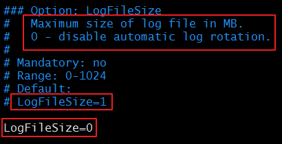
　　日志的滚动。默认值为1，表示滚动。我们设为0则表示不滚动。当数据特别多的时候，我们也可以设置成为1，然后在`Maximum size of log file in MB`设置当数据文件最大到多少时会自动滚动。

　　日志的级别。一共有6个级别。我们可以根据自己的需要来设置级别。其中0表示输出最少的信息，5表示输出最详细的信息，默认值为3，设置为3的话就表示，0、1、2、3四个级别都显示。考虑到生产系统中的压力时，这里的信息，如果没有必要的话，越简单越好，只要在出错的时候，我们可以依据其进行排错即可。

```shell
    DBHost=192.168.19.137      #数据库对外的主机
    DBName=zabbix               #数据库名称
    DBUser=zbxuser              #数据库用户
    DBPassword=passswd             #数据库密码
    DBPort=3306                 #数据库启动端口
```

　　数据库相关的设置。

> 补充：我们可以使用`grep -i "^####" zabbix_server.conf`来查看配置文件中有哪些大段，也可以使用`grep -i "^###" zabbix_server.conf`来查看配置文件中每一段中的配置项有哪些

　　以上，我们的基本配置已经完成，可以开启服务了：

```shell
[root@server zabbix]# systemctl start zabbix-server.service
```

　　开启服务以后，我们一定要去确认一下我们的端口有没有开启：

```shell
[root@server zabbix]# ss -nutl |grep 10051
tcp    LISTEN     0      128       *:10051                 *:*                  
tcp    LISTEN     0      128      :::10051                :::*    
```

　　如果查到的端口没有开启，我们就要去检查一下配置文件有没有出问题了。
　　至此，我们server端的进程启动已经ok了，接下来就可以使用web GUI来打开接口进行设定了

### 4、配置 web GUI

　　我们先来查看一下，我们web GUI的配置文件在哪里：

```shell
[root@server ~]# rpm -ql zabbix-web | less
/etc/httpd/conf.d/zabbix.conf
/etc/zabbix/web
/etc/zabbix/web/maintenance.inc.php
/etc/zabbix/web/zabbix.conf.php
/usr/share/doc/zabbix-web-3.2.6
/usr/share/doc/zabbix-web-3.2.6/AUTHORS
/usr/share/doc/zabbix-web-3.2.6/COPYING
/usr/share/doc/zabbix-web-3.2.6/ChangeLog
/usr/share/doc/zabbix-web-3.2.6/NEWS
/usr/share/doc/zabbix-web-3.2.6/README
……
```

　　可以看出，有一个`/etc/httpd/conf.d/zabbix.conf`文件，这个配置文件就是帮我们做映射的文件，我们可以去看一看这个文件：

```shell
Alias /zabbix /usr/share/zabbix     #我们访问的时候要在主机后加上/zabbix来访问我们这个服务
```


　　时区是一定要设置的，这里被注释掉是因为，我们也可以在php的配置文件中设置时区，如果我们在php配置文件中设置时区，则对所有的php服务均有效，如果我们在zabbix.conf中设置时区，则仅对zabbix服务有效。所以，我们去php配置文件中设置我们的时区：

```shell
vim /etc/php.ini
    [Date]
    ; Defines the default timezone used by the date functions
    ; http://php.net/date.timezone
    date.timezone = Asia/Shanghai
```

　　接下来，我们就可以启动我们的`httpd`服务了：

　　我们的服务已经开启，接着我们就可以用浏览器来访问了。

### 5、浏览器访问并进行初始化设置

　　我们使用浏览器访问`192.168.19.137/zabbix`，第一次访问时需要进行一些初始化的设置，我们按照提示操作即可：


 


　　点击Finish以后，我们就会跳转到登录页面，使用我们的账号密码登录即可：

　　默认用户名为：admin ，密码为：zabbix 。
　　登陆进来就可以看到我们的仪表盘了：


### 6、配置 agent 端

　　当我们把监控端配置启动以后，我们需要来设置一下我们的监控端，我们在被监控的主机安装好agent，设置好他的server，并把他添加到server端，就能将其纳入我们的监控系统中去了。

#### 1）安装 zabbix

　　同样的，我们先来安装zabbix。下载包，注释epel源，安装所需的包。具体步骤如下：

```
[root@node1 ~]# wget http://repo.zabbix.com/zabbix/3.4/rhel/7/x86_64/zabbix-release-3.4-2.el7.noarch.rpm
[root@node1 ~]# rpm -ivh zabbix-release-3.4-2.el7.noarch.rpm 
[root@node1 ~]# yum install zabbix-agent zabbix-sender -y
```

　　安装完成以后，我们去修改配置文件。

#### 2）修改配置文件

　　一样的，我们先查一下包内有什么：

```
[root@node1 zabbix]# rpm -ql zabbix-agent 
/etc/logrotate.d/zabbix-agent
/etc/zabbix/zabbix_agentd.conf
/etc/zabbix/zabbix_agentd.d
/etc/zabbix/zabbix_agentd.d/userparameter_mysql.conf
/usr/lib/systemd/system/zabbix-agent.service
/usr/lib/tmpfiles.d/zabbix-agent.conf
/usr/sbin/zabbix_agentd
/usr/share/doc/zabbix-agent-3.4.4
/usr/share/doc/zabbix-agent-3.4.4/AUTHORS
/usr/share/doc/zabbix-agent-3.4.4/COPYING
/usr/share/doc/zabbix-agent-3.4.4/ChangeLog
/usr/share/doc/zabbix-agent-3.4.4/NEWS
/usr/share/doc/zabbix-agent-3.4.4/README
/usr/share/man/man8/zabbix_agentd.8.gz
/var/log/zabbix
/var/run/zabbix
```

　　对配置文件做一个备份，然后去修改配置文件：

```
[root@node1 ~]# cd /etc/zabbix/
[root@node1 ~]# cd /etc/zabbix/
[root@node1 zabbix]# ls
zabbix_agentd.conf  zabbix_agentd.d
[root@node1 zabbix]# cp zabbix_agentd.conf{,.bak}
[root@node1 zabbix]# vim zabbix_agentd.conf
```


　　重点需要修改的仍然是`GENERAL PARAMETERS`段：

　　是否允许别人执行远程操作命令，默认是禁用的，打开的话会有安全风险。

```
Server=192.168.19.137       #指明服务器是谁的
ListenPort=10050            #自己监听的端口
ListenIP=0.0.0.0            #自己监听的地址，0.0.0.0表示本机所有地址
StartAgents=3               #优化时使用的

ServerActive=192.168.19.135 #主动监控时的服务器
Hostname=agent1.tiger.cn     #自己能被server端识别的名称
```

　　修改完成之后，我们保存退出。然后就可以启动服务了：

```
[root@node1 zabbix]# systemctl start zabbix-agent.service
```

　　照例查看端口是否已开启

```
[root@node1 zabbix]# ss -ntul |grep 10050
tcp    LISTEN     0      128       *:10050                 *:*  
```

　　已经开启成功。接着，我们就可以去server端添加了。
　　node2也进行同样的操作，唯一不同的就是配置文件中的`Hostname`要设为`node2.keer.com`。

### 7、监控过程详解

#### 1）修改密码及中文版

　　作为一只英语不好的运维，这里悄悄改成了中文版，如果大家英语好的话看英文版即可，英语不好就改了吧，毕竟中文版比较适合初学者更快的学习~


按如上操作即可，选择中文以后，点击下面的update即可更新成功，更新过后是这样子的~

　　同样的，为了安全起见，我们把密码改掉：


　　修改完成后同样点击更新即可。


#### 2）创建主机及主机群组

　　我们先来定义一个主机群组：


　　然后我们就可以去添加主机了：


　　当然，上面有很多选择卡，有一个加密：

　　设置完成后，点击添加。我们就可以看到，我们添加的这个主机已经出现在列表中了：

　　同样的，我们把node2节点也添加进来：


#### 3）监控项(items)

##### ① 介绍

　　我们点击上图中node1的监控项，即可创建我们的监控项，首先，我们创建三个应用集：

　　然后我们来定义监控项：


> 　　任何一个被监控项，如果想要能够被监控，一定要在zabbix-server端定义了能够连接至zabbix-agent端，并且能够获取命令。或者在agent端定义了能够让server端获取命令。一般都是内建的命令，都对应的有其名字，被我们称之为`key`。
> 
> 　　关于key值，我们可以直接在网页上设置(服务器自动执行)，也可以使用命令行命令(手动执行)来获取：
>
> > [root@server ~]# zabbix_get -s 192.168.37.122 -p 10050 -k "system.cpu.intr"
> > 　　在我们的agent端，也可以使用命令来查看`intr`的速率变化：
> > 
> > 　　我们继续来看我们的监控项：
> > 
> > 　　说了这么多，我们来简单定义一个：

##### ② 定义一个不带参数的监控项


　　设置完以后，点击更新，即可加入，并会自动跳转至下图页面：

　　定义完成，我们回到所有主机，等待5秒，我们可以看到，我们node1节点后面的选项已经有变成绿色的了：

　　我们也可以回到我们的仪表盘，可以看到，我们的监控项有一个处于启用状态：

　　那么，我们的数据在哪里呢？可以点击`最新数据`，把我们的node1节点添加至主机，应用一下，就可以看到下面的状态了：

　　可以看到，我们还有一个图形页面，点进去则可以看图形的分布：

　　事实上，我们关注的指标有很多种，我们一一添加进来即可。
　　刚刚我们定义的监控项是很简单的，指定一个`key`即可，但是有些监控项是带有参数的，这样一来，我们的监控项就有更多的灵活性。接下来，我们来简单说明一个需要带参数的监控项：


##### ③ 定义一个带参数的监控项


　　图中的`[]`就是需要参数的意思，里面的值即为参数，带`<>`为不可省略的。我们就以这个例子来说明：
　　`if`表示是接口名；`<mode>`表示是那种模式，包括但不限于：packets(包)、bytes(字节)、errors(错误)、dropped(丢包)、overuns等等（上述内容通过`ifconfig`查看）
　　我们来设置一下这个监控值：

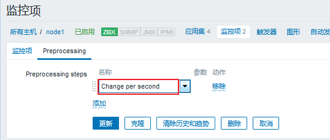
　　同样的，我们也可以通过命令行来查看：

```
[root@server ~]# zabbix_get -s 192.168.37.122 -p 10050 -k "net.if.in[ens33,packets]"
```

　　我们来看看网页的显示情况：检测中 ---> 最新数据 ---> Network Interface Stats(图形)
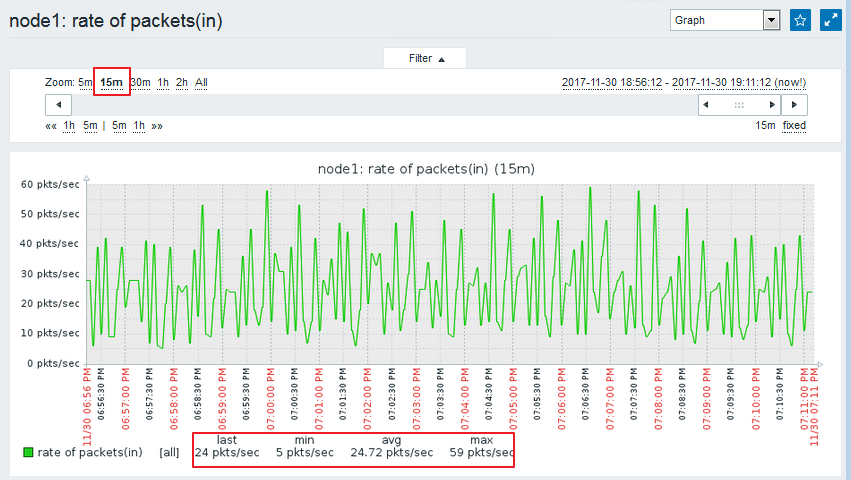


##### ④ 快速定义类似指标

　　如果我们想要定义一个类似的指标，我们可以直接选择克隆，然后简单的修改一点点参数即可。
　　就以我们刚刚定义的`net.if.in[ens33,packets]`为例，如果我们想要在定义一个`out`的进行如下操作即可：


　　如果我们要以字节为单位也要定义的话，进行同样的操作：
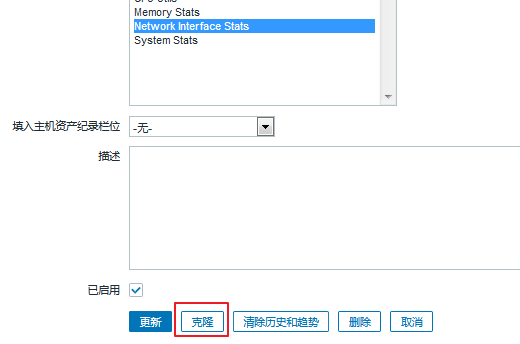

　　如果有需要的话也可以把byte再克隆成out。就不一一演示了~
　　可以看一下，我们现在已经定义的指标：
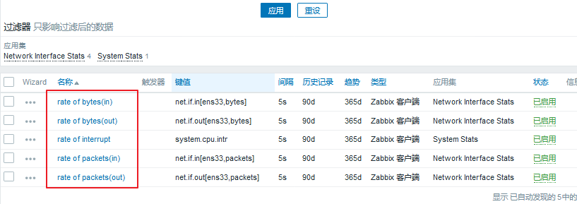
　　我们来到 检测中 ---> 最新数据，可以看到，我们定义的监控项都已经有值了：


##### ⑤ 删除监控项

　　如果有一个监控项，我们用不上了，就可以删除掉。但是如果你直接删除的话，默认数据是会留下的，所以我们要先清除数据，然后再删除，具体操作步骤如下：


##### ⑥ 监控项存储的值

　　对于监控项存储的值，老一点的版本只有以下三种方式：

- As is：不对数据做任何处理(存储的为原始值)
- Delta：（simple change)(变化)，本次采样减去前一次采样的值的结果
- Delta：（speed per second)(速率)，本次采样减去前一次采样的值，再除以经过的时长；
  　　而在3.4版本以后有了更多的表现形式：
  


#### 4）触发器（trigger）


##### ① 简介

　　当我们的采集的值定义完了以后，就可以来定义触发器了。
　　我们触发器的定义是：**界定某特定的item采集到的数据的非合理区间或非合理状态。通常为逻辑表达式。**
　　逻辑表达式（阈值）：通常用于定义数据的不合理区间，其结果如下：
　　`OK`(不符合条件)：正常状态 --> 较老的zabbix版本，其为FALSE；
　　`PROBLEM`(符合条件)：非正常状态 --> 较老的zabbix版本，其为TRUE；
　　一般，我们评定采样数值是否为合理区间的比较稳妥的方法是——根据最后N次的平均值来判定结果；这个最后N次通常有两种定义方式：

1. 最近N分钟所得结果的平均值
2. 最近N次所得结果的平均值

　而且，我们的触发器存在可调用的函数：

> nodata()　　　　#是否采集到数据，采集不到则为异常
> last()　　　　　 #最近几次的平均值
> date()
> time()
> now()
> dayofmonth()
> ...

　　**注：能用数值保存的就不要使用字符串**


##### ② 触发器表达式

　　基本的触发器表达式格式如下所示

```
{<server>:<key>.<function>(<parameter>)}<operator><constant>
```

- `server`：主机名称；
- `key`：主机上关系的相应监控项的key；
- `function`：评估采集到的数据是否在合理范围内时所使用的函数，其评估过程可以根据采取的数据、当前时间及其它因素进行；
- 目前，触发器所支持的函数有avg、count、change、date、dayofweek、delta、diff、iregexp、last、max、min、nodata、now、sum等
- `parameter`：函数参数；大多数数值函数可以接受秒数为其参数，而如果在数值参数之前使用“#”做为前缀，则表示为最近几次的取值，如sum(300)表示300秒内所有取值之和，而sum(#10)则表示最近10次取值之和；
- 此外，avg、count、last、min和max还支持使用第二个参数，用于完 成时间限定；例如，max(1h,7d)将返回一周之前的最大值；
  　　表达式所支持的运算符及其功能如下图所示：
  


##### ③ 定义一个触发器

　　我们可以查看一下`rate of packets(in)`的值，并以其为标准确定我们的非正常的值：

　　图中我们可以看出，我们的最大值为74，最小值为4，平均值为24。这样的话，我们可以定义50以上的都是非正常的值。
　　下面我们来定义一个触发器：
　　进入：配置 ---> 主机 ---> node1 ---> 触发器 ---> 创建触发器

　　我们的表达式可以直接点击右侧的添加，然后定义自己所需的内容，即可自动生成：

　　生成完毕后，我们就点击页面下方的添加，即成功定义了一个触发器，同时页面自动跳转：
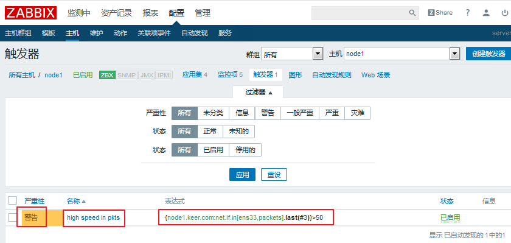
　　然后我们去看一下我们刚刚定义了触发器的那个监控项：

　　我们可以看出，这个里面就有了一根线，就是我们刚刚定义的值，超过线的即为异常状态，看起来非常直观。
　　但是，现在即使超过了这根线，也仅仅会产生一个触发器事件而不会做其他任何事。因此，我们就需要去定义一个动作(action)。


##### ④ 触发器的依赖关系

　　我们的触发器彼此之间可能会存在依赖关系的，一旦某一个触发器被触发了，那么依赖这个触发器的其余触发器都不需要再报警。
　　我们可以来试想一下这样的场景：
　　我们的多台主机是通过交换机的网络连接线来实现被监控的。如果交换机出了故障，我们的主机自然也无法继续被监控，如果此时，我们的所有主机统统报警……想想也是一件很可怕的事情。要解决这样的问题，就是定义触发器之间的依赖关系，当交换机挂掉，只它自己报警就可以了，其余的主机就不需要在报警了。**这样，也更易于我们判断真正故障所在。**
　　注意：目前zabbix不能够直接定义主机间的依赖关系，其依赖关系仅能通过触发器来定义。
　　我们来简单举一个例子，示范一下如何定义一个依赖关系：
　　打开任意一个触发器，上面就有依赖关系，我们进行定义即可：


　　由于当前我们只定义了一个触发器，就不演示了，过程就是这样~添加以后点击更新即可。
　　触发器可以有多级依赖关系，比如我们看下面的例子：
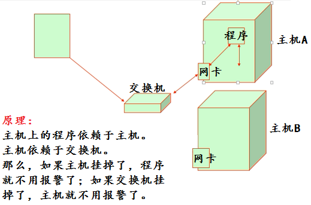


#### 5）定义动作（action）


##### ① 简介

　　我们需要去基于一个对应的事件为条件来指明该做什么事，一般就是执行远程命令或者发警报。
　　我们有一个**告警升级**的机制，所以，当发现问题的时候，我们一般是先执行一个**远程操作命令**，如果能够解决问题，就会发一个恢复操作的讯息给接收人，如果问题依然存在，则会执行**发警报**的操作，一般默认的警报接收人是当前系统中有的zabbix用户，所以当有人需要收到警报操作的话，我们则需要把它加入我们的定义之中。
　　其次，每一个用户也应该有一个接收告警信息的方式，即媒介，就像我们接收短信是需要有手机号的一样。
　　我们的每一个监控主机，能够传播告警信息的媒介有很多种，就算我们的每一种大的媒介，能够定义出来的实施媒介也有很多种。而对于一个媒介来说，每一个用户都有一个统一的或者不同的接收告警信息的端点，我们称之为目标地或者目的地。
　　综上，为了能够发告警信息，**第一，我们要事先定义一个媒介，第二，还要定义这个媒介上用户接收消息的端点（当然，在用户上，我们也称之为用户的媒介）。**
　　我们可以去看一下系统内建的媒介类型：

　　这只是大的媒介类型，里面还有更多的细分，我们以`Email`为例：
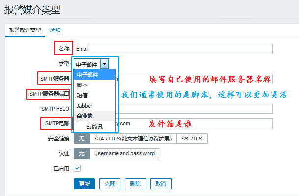
　　同样的，同一个类型我们也可以定义多个，还是以`Email`为例，我们可以定义一个腾讯的服务器，一个网易的服务器，一个阿里的服务器等等。


##### ② 定义一个媒介（media）

　　我们还是以`Email`为例。来简单的定义一个媒介：

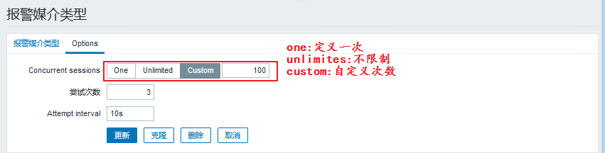
　　这样定义以后，我们去更新一下就可以了。
　　媒介定义好了，那么我们怎么才能够然后用户接收到邮件呢？比如让我们的Admin用户接收邮件，我们应该怎么操作呢？具体步骤如下：
　　进入 管理 ---> 用户 ---> Admin ---> 报警媒介
　　我们来添加一条进来：

　　添加过后是这样的：

　　然后我们更新就可以了。
　　**一个用户可以添加多个接收的媒介类型。**


##### ③ 定义一个动作（action）

　　我们之前说过了，动作是在某些特定条件下触发的，比如，某个触发器被触发了，就会触发我们的动作。
　　现在，我么基于redis来定义一个动作。
　　首先，我们在agent端使用yum安装一下`redis`：

```
[root@node1 ~]# yum install redis -y
```

　　修改一下配置文件：

```
[root@node1 ~]# vim /etc/redis.conf 
bind 0.0.0.0        #不做任何认证操作
```

　　修改完成以后，我们启动服务，并检查端口：

```
[root@node1 ~]# systemctl start redis
[root@node1 ~]# ss -nutlp | grep redis
tcp    LISTEN     0      128       *:6379                  *:*                   users:(("redis-server",pid=5250,fd=4))
```

　　接着，我们就可以去网站上来定义相关的操作了：

###### 1.定义监控项

　　进入 配置 ---> 主机 ---> node1 ---> 监控项（items）---> 创建监控项

　　填写完毕以后，我们点击下方的添加。
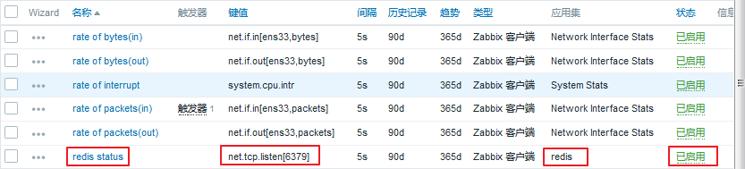
　　该监控项已成功添加。
　　我们可以去查看一下他的值：
　　检测中 ---> 最新数据


###### 2.定义触发器

　　定义好了监控项以后，我们亦可来定义一个触发器，当服务有问题的时候，我们才能及时知道：
　　进入 配置 ---> 主机 ---> node1 ---> 触发器（trigger）---> 创建触发器

　　填写完毕以后，我们点击下方的添加。

　　该触发器已成功添加。
　　我们去查看一下：
　　监测中 ---> 最新数据

　　我们来手动关闭redis服务来检测一下：

```
[root@node1 ~]# systemctl stop redis.service
```

　　进入 监测中 ---> 问题
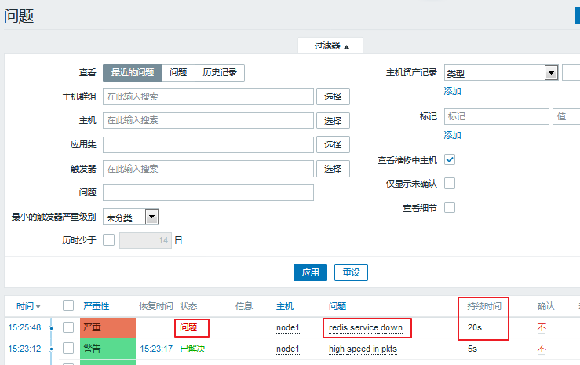
　　可以看到，现在已经显示的是问题了。并且有持续的时间，当我们的服务被打开，会转为已解决状态：

```
[root@node1 ~]# systemctl start redis.service 
```


###### 3.定义动作（action）

　　现在我们就可以去定义action了。
　　进入 配置 ---> 动作 ---> 创建动作（注意选择事件源为触发器）
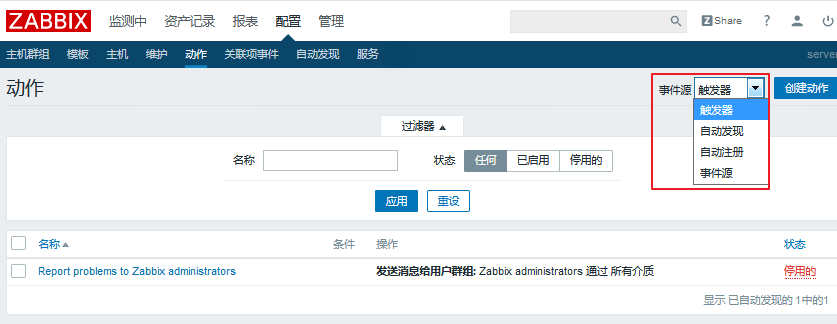

　　我们可以进行操作添加：

　　我们可以看出，还需要在虚拟机上进行两项操作，一是修改sudo配置文件使zabbix用户能够临时拥有管理员权限；二是修改zabbix配置文件使其允许接收远程命令。我们进行如下操作：

```
[root@node1 ~]# visudo          #相当于“vim /etc/sudoers”
    ## Allow root to run any commands anywhere
    root    ALL=(ALL)   ALL
    zabbix    ALL=(ALL)   NOPASSWD: ALL     #添加的一行，表示不需要输入密码

[root@node1 ~]# vim /etc/zabbix/zabbix_agentd.conf
    EnableRemoteCommands=1          #允许接收远程命令
    LogRemoteCommands=1             #把接收的远程命令记入日志

[root@node1 ~]# systemctl restart zabbix-agent.service
```

　　我们添加了第一步需要做的事情，也就是重启服务，如果重启不成功怎么办呢？我们就需要来添加第二步：

　　添加完成以后，我们可以看一下：
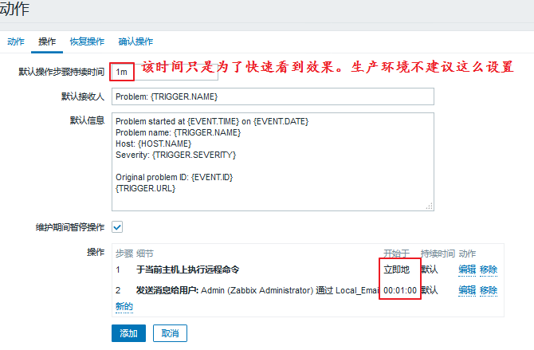
　　操作添加完了，如果服务自动恢复了，我们可以发送消息来提示：
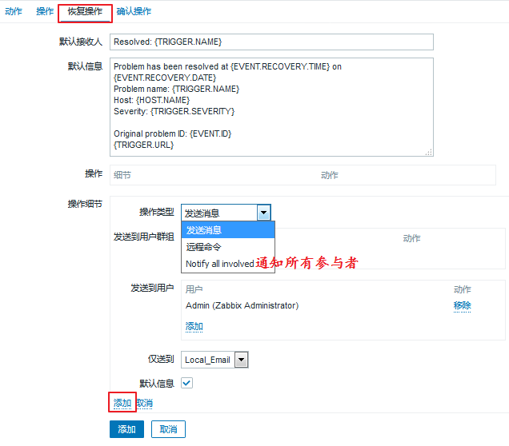
　　至此，我们的动作设置完毕，可以点击添加了，添加完成会自动跳转至如下页面：

　　现在我们可以手动停止服务来进行测试：

```
[root@node1 ~]# systemctl stop redis.service 
```

　　然后我们来到问题页面来查看，发现确实有问题，并且已经解决：

　　我们可以去server端查看是否收到邮件：

　　也可以去agent端查看端口是否开启：

```
[root@node1 ~]# systemctl stop redis.service 
[root@node1 ~]# ss -ntl
State       Recv-Q Send-Q Local Address:Port               Peer Address:Port              
LISTEN      0      128        *:6379                   *:*                  
LISTEN      0      128        *:111                    *:*                  
LISTEN      0      5      192.168.122.1:53                     *:*                  
LISTEN      0      128        *:22                     *:*                  
LISTEN      0      128    127.0.0.1:631                    *:*                  
LISTEN      0      128        *:23000                  *:*                  
LISTEN      0      100    127.0.0.1:25                     *:*                  
LISTEN      0      128        *:10050                  *:*                  
LISTEN      0      128       :::111                   :::*                  
LISTEN      0      128       :::22                    :::*                  
LISTEN      0      128      ::1:631                   :::*                  
LISTEN      0      100      ::1:25                    :::* 
```

　　可以看出端口正常开启，我们的动作触发已经完成。

> 补充：我们也可以使用脚本来发送警报，我们的脚本存放路径在配置文件中可以找到，定义为：`AlterScriptsPath=/usr/lib/zabbix/alertscripts`

　　接下来，我们来一波彻底一点的操作，我们来手动修改一下redis服务的监听端口，这样，我们就不能通过重启服务恢复了：

```
[root@node1 ~]# vim /etc/redis.conf
    #port 6379
    port 6380               #注释掉原来的端口，更换为新的端口

[root@node1 ~]# systemctl restart redis
```

　　然后，我们来网页查看一下状态：
　　进入 监测中 ---> 问题，可以看到是报错的：

　　这样，在经过了重启服务以后还是没能把解决问题，就会发邮件告警：

　　我们再把服务端口改回来，然后重启服务。这样，等到问题自动解决了以后，我们会再次收到邮件：


　　这样，我们的动作设定已经全部测试完成。
　　


#### 6）zabbix可视化


##### ① 简介

　　数据日积月累，如果我们想要更直观的了解到各项数据的情况，图形无疑是我们的最佳选择。
　　zabbix提示了众多的可视化工具提供直观展示，如graph、screen及map等。上文中我们也看到过一些简单的图形展示。
　　如果我们想要把多个相关的数据定义在同一张图上去查看，就需要去自定义图形了~


##### ② 自定义图形（Graphs）

　　自定义图形中可以集中展示多个时间序列的数据流。支持“**线状图**(normal)”、“**堆叠面积图**(stacked)”、“**饼图**(pie)” 和“**分离型饼图**(exploded)”四种不同形式的图形。
　　具体的设置过程如下：
　　进入 配置 ---> 主机 ---> node1 ---> 图形，选择右上角创建图形：

　　我们来看一看四种状态：
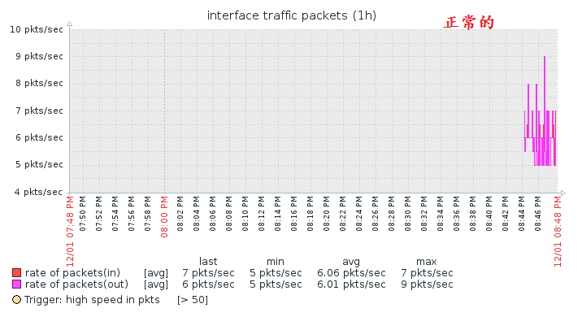
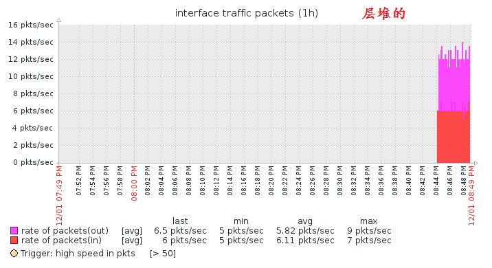
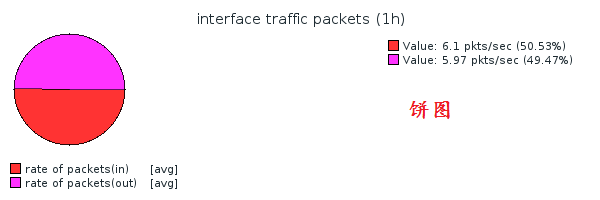

　　包括我们的主机都可以自定义，不过一般来说，线型是看的最清晰的，我们通常会使用这个。
　　我们也可以克隆一个packets来更改为bytes用~同样的，我们如果想添加别的内容，也都可以添加的。
　　我们一共添加了三个图形，我们可以在 监测中 ---> 图形 来查看


##### ③ 聚合图形（Screens）

　　我们创建的自定义图形也可以放在一个聚合图里显示，具体的设置方法如下：
　　进入 监测中 ---> 聚合图形 ---> 选择右上角创建聚合图形

　　我们还可以选择分享：

　　定义好了添加即可。
　　定义完成以后，我们需要编辑一下，来指定保存哪些图：


　　依次添加即可，添加完成之后是这样婶儿的~：

　　因为我们只有三张图，所以添加的有重复的，通常情况下是不需要这样的。


##### ④ 幻灯片演示（Slide shows）

　　如果我们有多个聚合图形想要按顺序展示的话，我们就可以定义一个幻灯片。
　　具体步骤如下：
　　进入 监测中 ---> 聚合图形 ---> 右上角选择幻灯片演示 ---> 创建幻灯片
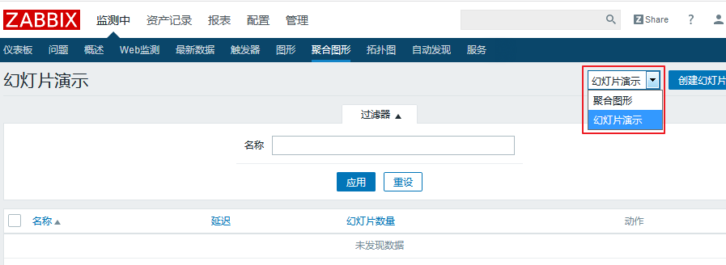

　　然后我们打开即可。打开以后显示的是图片1，5s以后会自动切换为图片2。
　　这样就可以实现幻灯片演示，我们就不需要去手动切换了。


##### ⑤ 定义拓扑图（Maps）

　　在拓扑图中，我们可以定义成一个复杂的网络连接图，我们可以使用一台主机来连接另一台主机，这样的话，我们就可以查看出到底是哪个链接出了问题。
　　我们就不来演示了，看一下过程即可：
　　进入 监测中 ---> 拓扑图 ---> 所有地图 ---> Local network(默认就有的)

　　通过 Ping 和 Traceroute 就可以实验我们上述的功能。


#### 7）模板


##### ① 创建模板

　　之前我们说过，每一个主机的监控项都很多，我们一个一个的添加实在是太头疼了，更何况，可能不止一个主机。
　　但是我们可以把一个redis的监控项添加进一个模板里，这样更方便于我们以后的添加。
　　具体操作如下：
　　进入 配置 ---> 模板 ---> 选择右上角创建模板

　　填写完以后，我们点击下方的添加即可。
　　我们可以基于组过滤一下，就能看到我们刚刚定义的模板：

　　一样的，我们可以向里面添加应用集、监控项、触发器、图形等等，添加完成以后，后期我们再有主机需要添加就直接套用模板即可。
　　需要注意的一点是，**我们现在添加的是模板，所以不会立即采用数据，只有链接到主机上以后，才会真正生效。**


##### ② 模板的导入与导出

　　我们也可以直接导入一个模板，在互联网上可以找到很多，导入的步骤如下：
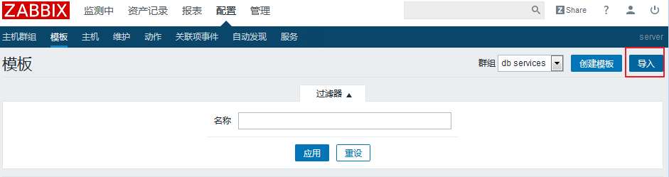

　　同样的，我们创建好的模板也可以导出为文件：
　　我们任意选中一个准备好的模板，然后页面的最下方就有导出按钮：


　　因此，我们就可以非常方便的进行应用了~


##### ③ 模板的应用

　　我们的软件已经创建了许多模板，我们可以使用一个模板来看看效果。
　　进入 配置 ---> 主机 ---> node1 ---> 模板
　　我们就可以选择要添加的模板了：


　　到这里我们就可以点击更新了。一旦我们成功链接至模板，我们的主机数据就会更新了：

　　注意：1、一个主机可以链接多个模板，但尽量不要让一个指标被采样两次。
　　2、如果我们有多个主机，同时这些主机也在一个主机组里，这样的话，我们只需要在这个主机组里添加模板，就能够让在主机组里的所有主机进行tongb


##### ④ 移除模板链接

　　当我们一个主机的模板不想要用了，我们就可以移除模板链接，具体操作步骤如下：
　　进入 配置 ---> 主机 ---> node1 ---> 模板
　　我们就可以把不需要的模板移除：
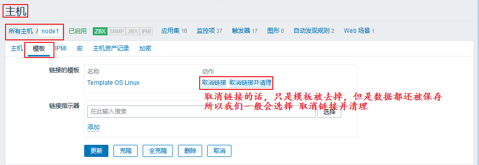
　　我们来删除掉试试看，移除并清理以后，我们点击更新。就会自动跳转至如下界面：

　　可以看出，我们的模板已经被移除了。


#### 8）宏（macro）


##### ① 简介

　　宏是一种抽象(Abstraction)，它根据一系列预定义的规则替换一定的文本模式，而解释器或编译器在遇到宏时会自动进行这一模式替换。
　　类似地，zabbix基于宏保存预设文本模式，并且在调用时将其替换为其中的文本。
　　zabbix有许多内置的宏，如{HOST.NAME}、{HOST.IP}、{TRIGGER.DESCRIPTION}、{TRIGGER.NAME}、{TRIGGER.EVENTS.ACK}等。
　　详细信息请参考[官方文档](https://www.zabbix.com/documentation/2.0/manual/appendix/macros/supported_by_location)
　　


##### ② 级别

　　宏一共有三种级别，分别是全局宏、模板宏、主机宏。
　　不同级别的宏的适用范围也不一样。

> 全局宏也可以作用于所有的模板宏和主机宏，优先级最低。
> 模板宏则可以作用于所有使用该模板的主机，优先级排在中间。
> 主机宏则只对单个主机有效，优先级最高。


##### ③ 类型

　　宏的类型分为系统内建的宏和用户自定义的宏。
　　为了更强的灵活性，zabbix还支持在全局、模板或主机级别使用用户自定义宏(user macro)。
　　系统内建的宏在使用的时候需要`{MACRO}`的语法格式，用户自定义宏要使用`{$MACRO}`这种特殊的语法格式。
　　宏可以应用在item keys和descriptions、trigger名称和表达式、主机接口IP/DNS及端口、discovery机制的SNMP协议的相关信息中……
　　宏的名称只能使用**大写字母、数字及下划线**。
　　进一步信息请参考[官方文档](https://www.zabbix.com/documentation/2.0/manual/appendix/macros/supported_by_location#additional_support_for_user_macros)。


##### ④ 定义一个宏

　　如果我们想要在我们的监控项(items)上使用宏，我们就要先去定义一个宏，然后去创建监控项，直接引用定义好的宏即可。具体操作步骤如下：

###### 1.定义全局宏

　　进入 管理 ---> 一般 ---> 右上角选择宏


　　这样，我们的全局宏就添加好了。

###### 2.定义监控项，调用宏

　　进入 配置 ---> 主机 ---> 所有主机 ---> 监控项 ---> 右上角创建监控项

　　填写完成以后，点击添加。然后我们就可以看到这个调用宏的监控项已经添加成功：

　　我们可以来查看一下这个监控项现在的状态：
　　进入 监测中 ---> 最新数据
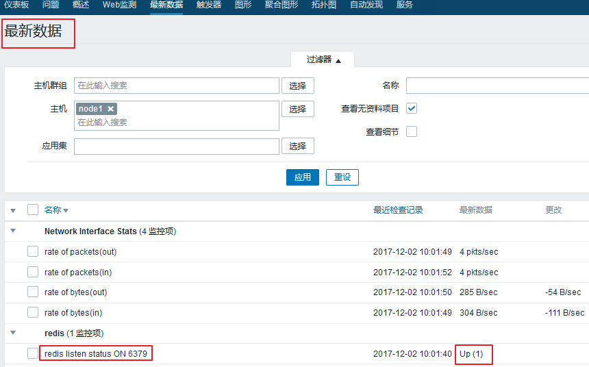
　　如果我们把服务停掉。就会变成`down`的状态：

```
[root@node1 ~]# systemctl stop redis
```

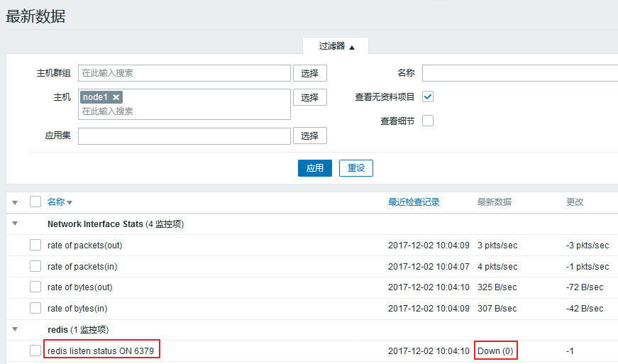
　　发现我们的监控项是可以正常使用的。

###### 3.修改宏

　　如果我们把node1节点上的redis服务监听端口手动改掉的话，我们刚刚定义的监控项就不能正常使用了，这样的话，我们就需要去修改宏。
　　但是，这毕竟只是个例，所以我们不需要去修改全局宏，只用修改模板宏或者主机宏就可以了。
　　下面分别说一下，模板宏和主机宏的不同修改操作：
**模板宏**
　　模板宏的修改，我们需要进入：配置 ---> 模板 ---> redis stats（相应的模板） ---> 宏

　　在这里点击添加就可以了。
**主机宏**
　　主机宏的修改，我们需要进入：配置 ---> 主机 ---> 所有主机 ---> node1 ---> 宏

　　在这里点击添加就可以了。

####  9）添加邮件报警功能

注：使用老的方式--利用本地邮件服务器发送报警，需要开启postfix服务

配置 zabbix 的邮件报警功能需要以下三个角色的参与。
1、 示警媒体(Media)
2、 触发器(Triggers)
3、 动作(Action)

示警媒体:
    指的是 zabbix 采用何种方式进行报警,目前 Zabbix 支持的示警媒体包括邮件、Jabber、短信。jabber是linux下一种即时通讯工具,可以和yahoo,icq等工具通信

触发器:
    指的是当监控对象达到某个条件或条件集合的时候,触发 Zabbix 产生事件。

动作:
    指的是 Zabbix 产生对应事件后,它通过示警媒体发送报警。

接下来,我们配置一个邮件报警功能的范例。效果是当 WEB 页面获取时间超过 3 秒,则触发报警,管理员将会收到一封 Zabbix 发出的报警邮件。

示警媒体的配置:
    首先需要配置 Zabbix 的邮件功能。
    点击 管理->示警媒体->Email。
    然后在页面中填入你的邮件服务器信息,例如下图所示:      
    
    配置完成后,不要忘记点击存档,保存你的配置。
    接下来,设置接受报警用户的电子邮件。
    点击管理->用户->点击 Zabbix Administrators 那一行的“用户”,可以看到这个用户组中的 Admin 用户。
    点击用户别名,打开这个用户的配置页面,选择示警媒体,并点击添加。
    在弹出的页面中配置该用户的电子邮件。配置完成后,记得点击存档保存。
        

​        触发器的配置:
​        接下来,点击配置->主机
​        我们给 agent-19 这台主机增加一个触发器。点击 agent-19 这一行中的“触发器”,然后再点击创建触发器。

​        该页各配置项含义如下:
​            名称:填入触发器的名字
​            表达式:用于配置触发器的触发条件,点击添加按钮有条件选项。
​            多重事件产生:如果选中,则问题如果持续多重的发生则每次都触发,否则只触发一次
​        点击表达式右侧的添加按钮:     
​        再点击项目右侧的选择,选择我们之前配置过的“web.server.online.monitor”,并设置触发的阀值,如下图所示
​        
​        Zabbix 会自动生成表达式。接下来根据情况选择事件的严重性。配置完毕后,点击存档保存。
​        动作的配置:
​            点击配置->动作->事件源下拉菜单中选择触发器->创建动作          
​            首先,对“动作”标签页进行配置。该页各配置项含义如下:
​                名称: 该动作的名称
​                默认操作步骤停留时间: 发现问题后多长时间执行动作  //为了测试这里可以设置到最少
​                默认标题: 报警信息的标题
​                默认消息: 报警信息的内容
​                恢复消息: 故障恢复后的消息内容。如果不开启则不会发送故障恢复通知。
​                这里的消息内容就是报警邮件的内容。如图所示,我们可以在内容中使用 Zabbix 内置宏,邮件发出时会自动将宏替换成对应的值。
​            接下来,选择“条件”标签页。在该页面中配置触发动作的条件。例如下图所示:
​                
​         然后,再选择“操作”标签页。然后如下图进行配置。
​                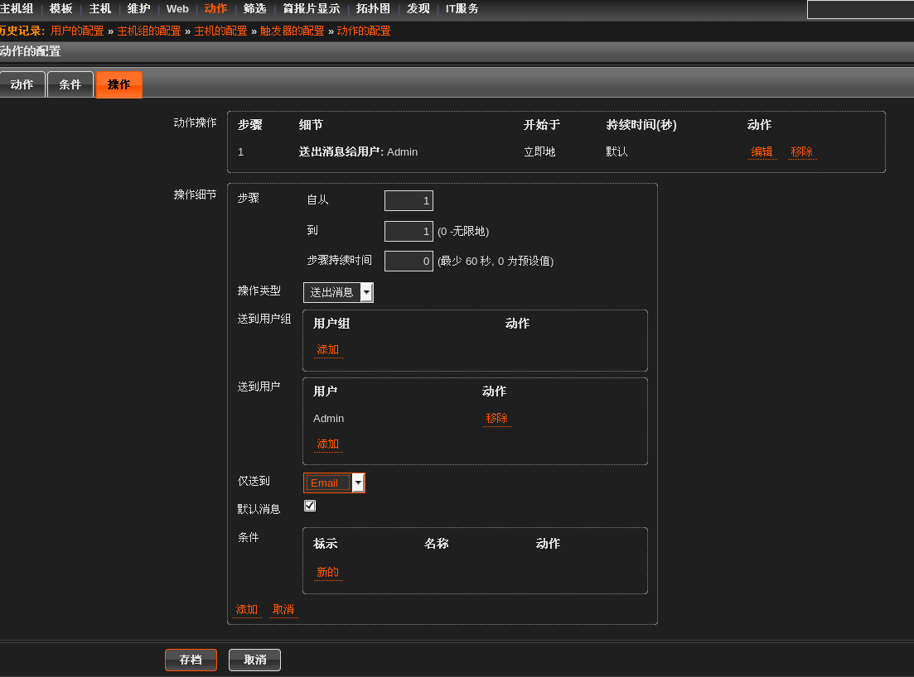
​    需要特别解释一下的是“步骤”部分的配置。所谓步骤是指报警可以有多个步骤,做不同的报警。例如,自从 1 到 3,就是指报警的步骤有三个。步骤持续时间就是一定时间后如果监控人员仍未响应报警就进入下一个报警步骤。
​    例如,发邮件给你报警,如果60 秒后你没响应,那就发 jabber 信息提醒你。如果 60 秒后还没响应,那就发短信给你。要是还没响应,就没有然后了。你可以形象的把它理解为 Zabbix 的一哭二闹三上吊。
​    到此,一个邮件报警功能就配置完毕了。如果你想立即看到结果,可以修改触发器的条件,将条件的阀值设置为 N>0.0003。你马上就会收到 Zabbix 发来的报警邮件了。
​    
​    ![assets/63-11.png)


#### 10）使用公网邮箱发送邮件


邮件系统简要介绍：
电子邮件系统包括两个组件：MUA(Mail User  Agent,邮件用户代理）和MTA(Mail Transport  Agent,邮件传送代理 postfix）MUA是邮件系统为用户提供的可以读写邮件的界面；而MTA是运行在底层，能够处理邮件的收发工作的程序。简单的说，用户可以 使用MUA写信、读信、而通过MTA收信、发信。Foxmail、Outlook、Webmail都属于MUA。
邮件的接收是MTA和MUA配合完成的。远程的MUA首先向远程MTA连接并验证发信人身份，然后由远程MTA向本地MTA发送邮件。接受者通过本 地MUA接收阅读邮件。邮件的发信也是MTA和MUA配合完成的，不过方向正好相反。本地MUA首先向本地的MTA连接并验证发信人身份，然后由本地 MTA向远程MTA发送邮件，再由远程的MUA读取邮件。
mail和mailx即为负责查看、编写邮件和向MTA发送邮件的MUA。mailx是mail的功能加强版。 
sendmail即为负责邮件在网络上传输的MTA，将邮件从一个MTA传送至另一个MTA。

开干：
1.注册163邮箱
2.登陆网页邮箱设置客户端授权密码


安装MUA软件：mailx

```
yum install mailx  -y

mail -V
12.5 7/5/10
mailx -V
12.5 7/5/10
```

配置公网邮箱信息：

vim /etc/mail.rc   追加以下内容

```
 set from=18612540627@163.com（邮箱地址） 
 set smtp=smtp.163.com（smtp服务器） 
 set smtp-auth-user=18612540627@163.com(用户名) 
 set smtp-auth-password=yanqiang20182018（邮箱密码-这里是授权码） 
 set smtp-auth=login
```

使用mailx发邮件的方式：
方式1：mailx -s "邮件标题" 收件箱Email < 包含正文的文件
方式2：cat 包含正文的文件 | mailx -s "邮件标题" 收件箱Email
方式3：echo "正文内容" | mailx -s "邮件标题" 收件箱Email
方式4：mailx -s "邮件标题" 收件箱Email，回车按CTRL+D发送

手动发送邮件测试：

```
mailx -v -s 'hello' '收件人@163.com'
```

手写邮件内容 （回车，然后ctrl+d正常结束)

```
EOT 

 Resolving host smtp.163.com … done. 
 Connecting to 123.125.50.135:smtp … connected. 
 220 163.com Anti-spam GT for Coremail System (163com[20141201])
   EHLO localhost 
   250-mail 
   250-PIPELINING 
   250-AUTH LOGIN PLAIN 
   250-AUTH=LOGIN PLAIN 
   250-coremail 1Uxr2xKj7kG0xkI17xGrU7I0s8FY2U3Uj8Cz28x1UUUUU7Ic2I0Y2UFHbOaIUCa0xDrUUUUj 
   250-STARTTLS 
   250 8BITMIME 
   AUTH LOGIN 
   334 dXNlcm5hbWU6 
    emhpZ3VvbGl1MTFAMTYzLmNvbQ== 
   334 UGFzc3dvcmQ6 
   bHpnODY3MTM1NzM5 
   235 Authentication successful 
   MAIL FROM:18612540627@163.com 
   250 Mail OK 
   RCPT TO:18612540627@163.com 
   250 Mail OK 
   DATA 
   354 End data with . 
   . 
   250 Mail OK queued as smtp5,D9GowAAnNd6vschZY_bxAA–.277S2 1506324911 
   QUIT 
   221 Bye
```

或者，将邮件内容放到一个文件中content.txt

```
# cat content.txt | mailx -v -s ‘hello’ ‘zhangsan@163.com’
```

手动使用mailx发送邮件测试结果：
       

zabbix添加邮件报警功能:
注：使用新的方式--利用公网邮件服务器发送报警，需要关闭postfix服务

配置 zabbix 的邮件报警功能需要以下三个角色的参与。
1、 示警媒体(Media)
2、 触发器(Triggers)
3、 动作(Action)

示警媒体:
    指的是 zabbix 采用何种方式进行报警,目前 Zabbix 支持的示警媒体包括邮件、Jabber、短信。jabber是linux下一种即时通讯工具,可以和yahoo,icq等工具通信

触发器:
    指的是当监控对象达到某个条件或条件集合的时候,触发 Zabbix 产生事件。

动作:
    指的是 Zabbix 产生对应事件后,它通过示警媒体发送报警。

接下来,我们配置一个邮件报警功能的范例。效果是当 WEB 页面获取时间超过 3 秒,则触发报警,管理员将会收到一封 Zabbix 发出的报警邮件。

示警媒体的配置:
    首先需要配置 Zabbix 的邮件功能。
    点击 管理->报警媒介类型->创建媒体类型
    

然后在页面中填入你的报警媒介类型信息,例如下图所示:
注：脚本名称任意，存放于/usr/lib/zabbix/alertscripts (生产上的测试服放这：/usr/local/zabbix/share/zabbix/alertscripts）    

    名称：sendmail                   //名称任意
    类型：脚本
    脚本名称：sendmail.sh      
    脚本参数：                          //一定要写，否则可能发送不成功
        {ALERT.SENDTO}              //照填，收件人变量
        {ALERT.SUBJECT}             //照填，邮件主题变量，变量值来源于‘动作’中的‘默认接收人’
        {ALERT.MESSAGE}           //照填，邮件正文变量，变量值来源于‘动作’中的‘默认信息’
    
    配置完成后,不要忘记点击存档,保存你的配置。       


修改zabbix服务端配置文件＆编写脚本：
    指定脚本的存储路径:

vim /etc/zabbix/zabbix_server.conf

```
 AlertScriptsPath=/usr/lib/zabbix/alertscripts
```

编写邮件脚本:

```
cd /usr/lib/zabbix/alertscripts
vim sendmail.sh    
#!/bin/sh 
#export.UTF-8
echo "$3" | sed s/'\r'//g | mailx -s "$2" $1
```

修改权限：

```
chmod u+x sendmail.sh && chown zabbix.zabbix sendmail.sh
```

修改admin用户的报警媒介：


用户默认是没有设置报警媒介的，设置后就可以接收报警消息了。  

接下来,设置接受报警用户的电子邮件

点击：管理->报警媒介类型->Admin->报警媒介->添加    
触发器的配置:
    接下来,点击配置->主机
    我们给 agent-19 这台主机增加一个触发器。点击 agent-19 这一行中的“触发器”,然后再点击创建触发器。      
该页各配置项含义如下:
        名称:填入触发器的名字
        表达式:用于配置触发器的触发条件,点击添加按钮有条件选项。
        多重事件产生:如果选中,则问题如果持续多重的发生则每次都触发,否则只触发一次
    点击表达式右侧的添加按钮:
       
   再点击项目右侧的选择,选择我们之前配置过的“web.server.online.monitor”,并设置触发的阀值,如下图所示
        Zabbix 会自动生成表达式。接下来根据情况选择事件的严重性。配置完毕后,点击存档保存。
                
动作的配置:
点击:配置->动作->事件源下拉菜单中选择触发器->创建动作
可以在内容中使用 Zabbix 内置宏,邮件发出时会自动将宏替换成对应的值。                

名称：
    任意写

默认接收人：
    故障级别：{TRIGGER.STATUS}。服务器：【{HOSTNAME1} 】 发生：{TRIGGER.NAME} 故障！ 
    注：默认接收人：相当于邮件的主题

    默认信息：邮件的主题
    告警主机：{HOSTNAME1} 
    告警时间：{EVENT.DATE} {EVENT.TIME}
    告警等级：{TRIGGER.SEVERITY} 
    告警信息：{TRIGGER.NAME}
    告警项目：{TRIGGER.KEY1} 
    问题详情：{ITEM.NAME}：{ITEM.VALUE}
    当前状态：{TRIGGER.STATUS}：{ITEM.VALUE1} 
    事件ID：{EVENT.ID}

恢复邮件：
    恢复主题：
        服务器：【{HOSTNAME1}】故障已恢复。故障原因：{TRIGGER.NAME} 
    恢复信息：恢复邮件的正文。当故障恢复正常后也发邮件通知一下。 

确认操作：   


点击:操作->编辑：


 发送间隔：60秒
 步骤：发送10次发送到：admin用户
 仅使用：sendmail方式发送


需要特别解释一下的是“步骤”部分的配置。所谓步骤是指报警可以有多个步骤,做不同的报警。例如,自从 1 到 3,就是指报警的步骤有三个。步骤持续时间就是一定时间后如果监控人员仍未响应报警就进入下一个报警步骤。
例如,发邮件给你报警,如果60 秒后你没响应,那就发 jabber 信息提醒你。如果 60 秒后还没响应,那就发短信给你。要是还没响应,就没有然后了。你可以形象的把它理解为 Zabbix 的一哭二闹三上吊。
到此,一个邮件报警功能就配置完毕了。如果你想立即看到结果,可以修改触发器的条件,将条件的阀值设置为 N>0.0003。你马上就会收到 Zabbix 发来的报警邮件了。
      

  


​                      

## 5、User parameters 用户参数

### 1、介绍和用法

① 介绍

自定义用户参数，也就是自定义key

有时，你可能想要运行一个代理检查，而不是Zabbix的预定义

你可以**编写一个命令**来**检索需要的数据**，并将其包含在代理配置文件("UserParameter"配置参数)的**用户参数**中

② 用法格式 syntax

**UserParameter=<key>,<command>**

　　A user parameter also contains a key　　一个用户参数也包含一个键

　　The key will be necessary when configuring an item 　　在配置监控项时，key是必需的

　　Note: Need to restart the agent 　　注意:需要重新启动agent 服务 

### 2、用法展示

（1）修改agent 端的配置，设置用户参数

① free | awk '/^Mem/{print $3}' 自己需要查找的参数的命令


② 修改配置文件，把查找参数的命令设为用户参数

cd /etc/zabbix/zabbix_agentd.d/

vim **memory_usage.conf**

**UserParameter=memory.used,free | awk '/^Mem/{print $3}'**

③ systemctl restart zabbix-agent.service 重启agent 服务

（2）在zabbix-server 端，查询

zabbix_get -s 192.168.30.7 -p 10050 -k "memory.used"


（3）在监控上，设置一个item监控项，使用这个用户参数


（4）查询graph 图形


 

### 3、用法升级

（1）修改agent 端的配置，设置用户参数

① 命令行查询参数的命令


② 修改配置文件，把查找参数的命令设为用户参数

UserParameter=**memory.stats[\*]**,cat /proc/meminfo | awk **'/^$1/{print $$2}**'

分析：$$2：表示不是前边调位置参数的$2 ，而是awk 的参数$2

注意：$1是调用前边的[*]，位置参数，第一个参数

 

（2）在zabbix-server 端，查询使用这个用户参数的key

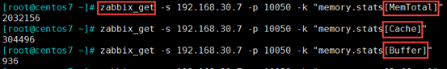

 

（3）在监控上，设置一个item监控项，使用这个用户参数

① 添加Memory Total 的item监控项，使用**memory.stats[MemTotal]** 的用户参数


在进程中定义倍数，规定单位


 

② clone 克隆Memory Total 创建Memory Free 的监控项

**memory.stats[MemFree]** 用户参数


③ 创建Memory Buffers 的item 监控项，使用 **memory.stats[Buffers]** 的key


 

（4）上面3个监控项的graph 图形

① memory total


② memory free


③ buffers


 

### 4、使用用户参数监控php-fpm 服务的状态

在agent 端：

（1）下载，设置php-fpm

① yum -y install php-fpm

② vim /etc/php-fpm.d/www.conf 打开php-fpm的状态页面

```
user = nginx
group = nginx
pm.status_path = /php-fpm-status    #php-fpm 的状态监测页面
ping.path = /ping      #ping 接口，存活状态是否ok
ping.response = pong    #响应内容pong
```

③ systemctl start php-fpm 开启服务

 

（2）设置nginx ，设置代理php，和php-fpm的状态页面匹配

① vim /etc/nginx/nginx.conf

```
location ~ \.php$ {
            fastcgi_pass   127.0.0.1:9000;
            fastcgi_index  index.php;
            fastcgi_param  SCRIPT_FILENAME  $document_root$fastcgi_script_name;
            include        fastcgi_params;
}
location ~* /(php-fpm-status|ping) {
            fastcgi_pass   127.0.0.1:9000;
            fastcgi_index  index.php;
            fastcgi_param  SCRIPT_FILENAME  $fastcgi_script_name;
            include        fastcgi_params;

            allow 127.0.0.1;   #因为这个页面很重要，所有需加访问控制
            deny all;

            access_log off;   #访问这个页面就不用记录日志了
}
```


② systemctl start nginx 开启nginx服务

 

（3）在agent 端，设置用户参数

① 查询 curl 192.168.30.7/php-fpm-status


② 设置

cd /etc/**zabbix/zabbix_agentd.d/**

vim php_status.conf

**UserParameter=php-fpm.stats[\*]**,**curl -s http://127.0.0.1/php-fpm-status | awk '/^$1/{print $$NF}'**

分析：设置用户参数为php-fpm.stats[*]，$1为第一个参数；$$NF为awk中的参数，倒数第一列

 

③ 重启服务

systemctl restart zabbix-agent

 

（4）在zabbix-server 端，查询使用这个用户参数的key

zabbix_get -s 192.168.30.7 -p 10050 -k "php-fpm.stats[idle]"

zabbix_get -s 192.168.30.7 -p 10050 -k "php-fpm.stats[active]"

zabbix_get -s 192.168.30.7 -p 10050 -k "php-fpm.stats[max active]"

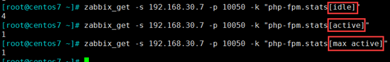

 

（5）创建一个模板，在模板上创建4个item监控项，使用定义的用户参数

① 创建一个模板

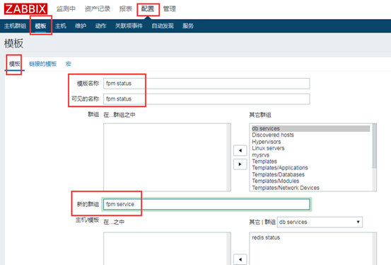

② 在模板上配置items 监控项，使用刚定义的用户参数

**fpm.stats[total processes]**


③ 再clone克隆几个items监控项

**fpm.stats[active processes]**


④ **fpm.stats[max active processes]**


⑤ **fpm.stats[idle processes]**


 

（6）host主机链接模板


 

（7）查看graph 图形

① php-fpm total processes


② php-fpm active processes


③ php-fpm max active processes


④ php-fpm idle processes

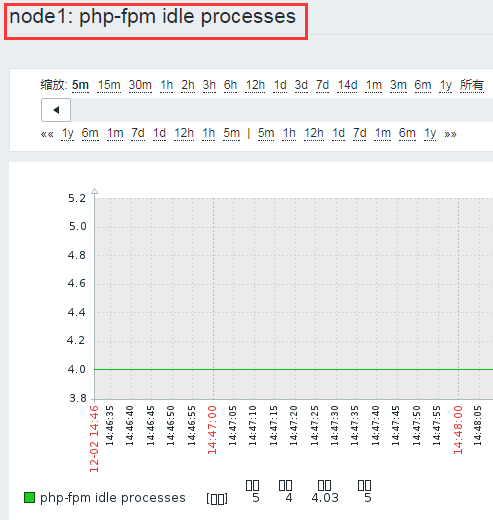

 

（8）把模板导出，可以给别人使用

① 导出模板

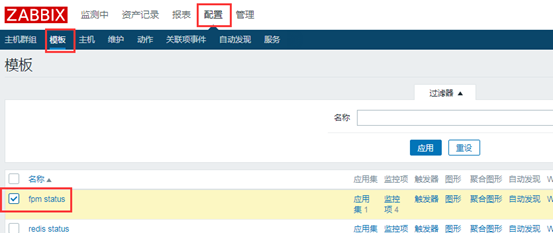

最下面有导出

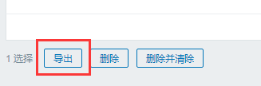

② 自己定义用户参数的文件，也不要忘记导出

/etc/zabbix/zabbix_agentd.d/php_status.conf

 

## 6、Network discovery 网络发现

### 1、介绍

（1）介绍

网络发现：zabbix server**扫描指定网络范围内的主机**；

网络发现是zabbix 最具特色的功能之一，它能够根据用户**事先定义的规则自动添加监控的主机或服务**等

优点：

　　加快Zabbix部署

　　简化管理

在快速变化的环境中使用Zabbix，而不需要过度管理

 

（2）发现方式：

ip地址范围；

　　可用服务（ftp, ssh, http, ...）

　　zabbix_agent的响应；

　　**snmp**_agent的响应；

 

（3）网络发现通常包含两个阶段：discovery发现 和actions动作

① discovery：

Zabbix定期扫描网络发现规则中定义的IP范围；检查的频率对于每个规则都是可配置的

每个规则都有一组用于为IP范围执行的服务检查

由网络发现模块执行的服务和主机(IP)的每个检查都会生成一个发现事件

8种响应事件


② actions：网络发现中的事件可以触发action，从而自动执行指定的操作，把discvery events当作前提条件；

　　Sending notifications 发送通知

　　Adding/removing hosts 添加/删除主机

　　Enabling/disabling hosts 启用/禁用host

　　Adding hosts to a group 向组中添加主机

　　Removing hosts from a group 移除组中的主机

　　Linking hosts to/unlinking from a template 从模板链接主机或取消链接

　　Executing remote scripts 执行远程脚本

这些事件的配置还可以基于设备的类型、IP 、状态、上线/ 离线等进行配置

 

（4）网络发现：接口添加

网络发现中添加主机时会自动创建interface 接口

例如：

　　如果基于SNMP 检测成功，则会创建SNMP 接口

　　如果某服务同时响应给了agent 和SNMP ，则**两种接口都会创建**

　　如果同一种发现机制( 如agent) 返回了非惟一数据，则**第一个接口被识别为默认，其它的为额外接口**

　　即便是某主机开始时只有agent 接口，后来又通过snmp 发现了它，同样会为其添加额外的snmp 接口

　　不同的主机如果返回了相同的数据，则第一个主机将被添加，余下的主机会被当作第一个主机的额外接口

 

### 2、配置网络发现Network discovery

（1）准备一台可被扫描发现的主机

① 安装agent 段的包

yum -y install zabbix-agent zabbix-sender

② 设置agent 配置，可以把之前设置好的node1的配置传过来

vim /etc/zabbix/zabbix_agentd.conf

Hostname=node2.along.com #只需修改hostname

③ visudo 修改sudo的配置

\#Defaults !visiblepw

zabbix ALL=(ALL) NOPASSWD: ALL


④ 开启服务

systemctl start zabbix-agent

 

（2）设置自动发现规则discovery


注释：

① key：zabbix_get -s 192.168.30.2 -p 10050 -k "system.hostname"


② 更新间隔：1h就好，不要扫描太过频繁，扫描整个网段，太废资源；这里为了实验，设为1m

 

（3）自动发现成功


 

（4）设置自动发现discovery 的动作action

a) 创建


b) 设置action动作


① 设置A条件，自动发现规则=test.net

② 设置B条件，自动发现状态=up


③ 要做什么操作

添加主机到监控

自动链接Template OS Linux 到此host


c) 配置action 完成，默认是disabled 停用的


d) 启用动作，查看效果

确实已经生效，添加主机成功，模板链接成功


 

（5）如果自己需要添加的主机已经扫描添加完成，就可以关闭网络扫描了，因为太耗资源

 

## 7、web监控

### 1、介绍

（1）介绍

① Web监控：监控指定的站点的**资源下载速度**，及**页面响应时间**，还有**响应代码**；

② 术语：

　　web Scenario： web场景（站点）

　　web page ：web页面，一个场景有多个页面

　　內建key：要测一个页面，要测三个步骤（下边3个內建key）

③ 内建key：

　　 web.test.in[Scenario,Step,bps]：传输速率

　　 web.test.time[Scenario,Step]： 响应时长

　　 web.test.rspcode[Scenario,Step]：响应码

 

### 2、创建设置web场景

（1）创建

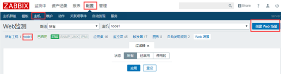

 

（2）配置web 监测

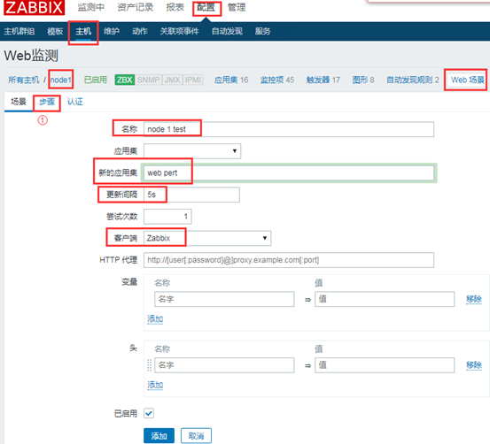

① 点击步骤，设置web page web页面

a) 设置名为home page，URL为http://192.168.30.7/index.html 的web页面


b) 设置名为fpm status，URL为http://192.168.30.7/fpm-status 的web页面

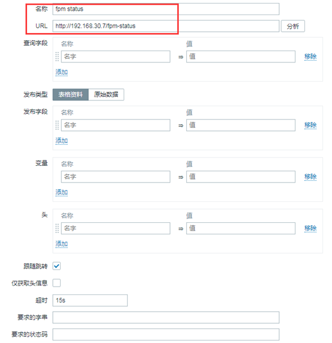

c) 设置2个web页面成功


② 如果有特殊认证，也可以添加


 

### 3、查看测试


 

## 8、主动/被动 监控

### 1、介绍

（1）主动/被动介绍

　　被动检测：相对于agent而言；agent, **server向agent请求获取配置的各监控项相关的数据**，agent接收请求、获取数据并响应给server；

　　主动检测：相对于agent而言；agent(active),**agent向server请求与自己相关监控项配置**，主动地将server配置的监控项相关的数据发送给server；

　　主动监控能极大节约监控server 的资源。

（2）zabbix_sender发送数据：实现人工生成数据，发给server端

① zabbix server上的某主机上，直接定义Item时随便定义一个不与其它已有key冲突的key即可，即item type为"zabbix trapper"；

② 用法选项：

zabbix_sender

　　-z zabbix_server_ip

　　-p zabbix_server_port

　　-s zabbix_agent_hostname

　　-k key

　　-o value 值

 

### 2、设置一个通过內建key发送数据的主动监控

（1）agent端所需要基本配置：

```
ServerActive=192.168.30.107   给哪个监控server 发送数据
Hostname=node1.along.com   自己的主机名，假设主机定死了，不设置下一项
#HostnameItem=   如果自己的主机名易变动，这一项相当于key一样去匹配
```

注意：若后两项同时启用，下边一个选择生效

 

（2）设置一个主动监测


① 选择进程，每秒更改，

因为key：system.cpu.switches ：上下文的数量进行切换，它返回一个整数值。为了监控效果，选择下一秒减上一秒的值作为监控


（3）已经有啦graph图形


 

### 3、设置一个通过命令zabbix_sender发送数据的主动监控

（1）配置一个zabbix traper(采集器) 的item 监控项


（2）agent 端手动发送数据

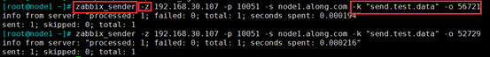

（3）监控到数据的变化


 

## 9、基于SNMP监控（了解）

### 1、介绍

（1）介绍

SNMP：**简单**网络管理协议；（非常古老的协议）

三种通信方式：读（get, getnext）、写（set）、trap（陷阱）；

端口：

　　161/udp

　　162/udp

SNMP协议：年代久远

　　v1: 1989

　　**v2c**: 1993

　　v3: 1998

监控网络设备：交换机、路由器

MIB：Management Information Base 信息管理基础

OID：Object ID 对象ID

 

（2）Linux启用snmp的方法：

yum install net-snmp net-snmp-utils

配置文件：定义ACL

　　/etc/snmp/snmpd.conf

启动服务：

　　systemctl start snmpd 被监控端开启的服务

　　 systemctl start snmptrapd    监控端开启的服务（如果允许被监控端启动主动监控时启用）

 

（3）配置文件的介绍

开放数据：4步


① 定义认证符，将社区名称"public"映射为"安全名称"

② 将安全名称映射到一个组名

③ 为我们创建一个视图，让我们的团队有权利

**掩码：**我列出一些注释，有很多，可以再网上查询

**.1.3.6.1.2.1.**

　　 1.1.0：系统描述信息，SysDesc

　　 1.3.0：监控时间， SysUptime

　　 1.5.0：主机名，SysName

　　 1.7.0：主机提供的服务，SysService

.1.3.6.1.2.2.

　　 2.1.0：网络接口数目

　　 2.2.1.2:网络接口的描述信息

　　 2.2.1.3:网络接口类型

　　 ……


④ 授予对systemview视图的只读访问权

 

（4）测试工具：

​    \# **snmpget** -v 2c -c public HOST OID

​    \# **snmpwalk** -v 2c -c public HOST OID 通过这个端口查询到的数据，全列出了

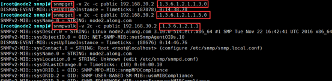

 

### 2、配置SNMP监控

（1）下载，修改配置文件

vim /etc**/snmp/snmpd.conf**

```
view    systemview    included   .1.3.6.1.2.1.1
view    systemview    included   .1.3.6.1.2.1.2   # 网络接口的相关数据
view    systemview    included   .1.3.6.1.4.1.2021   # 系统资源负载，memory, disk io, cpu load 
view    systemview    included   .1.3.6.1.2.1.25
```

（2）在agent 上测试

snmpget -v 2c -c public 192.168.30.2 .1.3.6.1.2.1.1.3.0

snmpget -v 2c -c public 192.168.30.2 .1.3.6.1.2.1.1.5.0


 

（3）在监控页面，给node2加一个snmp的接口

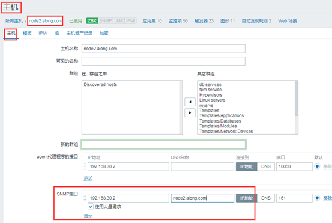

（4）在node2上加一个 Template OS Linux SNMPv2 模板


模板添加成功，生成一系列东西


点开一个item 看一下


 

（5）生成一些最新数据的图形graph了


 

### 3、设置入站出站packets 的SNMP监控

（1）监控网络设备：交换机、路由器的步骤：

① 把交换机、路由器的SNMP 把对应的OID的分支启用起来

② 了解这些分支下有哪些OID，他们分别表示什么意义

③ 我们要监控的某一数据：如交换机的某一个接口流量、报文，发送、传入传出的报文数有多少个；传入传出的字节数有多少个，把OID取出来，保存

 

（2）定义入站出站的item监控项

interface traffic packets(in)


interface traffic packets(out)


 

## 10、JMX接口


### 1、介绍

（1）介绍

Java虚拟机(JVM)具有内置的插装，使您能够使用JMX监视和管理它。您还可以使用JMX监视工具化的应用程序。

（2）配置设置介绍

① zabbix-java-gateway主机设置：

　　安装 zabbix-java-gateway程序包，启动服务；

　　yum -y install zabbix-java-gateway

② zabbix-server端设置（需要重启服务）：

　　**JavaGateway=**172.16.0.70

　　**JavaGatewayPort=**10052

　　**StartJavaPollers=**5 #监控项

③ tomcat主机设置：

　　 监控tomcat：

　　　　 /etc/sysconfig/tomcat，添加

　　**CATALINA_OPTS**="-Djava.rmi.server.hostname=TOMCAT_SERVER_IP -Djavax.management.builder.initial= -Dcom.sun.management.jmxremote=true -Dcom.sun.management.jmxremote.port=12345 -Dcom.sun.management.jmxremote.ssl=false -Dcom.sun.management.jmxremote.authenticate=false"   #启用JVM接口，默认没有启用

 

　　添加监控项：

　　　　jmx[object_name,attribute_name]

　　　　　　object name - 它代表MBean的对象名称

　　　　　　attribute name - 一个MBean属性名称，可选的复合数据字段名称以点分隔

　　　　示例：

　　　　　　 jmx["java.lang:type=Memory","HeapMemoryUsage.used"]

 

④ jmx的详细文档：https://docs.oracle.com/javase/1.5.0/docs/guide/management/agent.html

 

### 2、配置JVM接口监控

（1）安装配置tomcat

① 下载安装tomcat，主要是用JVM

yum -y install **java-1.8.0-openjdk-devel tomcat-admin-webapps tomcat-docs-webapp**

② 加CATALINA_OPTS= #启用JVM接口，默认没有启用

vim /etc/sysconfig/tomcat

```
CATALINA_OPTS="-Djava.rmi.server.hostname=192.168.30.2 -Djavax.management.builder.initial= -Dcom.sun.management.jmxremote=true   -Dcom.sun.management.jmxremote.port=12345  -Dcom.sun.management.jmxremote.ssl=false  -Dcom.sun.management.jmxremote.authenticate=false"
```

③ 开启服务

systemctl start tomcat

 

（2）在**zabbix-server 端**，安装配置java-gateway

① 安装配置java-gateway

yum -y install zabbix-java-gateway

/etc/zabbix/zabbix_java_gateway.conf 安装完后，会生成一个java_gateway 的配置文件

systemctl start zabbix-java-gateway.service 不用修改，直接开启服务

 

② 修改server 配置，开启java-gateway的配置

vim /etc/zabbix/**zabbix_server.conf**

```
JavaGateway=192.168.30.107  
JavaGatewayPort=10052
StartJavaPollers=5    #打开5个监控项
```

③ systemctl restart zabbix-server 重启zabbix-server 服务

 

（3）在node2 主机上添加JMX接口，实验模板

① 添加JMX接口


② 在node2 上连接tomcat JMX 模板


③ 随便查看一个监控项item


 

（4）自己定义一个堆内存使用的监控项，基于JVM接口（没必要，使用模板就好）


 

## 11、分布式监控


### 1、介绍

（1）介绍

分布式监控概述

　　proxy and node

Zabbix 的三种架构

　　Server-agent

　　Server-Node-agent

　　Server-Proxy-agent

监控Zabbix

 

（2）配置介绍

Zabbix Proxy的配置：

　　server-node-agent

　　server-proxy-agent

a) 配置proxy主机：

(1) 安装程序包

​    zabbix-proxy-mysql zabbix-get

​    zabbix-agent zabbix-sender

(2) 准备数据库

　　创建、授权用户、导入schema.sql；

(3) 修改配置文件

　　Server=

　　　　zabbix server主机地址；

　　Hostname=

　　　　当前代理服务器的名称；在server添加proxy时，必须使用此处指定的名称；

　　　　=需要事先确保server能解析此名称；

　　DBHost=

　　DBName=

　　DBUser=

　　DBPassword=

 

　　ConfigFrequency=10

　　DataSenderFrequency=1

 

b) 在server端添加此Porxy

​    Administration --> Proxies

 

c) 在Server端配置通过此Proxy监控的主机；

注意：zabbix agent端要允许zabbix proxy主机执行数据采集操作：

 

### 2、实现分布式zabbix proxy监控

实验前准备：

① ntpdate 172.168.30.1 同步时间

② 关闭防火墙，selinux

③ 设置主机名 hostnamectl set-hostname zbproxy.along.com

④ vim /etc/hosts 每个机器都设置hosts，以解析主机名；DNS也行

192.168.30.107 server.along.com

192.168.30.7 node1.along.com

192.168.30.2 node2.along.com

192.168.30.3 node3.along.com zbproxy.along.com


（1）环境配置（4台主机）

| 机器名称      | IP配置         | 服务角色  |
| ------------- | -------------- | --------- |
| zabbix-server | 192.168.30.107 | 监控      |
| agent-node1   | 192.168.30.7   | 被监控端  |
| agent-node2   | 192.168.30.2   | 被监控端  |
| node3         | 192.168.30.3   | 代理proxy |

 

zabbix-server 直接监控一台主机node1

zabbix-server 通过代理node3 监控node2

 

（2）在node3 上配置mysql

① 创建配置mysql

vim /etc/my.cnf.d/server.cnf

```
[server]
skip_name_resolve = on
innodb_file_per_table = on
innodb_buffer_pool_size = 256M
max_connections = 2000
log-bin = master-log
```

② systemctl start mariadb 开启服务

③ 创建数据库 和 授权用户

```
MariaDB [(none)]> create database zbxproxydb character set 'utf8';
MariaDB [(none)]> grant all on zbxproxydb.* to 'zbxproxyuser'@'192.168.30.%' identified by 'zbxproxypass';
MariaDB [(none)]> flush privileges;
```

（3）在node3 上下载zabbix 相关的包，主要是代理proxy的包

yum -y install **zabbix-proxy-mysql** zabbix-get zabbix-agent zabbix-sender

 

a) **初始化数据库**

zabbix-proxy-mysql 包里带有，导入数据的文件


cp /usr/share/doc/zabbix-proxy-mysql-3.4.4/schema.sql.gz ./ 复制

gzip -d schema.sql.gz 解包

mysql -root -p zbxproxydb < schema.sql 导入数据

 

b) 查看数据已经生成


 

（4）配置proxy端

① vim /etc/zabbix/zabbix_proxy.conf


```
Server=192.168.30.107   #server 的IP
ServerPort=10051   #server 的端口

Hostname=zbxproxy.along.com   #主机名
ListenPort=10051    #proxy自己的监听端口
EnableRemoteCommands=1    #允许远程命令
LogRemoteCommands=1    #记录远程命令的日志

数据的配置
DBHost=192.168.30.3
DBName=zbxproxydb  
DBUser=zbxproxyuser
DBPassword=zbxproxypass

ConfigFrequency=30    #多长时间，去服务端拖一次有自己监控的操作配置；为了实验更快的生效，这里设置30秒，默认3600s
DataSenderFrequency=1   #每一秒向server 端发一次数据，发送频度
```

② systemctl start zabbix-proxy 开启服务

 

（5）配置node2端，允许proxy代理监控

vim /etc/zabbix/zabbix_agentd.conf

```
Server=192.168.30.107,192.168.30.3
ServerActive=192.168.30.107,192.168.30.3
```

systemctl restart zabbix-agent 启动服务

 

（6）把代理加入监控server，创建配置agent 代理

① 创建agent 代理


② 配置


 

（7）创建node2 主机，并采用代理监控

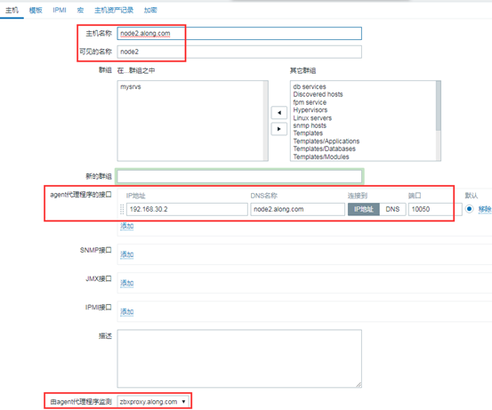

设置代理成功


 

（8）创建item监控项

① 为了实验，随便创一个监控项 CPU Switches


② 进程里设置每秒更改

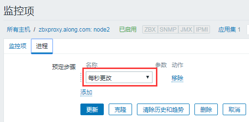

③ 成功，graph 图形生成


 

## 12、查询使用网上模板监控

### 1、官方的share分享网站

https://share.zabbix.com/zabbix-tools-and-utilities

例如：我们要实现监控Nginx ，我们查找一个模板


就以这个模板为例


 

### 2、在node1 上使用此模板

（1）安装配置 nginx

① yum -y install nginx

vim /etc/nginx/nginx.conf 按照网页的操作指示

```
location /stub_status {
        stub_status on;
        access_log off;
    #    allow 127.0.0.1;   #为了操作方便，我取消的访问控制
    #    deny all;
}
```


② 启动服务

systemctl restart nginx

（2）下载模板所依赖的脚本


mkdir -p /srv/zabbix/libexec/

cd /srv/zabbix/libexec/

wget https://raw.githubusercontent.com/oscm/zabbix/master/nginx/nginx.sh 从网页上获取脚本

chmod +x nginx.sh 加执行权限

 

（3）配置agent 的用户参数UserParameter

cd /etc/zabbix/zabbix_agentd.d/

wget https://raw.githubusercontent.com/oscm/zabbix/master/nginx/userparameter_nginx.conf 很短，自己写也行

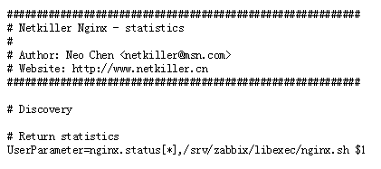

（4）在windows 上下载模板，并导入这server 的模板中

wget https://raw.githubusercontent.com/oscm/zabbix/master/nginx/zbx_export_templates.xml 可以现在linux上下载，再sz 导出到windows上


① 导入下载的模板

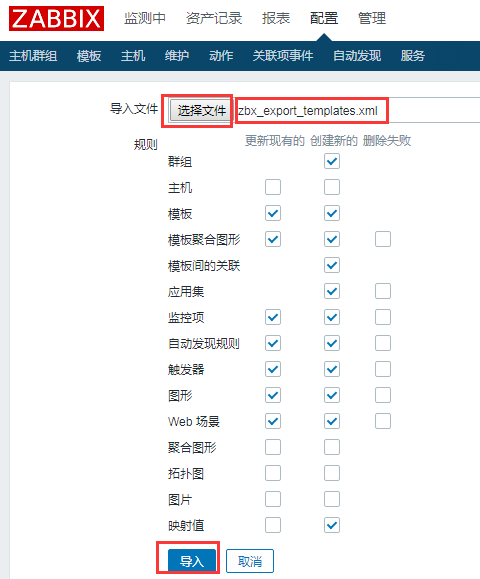

② 主机node1 链接这个模板


③ 模板生效


 

## 13、zabbix-server 监控自己，数据库，nginx

### 1、下载安装，配置agent

vim /etc/zabbix/zabbix_agentd.conf 配置agent

```
EnableRemoteCommands=1    允许远程命令
LogRemoteCommands=1    记录远程命令
Server=127.0.0.1
ServerActive=127.0.0.1
Hostname=server.along.com
```

### 2、自动生成Zabbix server 的主机


### 3、在主机中添加模板


### 4、启用Zabbix server


### 5、监控到数据

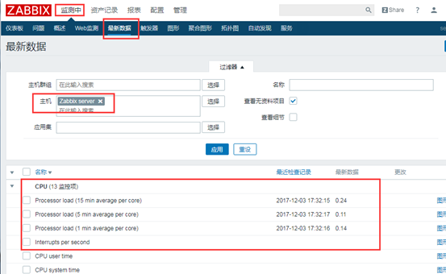

 

## 14、调优

### 1、调优

① Database：

　　历史数据不要保存太长时长；

　　尽量让数据缓存在数据库服务器的内存中；

② 触发器表达式：**减少使用聚合函数** min(), max(), avg()；尽量使用last()，nodata()；

　　因为聚合函数，要运算

③ 数据收集：polling较慢(减少使用SNMP/agentless/agent）；**尽量使用trapping（agent(active）主动监控）；**

④ 数据类型：文本型数据处理速度较慢；**尽量少**收集类型为**文本** text或string类型的数据；**多使用**类型为numeric **数值型数据** 的；

### 2、zabbix服务器的进程

(1) 服务器组件的数量；

　　alerter, discoverer, escalator, http poller, hourekeeper, icmp pinger, ipmi polller, poller, trapper, configration syncer, ...

 

　　StartPollers=60

　　StartPingers=10

　　...

　　StartDBSyncer=5

　　...

 

(2) 设定合理的缓存大小

　　 CacheSize=8M

　　 HistoryCacheSize=16M

　　 HistoryIndexCacheSize=4M

　　 TrendCacheSize=4M

　　 ValueCacheSize=4M

 

(3) 数据库优化

　　分表：

　　　　history_*

　　　　trends*

　　　　events*

 

### 3、其它解决方案

grafana：展示

collectd：收集

influxdb：存储

 

grafana+collectd+influxdb

 

prometheus：

　　 exporter：收集

　　 alertmanager:

grafana：展示

 

openfalcon