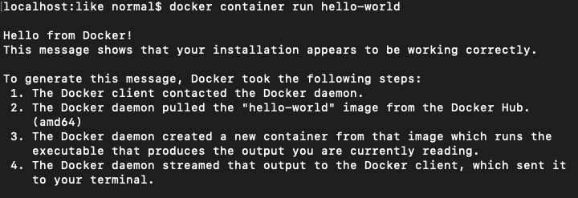

[TOC]
## 一、docker要解决什么问题？
### 环境配置的难题
开发环境、测试环境、线上环境……用户计算机的环境都不相同，你怎么知道自家的软件，能在那些机器跑起来？比如测试组经常说你给的软件跑不通……，应付的一种回答就是"它在我的机器上可以跑的"（It works on my machine），言下之意就是，其他机器很可能跑不了。


### 不一致的根因
操作系统的设置，各种库和组件的安装。只有它们都正确，软件才能运行。例如，安装一个Django应用，计算机必须有Python引擎，还必须有Django依赖，会有各种版本不兼容的问题，可能还要配置环境变量。

另外，多个开发者共用一个开发服务器时，配置文件、端口，进程都有冲突的可能。

环境配置如此麻烦，换一台机器，就要重来一次，旷日费时。很多人想到，能不能从根本上解决问题，软件可以带环境安装？也就是说，安装的时候，把原始环境一模一样地复制过来。

## 二、docker有哪些好处
### 将软件和环境封装成容器
Docker 属于 Linux 容器的一种封装，提供简单易用的容器使用接口。它是目前最流行的 Linux 容器解决方案。

Docker 将应用程序与该程序的依赖，打包在一个文件里面。运行这个文件，就会生成一个虚拟容器。程序在这个虚拟容器里运行，就好像在真实的物理机上运行一样。有了 Docker，就不用担心环境问题。

总体来说，Docker 的接口相当简单，用户可以方便地创建和使用容器，把自己的应用放入容器。容器还可以进行版本管理、复制、分享、修改，就像管理普通的代码一样。

### 和虚拟机的区别

虚拟机（virtual machine）就是带环境安装的一种解决方案。它可以在一种操作系统里面运行另一种操作系统，比如在 Windows 系统里面运行 Linux 系统。应用程序对此毫无感知，因为虚拟机看上去跟真实系统一模一样，而对于底层系统来说，虚拟机就是一个普通文件，不需要了就删掉，对其他部分毫无影响。
*（1）资源占用多

虚拟机会独占一部分内存和硬盘空间。它运行的时候，其他程序就不能使用这些资源了。哪怕虚拟机里面的应用程序，真正使用的内存只有 1MB，虚拟机依然需要几百 MB 的内存才能运行。

*（2）冗余步骤多

虚拟机是完整的操作系统，一些系统级别的操作步骤，往往无法跳过，比如用户登录。

*（3）启动慢

启动操作系统需要多久，启动虚拟机就需要多久。可能要等几分钟，应用程序才能真正运行。

Linux 容器（Linux Containers，缩写为 LXC）。

**Linux 容器不是模拟一个完整的操作系统，而是对进程进行隔离**。或者说，在正常进程的外面套了一个保护层。对于容器里面的进程来说，它接触到的各种资源都是虚拟的，从而实现与底层系统的隔离。

由于容器是进程级别的，相比虚拟机有很多优势。
*（1）启动快

容器里面的应用，直接就是底层系统的一个进程，而不是虚拟机内部的进程。所以，启动容器相当于启动本机的一个进程，而不是启动一个操作系统，速度就快很多。

*（2）资源占用少

容器只占用需要的资源，不占用那些没有用到的资源；虚拟机由于是完整的操作系统，不可避免要占用所有资源。另外，多个容器可以共享资源，虚拟机都是独享资源。

*（3）体积小

容器只要包含用到的组件即可，而虚拟机是整个操作系统的打包，所以容器文件比虚拟机文件要小很多。

Docker来防止运维被开发甩锅。

总之，容器有点像轻量级的虚拟机，能够提供虚拟化的环境，但是成本开销小得多。

## 三、docker的用途


Docker 的主要用途，目前有三大类。

（1）提供一次性的环境。比如，本地测试他人的软件、持续集成的时候提供单元测试和构建的环境。

（2）提供弹性的云服务。因为 Docker 容器可以随开随关，很适合动态扩容和缩容。

（3）组建微服务架构。通过多个容器，一台机器可以跑多个服务，因此在本机就可以模拟出微服务架构。

## 四、docker的安装

Docker 是一个开源的商业产品，有两个版本：社区版（Community Edition，缩写为 CE）和企业版（Enterprise Edition，缩写为 EE）。企业版包含了一些收费服务，个人开发者一般用不到。
docker.io以及docker-engine都是比较老的版本，目前最常用的就是docker-ce，社区版简称CE。
2017年启用新版本号结构：<年>.<月>.<补丁版本号>。2017年以前版本是1.12 ，那紧接着的版本就是17.06，有些企业用到了1.12，听你说用到了19。面试时被问到一定不要怀疑，你可以给面试官解释。并且每季度发布一个稳定版本，03、06、09才是稳定版本，生产环境一定用到的是这3个次版本号。
下面的介绍都针对社区版。

Docker CE 的安装请参考[官方文档](https://docs.docker.com/)。
准备工作
```bash
$ sudo yum install -y yum-utils device-mapper-persistent-data lvm2
```
添加 Docker 仓库
```bash
$ sudo yum-config-manager --add-repo https://download.docker.com/linux/centos/docker-ce.repo
```
查看可下载版本
```bash
$ yum list docker-ce --showduplicates | sort -r
```
下载最新版本
```bash
$ sudo yum install -y docker-ce
```


安装完成后，运行下面的命令，验证是否安装成功。

```shell
$ docker version
$ docker info
```
Docker 需要用户具有 sudo 权限，为了避免每次命令都输入sudo，可以把用户加入 Docker 用户组（[官方文档](https://docs.docker.com/install/linux/linux-postinstall/#manage-docker-as-a-non-root-user)）。

```
$ sudo usermod -aG docker $USER
```
Docker 是服务器----客户端架构。命令行运行docker命令的时候，需要本机有 Docker 服务。如果这项服务没有启动，可以用下面的命令启动（[官方文档](https://docs.docker.com/config/daemon/systemd/)）。

```shell
# service 命令的用法
$ sudo service docker start

# systemctl 命令的用法
$ sudo systemctl start docker
```

## 五、image 文件
**Docker 把应用程序及其依赖，打包在 image 文件里面。**只有通过这个文件，才能生成 Docker 容器。image 文件可以看作是容器的模板。Docker 根据 image 文件生成容器的实例。同一个 image 文件，可以生成多个同时运行的容器实例。

实际开发中，一个 image 文件往往通过继承另一个 image 文件，加上一些个性化设置而生成。举例来说，你可以在 Ubuntu 的 image 基础上，往里面加入 Apache 服务器，形成你的 image。

```shell
# 列出本机的所有 image 文件。
$ docker image ls

# 删除 image 文件
$ docker image rm [imageName]
```
image 文件是通用的，一台机器的 image 文件拷贝到另一台机器，照样可以使用。一般来说，为了节省时间，我们应该尽量使用别人制作好的 image 文件，而不是自己制作。即使要定制，也应该基于别人的 image 文件进行加工，而不是从零开始制作。

为了方便共享，image 文件制作完成后，可以上传到网上的仓库。Docker 的官方仓库 [Docker Hub](https://hub.docker.com/) 是最重要、最常用的 image 仓库。此外，出售自己制作的 image 文件也是可以的。

## 六、实例：hello world
下面，我们通过最简单的 image 文件"hello world"，感受一下 Docker。

需要说明的是，国内连接 Docker 的官方仓库很慢，还会断线，需要将默认仓库改成国内的镜像网站，具体的修改方法在下一篇文章的第一节。有需要的朋友，可以先看一下。

首先，运行下面的命令，将 image 文件从仓库抓取到本地。

```shell
$ docker image pull library/hello-world
```
上面代码中，`docker image pull`是抓取 image 文件的命令。`library/hello-world`是 image 文件在仓库里面的位置，其中`library`是 image 文件所在的组，`hello-world`是 image 文件的名字。

由于 Docker 官方提供的 image 文件，都放在`library`组里面，所以它的是默认组，可以省略。因此，上面的命令可以写成下面这样。

```shell
$ docker image pull hello-world
```
抓取成功以后，就可以在本机看到这个 image 文件了。

```shell
$ docker image ls
```
现在，运行这个 image 文件。

```shell
$ docker container run hello-world
```
`docker container run`命令会从 image 文件，生成一个正在运行的容器实例。

注意，`docker container run`命令具有自动抓取 image 文件的功能。如果发现本地没有指定的 image 文件，就会从仓库自动抓取。因此，前面的`docker image pull`命令并不是必需的步骤。

如果运行成功，你会在屏幕上读到下面的输出。


输出这段提示以后，`hello world`就会停止运行，容器自动终止。

当利用 docker run 来创建容器时，Docker 在后台运行的标准操作包括：

*检查本地是否存在指定的镜像，不存在就从公有仓库下载
*利用镜像创建并启动一个容器
*分配一个文件系统，并在只读的镜像层外面挂载一层可读写层
*从宿主主机配置的网桥接口中桥接一个虚拟接口到容器中去
*从地址池配置一个 ip 地址给容器
*执行用户指定的应用程序
*执行完毕后容器被终止

有些容器不会自动终止，因为提供的是服务。比如，安装运行 Ubuntu 的 image，就可以在命令行体验 Ubuntu 系统。

```bash
$ docker container run -it ubuntu bash
```
对于那些不会自动终止的容器，必须使用`docker container kill` 命令手动终止。

```bash
$ docker container kill [containID]
```

## 七、容器文件
**image 文件生成的容器实例，本身也是一个文件，称为容器文件。**也就是说，一旦容器生成，就会同时存在两个文件： image 文件和容器文件。而且关闭容器并不会删除容器文件，只是容器停止运行而已。

```shell
# 列出本机正在运行的容器
$ docker container ls

# 列出本机所有容器，包括终止运行的容器
$ docker container ls --all
```
上面命令的输出结果之中，包括容器的 ID。很多地方都需要提供这个 ID，比如上一节终止容器运行的`docker container stop`命令。

终止运行的容器文件，依然会占据硬盘空间，可以使用`docker container rm`命令删除。

```shell
$ docker container rm [containerID]
```
运行上面的命令之后，再使用`docker container ls --all`命令，就会发现被删除的容器文件已经消失了。

## 八、Dockerfile 文件
学会使用 image 文件以后，接下来的问题就是，如何可以生成 image 文件？如果你要推广自己的软件，势必要自己制作 image 文件。

这就需要用到 Dockerfile 文件。它是一个文本文件，用来配置 image。Docker 根据 该文件生成二进制的 image 文件。

下面通过一个实例，演示如何编写 Dockerfile 文件。


## 九、实例：制作自己的Docker容器
下面我以 django-blog 项目为例，介绍怎么写Dockerfile， 实现让用户在Docker容器里运行blog服务。
作为准备工作，请先[下载源码](https://gitlab.com/horizon365/ichat)：
```shell
git clone https://gitlab.com/horizon365/ichat.git
cd ichat
```
### 1.编写Dockerfile文件
在项目的根目录下，新建一个文本文件 Dockerfile，写入下面的内容。
```shell
FROM python:3.6.4
COPY . /app
WORKDIR /app
RUN pip3 install -r req.txt
EXPOSE 8000
```
上面代码一共五行，含义如下。

* FROM python:3.6.4：该 image 文件继承官方的 python，冒号表示标签，这里标签是3.6.4，即3.6.4版本的 python。
* COPY . /app：将当前目录下的所有文件（除了.dockerignore排除的路径），都拷贝进入 image 文件的/app目录。
* WORKDIR /app：指定接下来的工作路径为/app。
* RUN pip3 install -r req.txt：在/app目录下，运行pip install命令安装依赖。注意，安装后所有的依赖，都将打包进入 image 文件。
* EXPOSE 8000：将容器 8000 端口暴露出来， 允许外部连接这个端口。
### 2.创建image文件
有了 Dockerfile 文件以后，就可以使用`docker image build`命令创建 image 文件了。
```shell
docker image build -t django_blog:0908 .
```
上面代码中，-t参数用来指定 image 文件的名字，后面还可以用冒号指定标签。如果不指定，默认的标签就是latest。最后的那个点表示 Context 的路径，上例是当前路径，所以是一个点。

如果运行成功，就可以看到新生成的 image 文件django_blog 了。

### 3.生成容器
`docker container run`命令会从 image 文件生成容器。

```shell
$ docker container run -p 8000:8000 -it django_blog:0908 bash  #-it 后面必须跟 bash
```
上面命令的各个参数含义如下：

* -p参数：容器的 8000 端口映射到本机的 8000 端口。
* -it参数：容器的 Shell 映射到当前的 Shell，然后你在本机窗口输入的命令，就会传入容器。-t 选项让Docker分配一个伪终端（pseudo-tty）并绑定到容器的标准输入上， -i 则让容器的标准输入保持打开。
* -d则是让容器在后台运行
* django_blog:0908：image 文件的名字（如果有标签，还需要提供标签，默认是 latest 标签）。
* /bin/bash：容器启动以后，内部第一个执行的命令。这里是启动 Bash，保证用户可以使用 Shell。

如果一切正常，运行上面的命令以后，就会返回一个命令行提示符。

```shell
root@4fe16f46aae3:/app#
```
这表示你已经在容器里面了，返回的提示符就是容器内部的 Shell 提示符。执行下面的命令。

```shell
root@4fe16f46aae3:/app# python manage.py runserver 0.0.0.0:8000
```
这时，blog 框架已经运行起来了。打开本机的浏览器，访问 http://127.0.0.1:8000，网页显示"Not Found"，这是因为这个 demo的根路径 没有写路由。

这个例子中，Django 进程运行在 Docker 容器的虚拟环境里面，进程接触到的文件系统和网络接口都是虚拟的，与本机的文件系统和网络接口是隔离的，因此需要定义容器与物理机的端口映射（map）。

现在，在容器的命令行，按下 Ctrl + c 停止 Django 进程，然后按下 Ctrl + d （或者输入 exit）退出容器。此外，也可以用docker container kill终止容器运行。
```shell
# 在本机的另一个终端窗口，查出容器的 ID
$ docker container ls

# 停止指定的容器运行
$ docker container kill [containerID]
```
容器停止运行之后，并不会消失，用下面的命令删除容器文件。
```shell
# 查出容器的 ID
$ docker container ls --all

# 删除指定的容器文件
$ docker container rm [containerID]
```
也可以使用docker container run命令的--rm参数，在容器终止运行后自动删除容器文件。
```shell
$ docker container run --rm -p 8000:8000 -it django_blog:0908 bash
```
### 4. CMD命令
上一节的例子里面，容器启动以后，需要手动输入命令`python manage.py runserver 0.0.0.0:8000`。我们可以把这个命令写在 Dockerfile 里面，这样容器启动以后，这个命令就已经执行了，不用再手动输入了。
```
FROM python:3.6.4
COPY . /app
WORKDIR /app
RUN pip3 install -r req.txt
EXPOSE 8000
CMD python manager.py runserver 0.0.0.0:8000
```
上面的 Dockerfile 里面，多了最后一行`CMD python manager.py runserver 0.0.0.0:8000`，它表示容器启动后自动执行`python manager.py runserver 0.0.0.0:8000`。

你可能会问，`RUN`命令与`CMD`命令的区别在哪里？简单说，`RUN`命令在 image 文件的构建阶段执行，执行结果都会打包进入 image 文件；`CMD`命令则是在容器启动后执行。另外，一个 Dockerfile 可以包含多个`RUN`命令，但是只能有一个`CMD`命令。

注意，指定了`CMD`命令以后，`docker container run`命令就不能附加命令了（比如前面的`/bin/bash`），否则它会覆盖`CMD`命令。现在，启动容器可以使用下面的命令。

```shell
$ docker container run --rm -p 8000:8000 d django_blog:0908  
```

反例如下，如果使用  -it    bash  ，会导致bash覆盖掉 CMD命令

```shell 
$ docker container run --rm -p 8000:8000 -it django_blog:0908 bash    #反例
```
 ### 5.发布image文件
 容器运行成功后，就确认了 image 文件的有效性。这时，我们就可以考虑把 image 文件分享到网上，让其他人使用。
 首先，去 hub.docker.com 或 cloud.docker.com 注册一个账户。然后，用下面的命令登录。
```shell
$ docker login
```
接着，为本地的 image 标注用户名和版本。

```shell
$ docker image tag [imageName] [username]/[repository]:[tag]
# 实例
$ docker image tag django_blog:0908 horizon365/kdjango_blog:0908
```
也可以不标注用户名，重新构建一下 image 文件。

```shell
$ docker image build -t [username]/[repository]:[tag] .
```
最后，发布 image 文件。

```shell
$ docker image push [username]/[repository]:[tag]
```
发布成功以后，登录 hub.docker.com，就可以看到已经发布的 image 文件。
### 6. 其它有用的命令
docker 的主要用法就是上面这些，此外还有几个命令，也非常有用。

*（1）docker container start

前面的docker container run命令是新建容器，每运行一次，就会新建一个容器。同样的命令运行两次，就会生成两个一模一样的容器文件。如果希望重复使用容器，就要使用docker container start命令，它用来启动已经生成、已经停止运行的容器文件。

```shell
$ docker container start [containerID]
```
*（2）docker container stop

前面的docker container kill命令终止容器运行，相当于向容器里面的主进程发出 SIGKILL 信号。而docker container stop命令也是用来终止容器运行，相当于向容器里面的主进程发出 SIGTERM 信号，然后过一段时间再发出 SIGKILL 信号。

```shell
$ bash container stop [containerID]
```
这两个信号的差别是，应用程序收到 SIGTERM 信号以后，可以自行进行收尾清理工作，但也可以不理会这个信号。如果收到 SIGKILL 信号，就会强行立即终止，那些正在进行中的操作会全部丢失。

*（3）docker container logs

docker container logs命令用来查看 docker 容器的输出，即容器里面 Shell 的标准输出。如果docker run命令运行容器的时候，没有使用-it参数，就要用这个命令查看输出。

```shell
$ docker container logs [containerID]
```
*（4）docker container exec

docker container exec命令用于进入一个正在运行的 docker 容器。如果docker run命令运行容器的时候，没有使用-it参数，就要用这个命令进入容器。一旦进入了容器，就可以在容器的 Shell 执行命令了。

```shell
$ docker container exec -it [containerID] /bin/bash
```
老手和新手的区别首先在于分清楚容器内外的路径，容器内和容器外的进程。
可以在Dockerfile里配置`PS1`的环境变量，这是交互式命令后的提示符格式。

*（5）docker container cp

docker container cp命令用于从正在运行的 Docker 容器里面，将文件拷贝到本机。下面是拷贝到当前目录的写法。

```shell
$ docker container cp [containID]:[/path/to/file] .
```

* (6) docker export

将容器内的文件全部拷贝到宿主机指定目录，相当于快照文件。下面是拷贝到xx.tar的写法。
```shell
docker export [containID] > xx.tar
```
 用解压软件打开tar能看到容器内原有的目录树结构。

* （7）docker import

对应于export命令，将export出来的文件重新导入成一个image文件。
```shell
$ cat xx.tar | docker import - demo/ubuntu:v1.0

```
使用网络地址导入
```shell
$ docker import http://example.com/exampleimage.tgz demo/ubuntu:v1.0
```
import 和 export 的做法，实际上是将一个容器来保存为 tar 文件，然后在导入为镜像。这样制作的镜像同样是黑箱镜像，不应该使用。而且这类导入导出会导致原有分层丢失，合并为一层，而且会丢失很多相关镜像元数据或者配置，比如 CMD 命令就可能丢失，导致镜像无法直接启动。
* (8) docker save
镜像存储，将镜像内的目录树以及打包时历史记录和元数据信息全部保存下来。
```shell
docker save demo/ubuntu:v1.0 -o ubuntu_demo.tar
```
* (9) docker load

```shell
docker load -i ubuntu_demo.tar
```
* 用户既可以使用 docker load 来导入镜像存储文件到本地镜像库，也可以使用 docker import 来导入一个容器快照到本地镜像库。这两者的区别在于容器快照文件将丢弃所有的历史记录和元数据信息（即仅保存容器当时的快照状态），而镜像存储文件将保存完整记录，体积也要大。此外，从容器快照文件导入时可以重新指定标签等元数据信息。

* (10) docker container prune
关闭全部终止状态的容器
