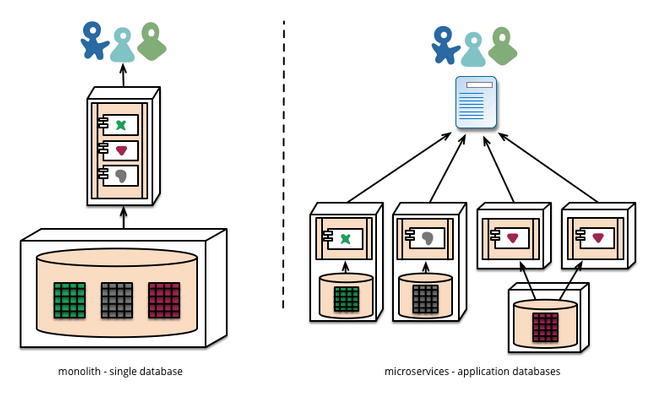
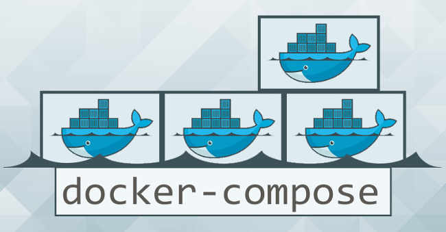

[TOC]
站在Docker的角度，软件就是容器的组合：业务逻辑容器、数据库容器、存储容器、队列容器……Docker使得软件可以拆分成若干个标准化容器，然后像搭积木一样组合起来。

这正是微服务的思想：软件把任务外包出去，让各种外部服务完成这些任务，软件本身只是底层服务的调度中心和组装层。

微服务很适合用Docker容器实现，每个容器承载一个服务。一台计算机同时运行多个容器，从而能轻松地模拟出复杂的微服务架构。




云计算是基于微服务的，微服务是云计算的基石。常见的云计算框架有k8s
，而k8s是对很多个Docker容器的管理。

下面介绍，如何在一台计算机上实现多个服务，让它们互相配合，组合出一个应用程序。


这里选择的是我们下一个课程要学习的项目Blog，它的架构比较简单，只要2个容器就够了（业务容器 + 数据库容器）。很容易入门，并且具有通用性，许多应用程序都可以复用。

我们采用两种方法，演示如何架构 Django网站。
* 方法 A: 自建Django 容器,mysql容器
* 方法 B: 采用Docker Compose 工具

## 一、预备工作：image仓库的镜像网址
本教程需要从仓库下载 image 文件，但是国内访问 Docker 的官方仓库很慢，还经常断线，所以要把仓库网址改成国内的镜像站。这里推荐使用三方镜像加速 http://f1361db2.m.daocloud.io 。下面是我的 Debian 系统的默认仓库修改方法，其他系统的修改方法参考[官方文档](https://www.docker-cn.com/registry-mirror)。

打开/etc/default/docker文件（需要sudo权限），在文件的底部加上一行。

```shell
DOCKER_OPTS="--registry-mirror=http://f1361db2.m.daocloud.io"
```
然后，重启 Docker 服务。

```shell
$ sudo service docker restart
```
现在就会自动从镜像仓库下载 image 文件了。

## 二、方法 A:自建 Django和mysql容器

创建自定义网络：
docker network create gtsb
### 2.1 python:3.6.4 image + mysqlclient
首先，新建一个工作目录，并进入该目录。

```
$ mkdir docker-demo && cd docker-demo
```
在`req.txt`中增加一行：
```
mysqlclient
```
并修改`settings.py`中的数据库配置：
```py
    'default': {
        'ENGINE': 'django.db.backends.mysql',
        'NAME': 'blog',  # 和mysql容器参数对应
        'USER': 'root',  # 和mysql容器参数对应
        'PASSWORD': '123456', # 和mysql容器参数对应
        'HOST': '127.0.0.1',
        'PORT': '5432',
    },
```
然后，按照之前学习的重新打包一个Django image。
```
$ docker container run \
  -d  --name  djangowithmysql \
  -e MYSQL_ROOT_PASSWORD=123456 \
  -e MYSQL_DATABASE=blog \
  -e HOST=mysql \
  -p 8000:8000  \
  10.36.145.100:5000/qianfeng/django_blog:0920
```
该命令的三个参数含义如下。

* --rm：停止运行后，自动删除容器文件。
* --name django_blog：容器的名字叫做django_blog。
* --volume "$PWD/":/app：将当前目录（$PWD）映射到容器的/app。因此，当前目录的任何修改，都会反映到容器里面，进而被外部访问到。

会有一个报错：

```
django.db.utils.OperationalError: (2003, "Can't connect to MySQL server on '127.0.0.1' (111)")
```
因为django容器还不能和mysql容器通讯。setting.py里的文件要改HOST变量为实际的mysql地址。

### 2.2 官方的MySQL容器
这里Django服务要求有MySQL服务，所以必须新建 MySQL 容器。

打开一个新的命令行窗口，执行下面的命令。

```
$ docker container run \
  -d \
  --rm \
  --name djangodb \
  --network gtsb   \
  --env MYSQL_ROOT_PASSWORD=123456 \
  --env MYSQL_DATABASE=blog \
  10.36.145.100:5000/mysql:5.7 \
  --character-set-server=utf8
```
上面的命令会基于 MySQL 的 image 文件（5.7版本）新建一个容器。该命令的五个命令行参数的含义如下。
* -d：容器启动后，在后台运行。
* --rm：容器终止运行后，自动删除容器文件。
* --name djangodb：容器的名字叫做djangodb
* --network gtsb: 连接自定义桥接网络gtsb
* --env MYSQL_ROOT_PASSWORD=123456：向容器进程传入一个环境变量MYSQL_ROOT_PASSWORD，* 该变量会被用作 MySQL 的根密码。
* --env MYSQL_DATABASE=blog：向容器进程传入一个环境变量MYSQL_DATABASE，容器里面的 MySQL 会根据该变量创建一个同名数据库（本例是blog）。
* --character-set-server=utf8: 设定服务端的字符编码格式为utf8

运行上面的命令以后，正常情况下，命令行会显示一行字符串，这是容器的 ID，表示已经新建成功了。

这时，使用下面的命令查看正在运行的容器，你应该看到django_blog和djangodb两个容器正在运行。

```
$ docker container ls
```
其中，djangodb是后台运行的，前台看不见它的输出，必须使用下面的命令查看。

```
$ docker container logs djangodb
```

### 2.3 Django容器连接MySQL
之前的Django容器默认使用的本机sqlite数据库，随着业务扩张的需要，现在改为独立的MySQL容器。
首先修改setting.py的配置文件使Django知道mysql的配置信息。
重新打包 镜像 djangowithmysql image，重新新建一个 django容器。

```
$ docker container run \
  -d  --name djangowithmysql \
  -e MYSQL_ROOT_PASSWORD=123456 \
  -e MYSQL_DATABASE=blog \
  -e HOST=mysql \
  --network gtsb \
  -p 8000:8000  \
  10.36.145.100:5000/qianfeng/django_blog:0920
```
跟上一次相比，上面的命令多了一个参数--link djangodb:mysql，表示 Django 容器要连到djangodb容器，冒号表示该容器的别名是mysql。
至此，自建 Django 容器的演示完毕，可以把正在运行的两个容器关闭了（容器文件会自动删除）。

```
$ docker container stop djangowithmysql djangodb
```

## 三、方法B：Docker compose
上面的方法 B 已经挺简单了，但是必须自己分别启动两个容器，启动的时候，还要在命令行提供容器之间的连接信息。因此，Docker 提供了一种更简单的方法，来管理多个容器的联动。

```shell
docker-compose 安装

yum -y install epel-release
yum -y install python-pip

pip install --upgrade pip  #更新pip

pip install pip -U   #更新清华源
pip config set set global.index-url https://pypi.tuna.tsinghua.edu.cn/simple


pip install docker-compose 
```


### 4.1 Docker Compose 简介

Compose 是 Docker 公司推出的一个工具软件，可以管理多个 Docker 容器组成一个应用。你需要定义一个 YAML 格式的配置文件docker-compose.yml，写好多个容器之间的调用关系。然后，只要一个命令，就能同时启动/关闭这些容器。

```
# 启动所有服务
$ docker-compose up
# 关闭所有服务
$ docker-compose stop
```
### 4.2 Docker Compose 的安装
Mac 和 Windows 在安装 docker 的时候，会一起安装 docker compose。Linux 系统下的安装参考官方文档。

安装完成后，运行下面的命令。

```
$ docker-compose --version
```
### 4.3 Blog事例
在`docker-demo`目录下，新建`docker-compose.yml`文件，写入下面的内容。

```yml
version: '2'
services:
    web:
        image: djangowithmysql
        depends_on:
            - mysql
        build:
            context: .
            dockerfile: Dockerfile
        environment:
           MYSQL_ROOT_PASSWORD: 123456
           MYSQL_DATABASE: blog
           HOST: mysql
        ports:
         - "8000:8000"
        working_dir: /app
        networks:
         - gtsb
        restart: always
    mysql:
        image: mysql:5.7
        volumes:
           - mysql-data:/var/lib/mysql
        environment:
           TZ: 'Asia/Shanghai'
           MYSQL_ROOT_PASSWORD: 123456
           MYSQL_DATABASE: blog
        command: ['mysqld', '--character-set-server=utf8']
        networks:
         - gtsb
networks:
    gtsb:

volumes:
    mysql-data:


	    stdin_open: true # -i interactive
        tty: true # -t tty
        privileged: true
        entrypoint: ["sh"] # 执行 sh
        #放在框架里防止自动退出
```
上面代码中，两个顶层标签表示有两个容器`mysql`和`web`。每个容器的具体设置，前面都已经讲解过了，还是挺容易理解的。

启动两个容器。

```
$ docker-compose up
```
浏览器访问 http://127.0.0.3:8080，应该就能看到 WordPress 的安装界面。

现在关闭两个容器。

```
$ docker-compose stop
```
关闭以后，这两个容器文件还是存在的，写在里面的数据不会丢失。下次启动的时候，还可以复用。下面的命令可以把这两个容器文件删除（容器必须已经停止运行）。

```
$ docker-compose rm
```
