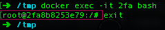

# 1. 网络模式
docker network ls

要加容器名，才能保证正常通讯。
网络模式（包括端口映射）
`docker network create gtsb`
`docker run -d --name web --network gtsb nginx`
自定义网络，同一个自定义网络中，可以使用对方容器的容器名、服务名、网络别名来找到对方。这个时候帮助进行服务发现的是Docker 内置的DNS。所以，无论容器是否重启、更换IP，内置的DNS都能正确指定到对方的位置。


### 实际使用中容易遇到的问题：
#### 1. Docker引擎的安装报错？
各大发行版的仓库没有及时更新，并且与系统内核联系紧密。
方法：二进制最容易。
#### 2. 容器运行后马上退出？
因为后台没输出，导致docker服务端认为容器以及运行结束。方法：可以用sshd拖起，docker -d + /usr/bin/sshd -D
容器只是进程。因此当执行 docker run 的时候，实际所做的只是启动一个进程，如果进程退出了，那么容器自然就终止了。

```shell
CONTAINER ID        IMAGE                           COMMAND             CREATED             STATUS                      PORTS                                                                  NAMES
cc2aa3f4745f        ubuntu                          "/bin/bash"         23 hours ago        Exited (0) 22 hours ago                                                                            clever_lewin
```
#### 3. 查看容器资源情况？
方法： docker stats + docker inspect
```shell
~ docker stats 98b
CONTAINER           CPU %               MEM USAGE / LIMIT   MEM %               NET I/O             BLOCK I/O           PIDS
98b                 0.00%               0B / 0B             0.00%               0B / 0B             0B / 0B             0
```
```shell
~ docker inspect 98b
[
    {
        "Id": "98b4e05e569100273daaf561ccae4e4769a02573906cf5990b2c81a44862b9c4",
        "Created": "2017-11-18T10:12:57.365806933Z",
        "Path": "nginx",
        "Args": [
            "-g",
            "daemon off;"
        ],
        "State": {
            "Status": "exited",
            "Running": false,
            "Paused": false,
            "Restarting": false,
            "OOMKilled": false,
            "Dead": false,
            "Pid": 0,
            "ExitCode": 0,
            "Error": "",
            "StartedAt": "2018-06-02T02:42:34.242575Z",
            "FinishedAt": "2018-06-07T13:44:41.5775559Z"
        },
        "Image": "sha256:40960efd7b8f44ed5cafee61c189a8f4db39838848d41861898f56c29565266e",
        "ResolvConfPath": "/var/lib/docker/containers/98b4e05e569100273daaf561ccae4e4769a02573906cf5990b2c81a44862b9c4/resolv.conf",
        "HostnamePath": "/var/lib/docker/containers/98b4e05e569100273daaf561ccae4e4769a02573906cf5990b2c81a44862b9c4/hostname",
        "HostsPath": "/var/lib/docker/containers/98b4e05e569100273daaf561ccae4e4769a02573906cf5990b2c81a44862b9c4/hosts",
        "LogPath": "/var/lib/docker/containers/98b4e05e569100273daaf561ccae4e4769a02573906cf5990b2c81a44862b9c4/98b4e05e569100273daaf561ccae4e4769a02573906cf5990b2c81a44862b9c4-json.log",
        "Name": "/webserver",
        "RestartCount": 0,
        "Driver": "overlay2",
        "Platform": "linux",
        "MountLabel": "",
        "ProcessLabel": "",
        "AppArmorProfile": "",
        "ExecIDs": null,
        "HostConfig": {
            "Binds": null,
            "ContainerIDFile": "",
            "LogConfig": {
                "Type": "json-file",
                "Config": {}
            },
            "NetworkMode": "default",
            "PortBindings": {
                "80/tcp": [
                    {
                        "HostIp": "",
                        "HostPort": "80"
                    }
                ]
            },
            "RestartPolicy": {
                "Name": "no",
                "MaximumRetryCount": 0
            },
            "AutoRemove": false,
            "VolumeDriver": "",
            "VolumesFrom": null,
            "CapAdd": null,
            "CapDrop": null,
            "Dns": [],
            "DnsOptions": [],
            "DnsSearch": [],
            "ExtraHosts": null,
            "GroupAdd": null,
            "IpcMode": "shareable",
            "Cgroup": "",
            "Links": null,
            "OomScoreAdj": 0,
            "PidMode": "",
            "Privileged": false,
            "PublishAllPorts": false,
            "ReadonlyRootfs": false,
            "SecurityOpt": null,
            "UTSMode": "",
            "UsernsMode": "",
            "ShmSize": 67108864,
            "Runtime": "runc",
            "ConsoleSize": [
                0,
                0
            ],
            "Isolation": "",
            "CpuShares": 0,
            "Memory": 0,
            "NanoCpus": 0,
            "CgroupParent": "",
            "BlkioWeight": 0,
            "BlkioWeightDevice": [],
            "BlkioDeviceReadBps": null,
            "BlkioDeviceWriteBps": null,
            "BlkioDeviceReadIOps": null,
            "BlkioDeviceWriteIOps": null,
            "CpuPeriod": 0,
            "CpuQuota": 0,
            "CpuRealtimePeriod": 0,
            "CpuRealtimeRuntime": 0,
            "CpusetCpus": "",
            "CpusetMems": "",
            "Devices": [],
            "DeviceCgroupRules": null,
            "DiskQuota": 0,
            "KernelMemory": 0,
            "MemoryReservation": 0,
            "MemorySwap": 0,
            "MemorySwappiness": null,
            "OomKillDisable": false,
            "PidsLimit": 0,
            "Ulimits": null,
            "CpuCount": 0,
            "CpuPercent": 0,
            "IOMaximumIOps": 0,
            "IOMaximumBandwidth": 0
        },
        "GraphDriver": {
            "Data": {
                "LowerDir": "/var/lib/docker/overlay2/2cf5434dc752c8dacbe9f488de6e8cc3ae5ade948dc6a33385f117447478aff2-init/diff:/var/lib/docker/overlay2/7ddaeded69c0cd009bf480b6cbf2ad5d79f48d93d535cade868a35fe69bd2491/diff:/var/lib/docker/overlay2/b28caccf72c965c0587f74fd5ee5eac401e51781f35e8767d53202a44419ef7a/diff:/var/lib/docker/overlay2/8ab3bac706acdfee228945c6ee7f5a5f61d9696f1af673b9ea786d753e1e8c72/diff",
                "MergedDir": "/var/lib/docker/overlay2/2cf5434dc752c8dacbe9f488de6e8cc3ae5ade948dc6a33385f117447478aff2/merged",
                "UpperDir": "/var/lib/docker/overlay2/2cf5434dc752c8dacbe9f488de6e8cc3ae5ade948dc6a33385f117447478aff2/diff",
                "WorkDir": "/var/lib/docker/overlay2/2cf5434dc752c8dacbe9f488de6e8cc3ae5ade948dc6a33385f117447478aff2/work"
            },
            "Name": "overlay2"
        },
        "Mounts": [],
        "Config": {
            "Hostname": "98b4e05e5691",
            "Domainname": "",
            "User": "",
            "AttachStdin": false,
            "AttachStdout": false,
            "AttachStderr": false,
            "ExposedPorts": {
                "80/tcp": {}
            },
            "Tty": false,
            "OpenStdin": false,
            "StdinOnce": false,
            "Env": [
                "no_proxy=*.local, 169.254/16",
                "PATH=/usr/local/sbin:/usr/local/bin:/usr/sbin:/usr/bin:/sbin:/bin",
                "NGINX_VERSION=1.13.6-1~stretch",
                "NJS_VERSION=1.13.6.0.1.14-1~stretch"
            ],
            "Cmd": [
                "nginx",
                "-g",
                "daemon off;"
            ],
            "ArgsEscaped": true,
            "Image": "nginx",
            "Volumes": null,
            "WorkingDir": "",
            "Entrypoint": null,
            "OnBuild": null,
            "Labels": {
                "maintainer": "NGINX Docker Maintainers <docker-maint@nginx.com>"
            },
            "StopSignal": "SIGTERM"
        },
        "NetworkSettings": {
            "Bridge": "",
            "SandboxID": "012db9ea7749d53e2243395879d6b3fb28c6eda5a020f402f40ac41096bcec1f",
            "HairpinMode": false,
            "LinkLocalIPv6Address": "",
            "LinkLocalIPv6PrefixLen": 0,
            "Ports": {},
            "SandboxKey": "/var/run/docker/netns/012db9ea7749",
            "SecondaryIPAddresses": null,
            "SecondaryIPv6Addresses": null,
            "EndpointID": "",
            "Gateway": "",
            "GlobalIPv6Address": "",
            "GlobalIPv6PrefixLen": 0,
            "IPAddress": "",
            "IPPrefixLen": 0,
            "IPv6Gateway": "",
            "MacAddress": "",
            "Networks": {
                "bridge": {
                    "IPAMConfig": null,
                    "Links": null,
                    "Aliases": null,
                    "NetworkID": "85f344315752993718fbe7be28bcc44b5db3af7c007393806a602aea566fc1f0",
                    "EndpointID": "",
                    "Gateway": "",
                    "IPAddress": "",
                    "IPPrefixLen": 0,
                    "IPv6Gateway": "",
                    "GlobalIPv6Address": "",
                    "GlobalIPv6PrefixLen": 0,
                    "MacAddress": "",
                    "DriverOpts": null
                }
            }
        }
    }
]

```
#### 4. 集群下如何保持镜像的一致性？
方法： 在同一个机器build，然后分发到所有节点，确认是同样的id。Dockfile版本有git控制。
#### 5. 卷和挂载目录的区别？
卷 (Docker Volume) 是受控存储，是由 Docker 引擎进行管理维护的。因此使用卷，你可以不必处理 uid、SELinux 等各种权限问题，Docker 引擎在建立卷时会自动添加安全规则，以及根据挂载点调整权限。并且可以统一列表、添加、删除。另外，除了本地卷外，还支持网络卷、分布式卷。

而挂载目录那就没人管了，属于用户自行维护。你就必须手动处理所有权限问题。特别是在 CentOS 上，很多人碰到 Permission Denied，就是因为没有使用卷，而是挂载目录，而且还对 SELinux 安全权限一无所知导致。
#### 6. 分不清楚容器内外？
老手和新手的区别首先在于分清楚容器内外的路径，容器内和容器外的进程。
容器内的进程有自己独立的userland。
可以在Dockerfile里配置`PS1`的环境变量，这是交互式命令后的提示符格式。


#### 7. 打的镜像包体积特别大怎么办？
理解层的概念，如果有用完就删除的文件，务必放到一个 RUN 下，多条命令应该用 && 连接，并且在最后要打扫干净所使用的环境。其文件系统是 Union FS，分层式存储，每一次 commit 都会建立一层，上一层的文件并不会因为 rm 而删除，只是在当前层标记为删除而看不到了而已。
```dockerfile
RUN buildDeps='gcc libc6-dev make' \
    && set -x \
    && apt-get update && apt-get install -y $buildDeps --no-install-recommends \
    && rm -rf /var/lib/apt/lists/* \
    && wget -O redis.tar.gz "$REDIS_DOWNLOAD_URL" \
    && echo "$REDIS_DOWNLOAD_SHA1 *redis.tar.gz" | sha1sum -c - \
    && mkdir -p /usr/src/redis \
    && tar -xzf redis.tar.gz -C /usr/src/redis --strip-components=1 \
    && rm redis.tar.gz \
    && make -C /usr/src/redis \
    && make -C /usr/src/redis install \
    && rm -r /usr/src/redis \
    && apt-get purge -y --auto-remove $buildDeps
```
#### 8. /var或者/分区空间大小不足怎么办？
dockerd 运行时指定 -g 参数
#### 9. docker版本要用哪个？
docker.io以及docker-engine都是比较老的版本，社区版简称CE，目前最常用的就是docker-ce。
2017年启用新版本号结构：<年>.<月>.<补丁版本号>。2017年以前版本是1.12 ，那紧接着的版本就是17.06，面试时被问到一定不要怀疑。并且每季度发布一个稳定版本，03、06、09才是稳定版本，生产环境一定用到的是这3个次版本号。
#### 10. 官方镜像仓库pull很慢？
使用DaoCloud。
#### 11. 找不到配置文件？
对于 upstart 的系统（Ubuntu 14.10或以前的版本，Debian 7或以前的版本），配置文件可能在 /etc/default/docker，其配置方式基本是配置 DOCKER_* 的环境变量。

而对于 systemd 的系统(Ubuntu 15.04及以后的版本，Debian 8及以后的版本，CentOS 7/RHEL 7及以后的版本)，配置文件则在 systemd 的配置目录下。

首先应该 enable 该服务：

`sudo systemctl enable docker`
然后修改配置文件 /etc/systemd/system/multi-user.target.wants/docker.service （只要服务 enable 了，那么不管什么系统，应该都会在这个位置看到配置文件）
#### 12. Docker服务端重启后容器会挂掉吗？容器运行失败后能尝试重启吗？
服务端加上--live-restore参数，容器运行时加上 restart参数。
#### 13. 如何免sudo执行docker命令？
`sudo usermod -aG docker $USER`
就可以把当前用户加入 docker 组，退出、重新登录系统后，执行 docker info 看一下，就会发现可以不用 sudo 直接执行 docker 命令了。
#### 14. 防止Docker服务端被入侵
-H tcp://0.0.0.0:2375 是说你希望通过 2375/tcp 来操控你的 Docker 引擎，是允许任何人来操控你的 Docker 引擎。如果必须要用上述参数，一定要配置TLS证书。
#### 15. 容器怎么取宿主机 IP 啊？
直接用环境变量送进去即可。
`docker run -d -e HOST_IP=<宿主的IP地址> nginx`
#### 16。 docker images -a 后显示了好多 <none> 的镜像？都是什么呀？能删么？
简单来说，<none> 就是说该镜像没有打标签。而没有打标签镜像一般分为两类，一类是依赖镜像，一类是丢了标签的镜像。前一种无法删除，后一种可以通过以下命令批量删除。
`docker rmi $(docker images -a|grep "<none"|awk {'print $3'})`

#### 17. 想要临时保存容器为镜像？
用docker commit，但是黑箱镜像，尽量少用，CMD可能会丢失。
#### 18. Docker build时报错`COPY failed`？
```shell
➜  /tmp docker build -t test:0829 
"docker build" requires exactly 1 argument.
See 'docker build --help'.

Usage:  docker build [OPTIONS] PATH | URL | -

Build an image from a Dockerfile
```
构建镜像必须指定 context，上面的报错就是因为少了context参数。`docker build -t xxx . `中的这个`.`，实际上就是在指定 Context 的目录，而并非是指定 Dockerfile 所在目录。Dockerfile 文件默认在当前路径，也可以通过-f参数指定。例如如下命令：
`docker build -f docker/Dockerfile -t xxx <context路径>`
context 是工作目录，但不要和构建镜像的Dockerfile 中的 WORKDIR 弄混，context 是 docker build 命令的工作目录。

#### 19.Docker 引擎日志在哪？
journalctl -u docker.service