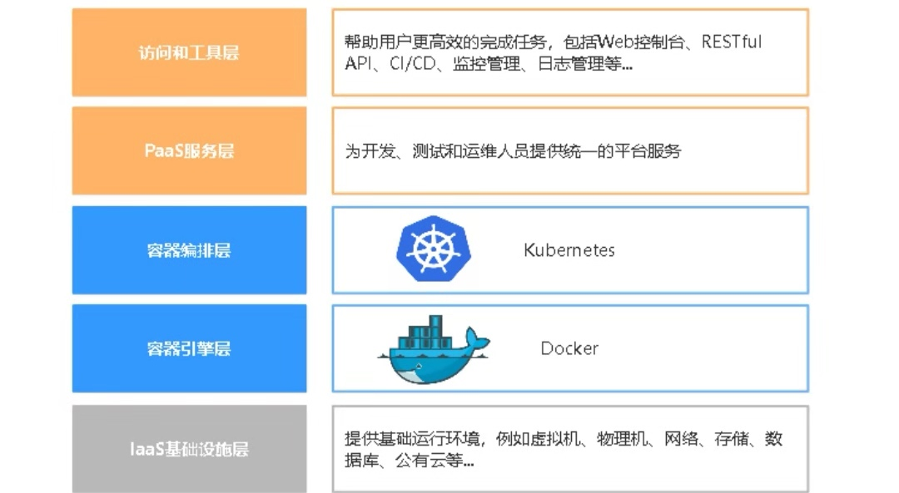

## 颠覆性技术 - 容器

-Author: bavdu

-Mail: bavduer@163.com

-Github: https://github.com/bavdu

---

**/* 导读 */**

&emsp;&emsp;一门新技术的产生必定是为了解决某些问题而存在的, 同样也会带来一定的问题, 容器技术是一项颠覆性技术, 改变了企业的CI/CD(持续集成/持续交付、部署)环节的方式, 开启了一场革命, 我们一起看看这场革命怎么实行的！

**/* Docker是什么？ */**

&emsp;&emsp;2013年初, Docker横空出世, 一个怀揣着改变应用程序部署的革命技术, 目前看来, 显然它做到了！

&emsp;&emsp;Docker是一个开源的应用容器引擎, 对应用进程进行封装隔离, 并且独立于宿主机与其他进程. Docker理念是将应用程序及依赖包打包到一个可移植的镜像中, 可以运行到任意Docker引擎上. 具有快速部署、可移植性、环境隔离等特点。

**/* Kubernetes是什么？*/**

&emsp;&emsp;Kubernetes(K8S)是Google开源的容器集群管理系统, 其设计源于Google在容器编排方面积累的丰富经验, 并结合社区创新的最佳实践。K8S在Docker容器技术的基础之上, 大大提高了容器化部署应用, 简单高效。并具备了完整的集群管理能力, 例如服务发现、资源配额、缩容扩容、动态更新、持久化存储、监控、日志等, 涵盖项目周期的各个环节。经过这几年的快速发展, K8S已经成为建设容器云平台的首选方案。

**/* Docker和Kubernetes有什么联系？*/**

&emsp;&emsp;说到这里, 就涉及到容器云平台核心组成了。Docker是一个容器引擎, 用于运行容器, Kubernetes是一个容器编排系统, 不具备容器引擎功能, 相比Docker是一个更高级封装, 而它们在一起堪称珠联璧合, 一起搞大事！～

**/* 日常运维的问题 */**

> 1. 多开发语言, 多运行环境

公司发展迅速, 业务量蹭蹭的往上涨, 同时也会开展其他业务线, 打造自己的生态圈.多业务线维护给运维也带来一定挑战, 例如多项目、多语言, Java、Go、Python、PHP, 这就意味着运行环境可能非常复杂, 还要维护多个版本, 写N个脚本、长期积累还会导致环境臃肿、杂乱、故障率高、不易维护等问题, 当迁移业务时, 这个不敢动那个不敢动！

> 2. 环境不一致引发争议

开发人员通常在Mac、windows系统上开发项目, 功能上线, 合并代码到版本库, 随后通知测试部门测试, 测试通过后发布到生产环境, 目前大多数互联网公司都是这种流程.

那么问题来了, 项目可能在测试环境或生产环境就运行不起来了..., 为什么呢？操作系统、软件版本、少依赖包、配置忘记修改等等？从而出现这些神秘的bug, 神秘的配置. 有同学说：写一个参考文档. 通常还是会有疏漏的地方, 而且这依赖于文档编辑能力和理解能力。

> 3. 微服务架构带来的问题

微服务架构是当下最流行的一种业务架构开发模式, 目的是让臃肿的业务系统拆分成多个微服务,一个微服务完成某个特定的功能, 如电商的购物车、支付、用户后台、消息等等。每一个微服务都是微型的六边形应用, 都有着自己的业务逻辑和适配器, 微服务部署在多台服务器上, 每次项目升级都要java-jar启动服务, 维护几十台这样的服务器, 简直苦不堪言, 感觉要吐血～

> 4. 项目上线周期长

马上就要双11、双12了, 到时业务访问量会很大, 得扩容服务器了。新项目/扩容大致流程：

`申请资源 -> 资源审批 -> 虚拟机创建 -> 环境部署 -> 代码测试 -> 上线`

多部门协作, 这个流程最起码要一周吧, 流程化提高一定生产力也可能带来一定的局限性, 增加事务落实时间;那应该如何才能做到业务快速扩展并发能力和缩短上线周期呢？难道这个流程不能再优化了么？

**/* 学习目标 */**

1. 掌握Docker、Kubernetes核心概念
2. 熟悉Docker日常运维管理
3. 熟练部署kubernetes集群
4. 熟悉容器云平台日常运维管理
5. 容器云平台架构设计及规划
6. 将微服务业务架构迁移到容器云平台
7. kubernetes核心功能企业应用, 包括Pod、Service、lngress、Volume、PersistenVolume、HA、监控、日志、网络及工作原理

`摘自: 《基于Kubernetes企业级容器云平台落地与实践》`