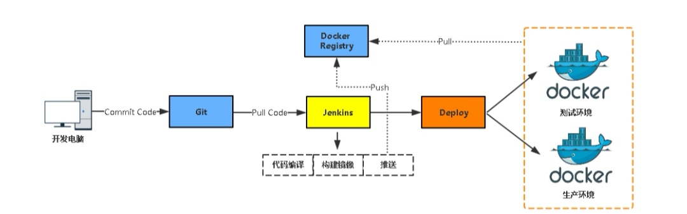
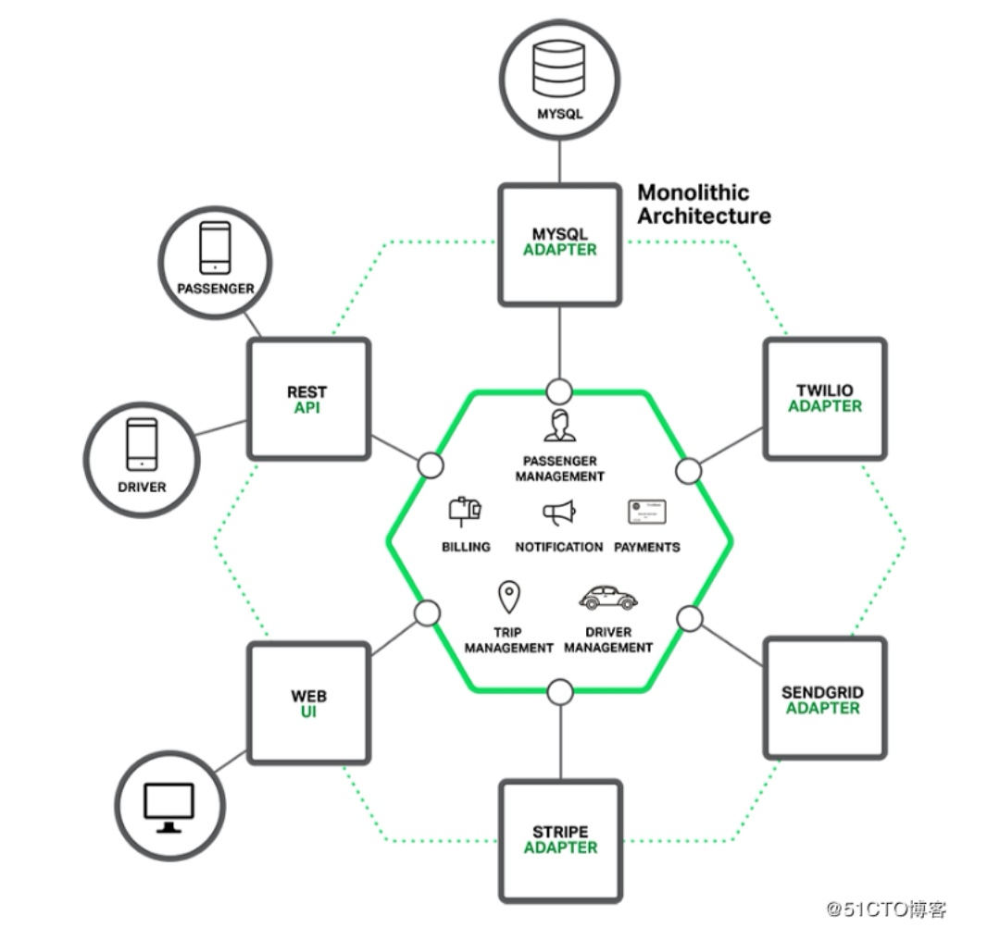
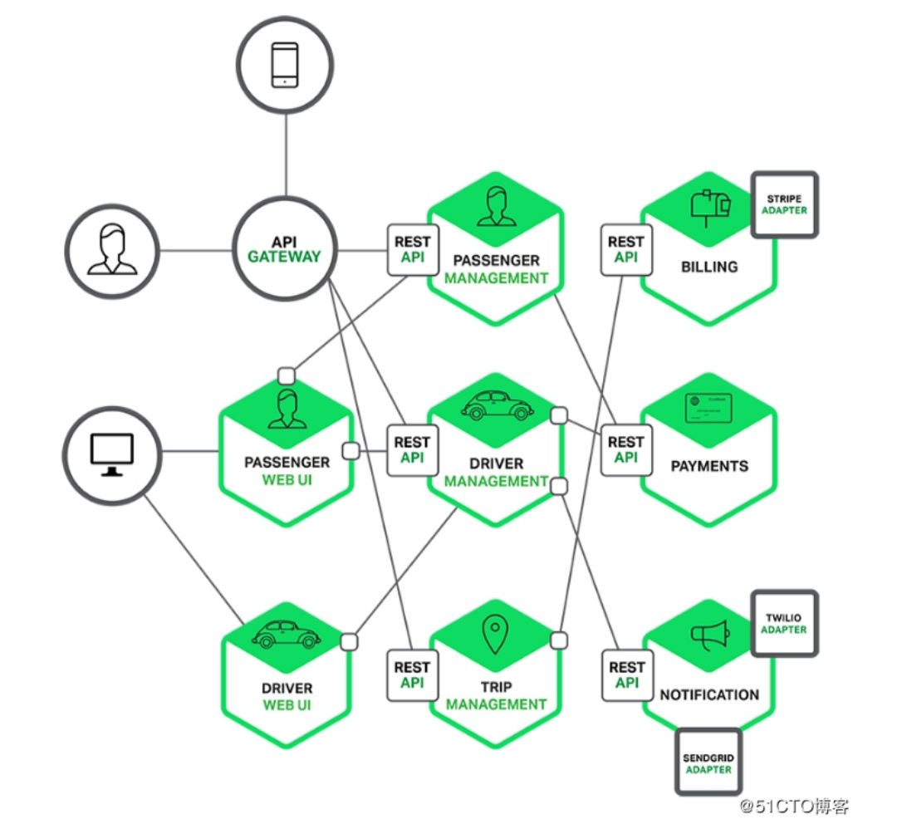
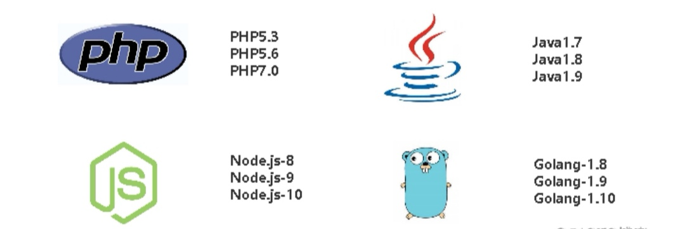

## 容器技术给企业究竟解决了什么问题？

-Author: bavdu

-Mail: bavduer@163.com

-Github: https://github.com/bavdu

---

首先, 要明确企业上容器云平台的目的, 容器是为业务服务的, 任何技术都是为更好的服务业务, 这是我们的出发点.

其次, 看看业务特点是不是适合容器化, 业务是不是具有版本迭代快、访问波动大、业务量增长快等特点.

**/* 容器技术不是万能的, 企业容器云方案设计需要遵循什么原则？ */**

1. 业务是否可以基于微服务架构进行改造？
2. 已有的IT系统, 例如监控系统、安全系统、网络系统等, 为避免重复建设是否能融入现有架构中？而不是立起炉灶重新建设.
3. 建设容器云平台目的是能为应用带来部署灵活、弹性伸缩、节省资源等优势. 这些要求最好具备微服务架构、无状态化等特点, 这些优势能更好的发挥。但不适合容器化的应用也不能勉强, 否则建设后, 不能带来预期的价值, 不仅浪费了大量企业投入, 还使得容器平台的价值得不到认可, 这都是不愿意看到的结果.

**/* Docker究竟解决了什么实际问题？*/**

> 场景一: 节省项目环境部署时间

1. <u>单项目打包</u>📦

Q: 每次部署项目到测试、生产等环境, 都要部署一大堆依赖软件、工具, 而且部署期间出现问题几率很大, 不经意就花费了很长时间.

A: Docker主要理念就是环境打包, 可在任意Docker Engine上运行, 我们只需要将每个项目环境打包到镜像, push到镜像仓库, 当有需要部署这个项目时, 直接pull镜像启动容器, 这个项目就可以访问了！一次构建多次部署！

2. <u>整套项目打包</u>📦

Q: 公司有这样一项业务: 有一个产品可以整套部署到客户那里, 以往都是派一名实施工程师到客户现场部署, 花费人工成本高.

A: Docker可以将整套项目封装打包起来, 通过官方的Docker Compose容器编排工具实现一键部署, 分分钟搞定, 就不需要再派人过去了.

3. <u>新开源技术试用</u>🔧

Q: 有时, 我们想调研一些开源项目, 开发人员对Linux系统不熟悉, 部署期间处理问题能力弱

A: 直接从公共镜像仓库pull官方做好的镜像启动容器即可, 而不需要花费大量的时间部署系统！

> 场景二:  环境一致性

Q: 开发人员通常在Mac、windows系统上开发项目, 功能上线, 合并代码到版本仓库, 随后通知测试部门测试, 测试通过后运维发布到生产环境, 目前大多数互联网公司都是这样的流程。那么问题来了, 项目可能在测试环境或生产环境运行不起来...., 为什么？操作系统、软件版本、少依赖包、配置忘记修改等等, 都有可能导致项目无法运行！

A: 容器消除了线上线下的环境差异, 保证了应用生命周期的环境一致性和标准化. 开发人员使用镜像实现标准开发环境的构建, 开发完成后封装项目及依赖环境, 测试和运维人员可以直接用这个镜像在任何Docker Engine创建容器进行测试和发布, 大大简化了持续集成、测试、发布的过程. Docker的可移植性, 保持运行状态一致性, 可想而知, 是否更容易解决问题呢？

> 场景三:  CI/CD (持续集成/持续部署、交付)

时间就是金钱, 项目高效的快速迭代需要一个合理的CI/CD环境支撑.

CI/CD是一个持续自动化的项目流程, 包括构建、部署、测试、发布等工作. 原则是自动化, 减少人工干预.

上面提到了Docker将项目及依赖关系打包成镜像, 可快速部署到任何环境中, 包括测试环境、预生产环境环境、生产环境, 消除了线上线下的环境差异, 极大减少由于环境不一致导致的问题, 加快开发、部署、回滚.

> 场景四:  为部署微服务架构业务而生

Q: 微服务架构是当下最流行的一种业务架构开发模式, 目的是让臃肿的业务系统拆分成多个微服务, 一个微服务完成某个特定的功能, 如电商网站的购物车、支付后台、用户后台、消息等等。每一个微服务都是微型的六边型应用, 都有自己的业务逻辑和适配器, 一些微服务还会发布API给其他微服务和应用客户端使用

出租车的调度软件拆分前：

出租车的调度软件拆分后：

每一个应用功能区都使用微服务完成, 另外web应用会被拆分成一系列简单的web应用, 这样的拆分对于不同用户、设备、特殊应用场景部署都更容易.

A: 微服务特点: 组件化、松耦合、去中心、灵活独立

容器特点: 沙箱机制、隔离性、可移植性、快速部署

Docker容器设计轻巧, 一个容器一个微服务, 是实现微服务架构部署的理想选择

> 场景五:  弹性伸缩

Q: 在618、双11这种大型的促销活动中, 业务访问量会很大, 得扩容服务器了！

传统方式新项目/扩容大致流程:

申请资源--资源审批—虚拟机创建--环境部署--代码测试--上线

多部门协作, 这个流程起码得一周吧, 流程化提高一定生产力也可能带来一定的局限性, 增加事项落实时间,流程就需要优化！

A: 说到弹性伸缩, 在云计算领域数AWS做的好！

-AWS Auto Scaling 可以监控你的应用程序并自动调整容量, 以便尽可能低的成本来保持稳定、可预测的性能。使用AWS Auto Scaling 你可以在几分钟之内为多项服务中的多个资源轻松设置应用程序扩展

-当使用容器技术之后, 这种弹性伸缩的单元就是物理机/云主机之上的容器了. 由于Docker容器快速启动的特性, 可以在秒级部署几十个、上百个容器来提供服务, 成倍提高并发能力, 缩短上线周期. 当业务高峰期下去了, 动态销毁一部分容器, 释放资源, 让业务低成本稳定运行

> 场景六:  环境治理

Q: 公司发展迅速, 业务量蹭蹭的往上涨, 同时也会开展其他业务线, 打造自己的生态圈。多业务线维护给运维也带来一定的挑战, 例如不同项目多种开发语言, 这就意味着运行环境不同, 要维护多个版本, 写N个脚本、长期积累还会导致环境臃肿, 杂乱

A: 根据不同环境构建不同的镜像, 例如：

1. 基础镜像：基本运行环境, Java、PHP
2. 项目镜像：包含项目, 可以直接部署

镜像在镜像仓库中管理及维护, 通过版本管理应用环境镜像

> 场景七:  跨云平台支持

容器其中最大的特点之一就是移植性, 现在越来越多的云平台厂商研发容器云, 用户再也不用担心受到云平台的捆绑了, 上云下云, 混合部署等会变的很方便.