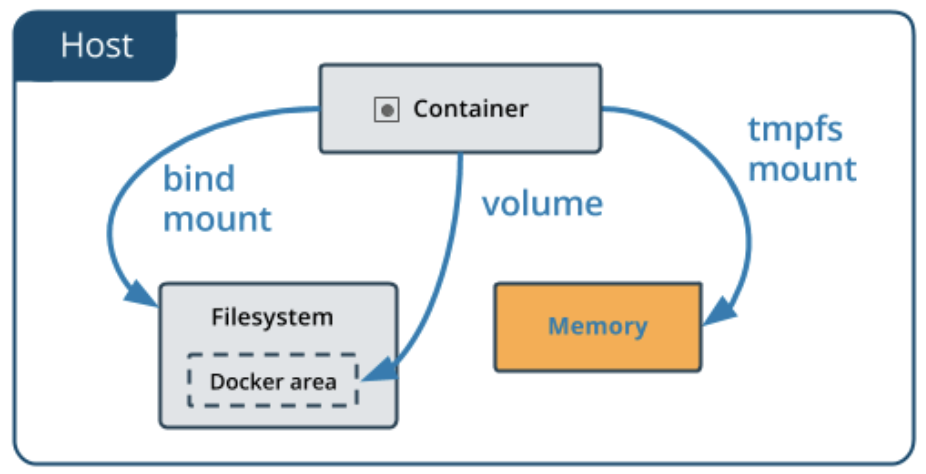
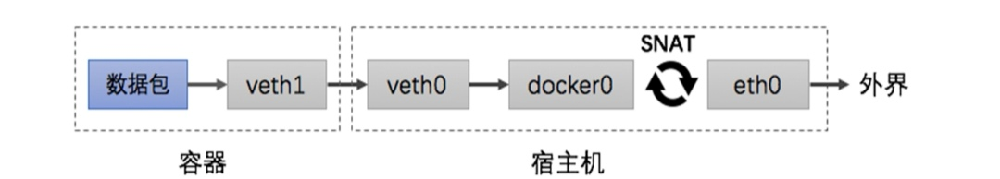
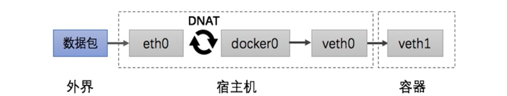

## Docker技术快速入门与应用实战

-Author: bavdu

-Mail: bavduer@163.com

-Github: https://github.com/bavdu

---


大家好, 我是千锋云计算的讲师刘超(bavdu), 今天带大家分享的内容是Docker的入门技术, 即对容器、数据卷、网络的管理, 镜像管理为docker技术的一大重点需要另起一章来讲解, 所以想学习镜像管理的同学可以期待后续的文章, 感谢大家对千锋云计算的支持与帮助


**/* 简介 */**

Docker是一个开源的应用容器引擎, 使用Go语言开发, 基于Linux内核的CGroup、NameSpace、Union FS等技术实现, 对应用程序进行封装隔离, 并且独立于宿主机与其他进程, 这种运行时封装的状态称为容器, 是一种系统级的虚拟化技术.

Docker早期版本实现是基于LXC,并进一步对其封装, 包括文件系统、网络互联、镜像管理等方面, 极大简化了容器管理. 从0.7版本以后开始去除LXC, 转为自行研发的lib container, 从1.1开始, 进一步演进为使用runc和containerd


**/* Docker思想 */** 

Docker的理念是将应用及依赖包打包到一个可移植的容器中, 可发布到任意Docker Engine上. 使用沙箱机制运行程序, 程序之间相互隔离.

随着Docker的火热, docker、oci、runc、containerd等等名词也逐渐传播开来, 这么多名词, 也容易让人混淆, 下面对这些名词进行一个梳理

2015年, 由Docker、RedHat、Google、IBM、Microsoft等厂商共同成立OCI组织, 其目的围绕容器技术指定开放标准和规范

2017年, OCI v1.0正式发布, 其中包含两个规范: 容器运行时(runtime)和镜像规范(image), 有了这两个规范, 不同的组织或厂商开发的容器就能够在不同的Container引擎上运行, 这样就保证了容器的可移植性和互操作性。

OCI下一步关键工作是提供认证, 以验证开发者的产品和项目是否符合规范


**/* Docker架构 */**


**/* Linux下安装Docker */**

官方文档: https://docs.docker.com/install/linux/docker-ce/centos

```shell
## On CentOS Install Docker-CE.
$ sudo yum remove docker \
                  docker-client \
                  docker-client-latest \
                  docker-common \
                  docker-latest \
                  docker-latest-logrotate \
                  docker-logrotate \
                  docker-selinux \
                  docker-engine-selinux \
                  docker-engine

$ sudo yum install -y yum-utils \
  device-mapper-persistent-data \
  lvm2

$ sudo curl -o /etc/yum.repos.d/docker-ce.repo \
  https://mirrors.aliyun.com/docker-ce/linux/centos/docker-ce.repo 

$ sudo yum install docker-ce

$ sudo systemctl start docker && sudo systemctl enable docker
```

```shell
## Configuring the docker accelerator.
curl -sSL https://get.daocloud.io/daotools/set_mirror.sh | sh -s http://f1361db2.m.daocloud.io
```


####**/* Container Manager */**

如果你没有Docker帐户,请在[hub.docker.com上](https://hub.docker.com/)注册一个帐户. 记下您的用户名, 然后登陆

```shell
$ docker login

##如果没有可以使用
用户名: bavdu
密码: BavDu.0725
```

- 创建容器, 并放入后台运行

`$ docker container run -d nginx`

- 列出当前运行中的容器

`$ docker container ls`

- 指定容器名称、主机名、设置环境变量

`$ docker container run -d --name web01 -h nginxweb -e TEST=Hello_Docker nginx`

- 测试主机名及环境变量

```shell
$ docker container exec -it nginx bash

root@nginxweb:/# echo $TEST
Hello_Docker
root@nginxweb:/# hostname
nginxweb
```

- 暴露端口对外服务

`docker container run -d -p 88:80 nginx`

- 删除容器

`docker container stop CONTAINER_NAME`

`docker container rm CONTAINER_NAME`


**/* 容器资源管理 */**

容器是密集型的, 启动大量的容器, 如果不对容器进行资源限制, 难免会因为某个容器占用大量资源, 导致宿主机资源殆尽.所以需要对CPU、内存的使用进行限制

| 选项               | 描述                      |
| ------------------ | ------------------------- |
| -m --memory        | 容器可以使用的最大内存量  |
| --memory-swap      | 允许交换到磁盘的内存量    |
| --oom-kill-disable | 禁用OOM killer            |
| --cpus             | 可以使用CPU的数量         |
| --cpuset-cpus      | 限制容器使用特定的CPU核心 |
| --cpu-shares       | CPU共享                   |

- 限制容器内存使用

```shell
$ docker container run -d --name nginx01 \
--memory='500M' \
--memory-swap='600M' \
--oom-kill-disable nginx
```

- 限制CPU核心数

```shell
docker container run -d --name nginx02 \
--cpus="0.5" nginx
```

建议设置: --memory之后设置--oom-kill-disable, --cpus使用不超过50%


####**/* Data Volume Manager */**

前面讲到过容器删除, 容器里产生的数据也会被删除, 并且在容器里的操作是在容器的可写层, 会经过存储驱动管理, 这种额外的抽象会降低宿主机性能

<u>容器在可写层存储数据, 有以下缺点</u>

1. 当容器停止运行时, 数据将不会持续存在, 如果另一个进程需要这些数据, 则很难将数据从容器中取出来, 并且删除容器时数据会随之删除
2. 容器的可写层与容器运行的宿主机紧密耦合, 无法轻松的将数据移动到别的地方
3. 容器的可写层需要存储驱动程序来管理文件系统. 存储驱动程序使用Linux内核提供的联合文件系统, 与直接在宿主机上写入文件相比, 这种额外的抽象会降低性能

<u>解决方案</u> 

- volume: Docker管理宿主机文件系统的一部分(/var/lib/docker/volume), 保存数据的最佳方式
- bind mouts: 将宿主机上任意位置的文件或者目录挂载到容器中
- tmps: 挂载存储在宿主机系统的内存中, 而不会写入文件系统, 如果不希望将数据持久存储在任何位置, 可以使用tmps, 同时避免写入容器可写层提高性能



<u>volume特点</u>

- 多个容器之间共享数据
- 当容器停止或被删除时, 该卷依然在
- 多个容器可以同时挂载相同的卷
- 当明确删除卷时, 卷才会被删除

```shell
$ docker volume create web-vol
web-vol

$ docker volume ls
DRIVER              VOLUME NAME
local               web-vol

$ docker volume inspect web-vol
[
    {
        "CreatedAt": "2018-10-10T22:52:13+08:00",
        "Driver": "local",
        "Labels": {},
        "Mountpoint": "/var/lib/docker/volumes/web-vol/_data",
        "Name": "web-vol",
        "Options": {},
        "Scope": "local"
    }
]

$ docker container run -d --name nginx-vol \
--mount source=web-vol,destination=/usr/share/nginx/html nginx
37501f509de9196b121a028f21a8783dfeb4230c87b36a03b9464777dcfe4bc1

$ ls /var/lib/docker/volumes/web-vol/_data/
50x.html  index.html
```

<u>bind mounts特点</u>

- 从宿主机共享配置文件到容器
- 在宿主机上的开发环境和容器之间共享代码
- 当宿主机的文件或目录结构, 保证与容器所需的绑定, 挂载一致

```shell
$ mkdir -p /app/cloud-bind

$ docker container run -d --name nginx-bind \
--mount type=bind,src=/app/cloud-bind,dst=/usr/share/nginx/html nginx
fbd9bd370c9fd3ffb1286f8bf619df78e63b1f191602cd746733e0b0db771b2e

$ ls /app/cloud-bind/
$ docker container inspect nginx-bind
```


####**/* NetWork Manager */**

Docker支持五种网络模式:

- **bridge**
  - --net=bridge
  - 默认网络, Docker启动后创建一个docker0网桥, 默认创建的容器也是添加到这个网桥中
- **host**
  - --net=host
  - 容器不会获得一个独立的network namespace, 而是与宿主机共用一个. 这就意味着容器不会有自己的网卡信息, 而是使用宿主机的, 容器除了网络, 其他都是隔离的
- **none**
  - --net=none
  - 获取独立的network namespace, 但不为容器进行任何网络配置, 需要我们手动配置
- **container**
  - --net=container:name/ID
  - 与指定容器使用同一个network namespace, 具有同样的网络配置信息, 两个容器除了网络, 其他依然隔离
- **自定义网络**
  - 与默认的bridge原理一样, 但自定义网络具备内部DNS发现, 可以通过容器名或者主机名之间进行网络通讯

```shell
[root@docker ~]# docker network create cloud
0c60ccd588f9f65be05093927e27c6e706e40b4ad806537e8c0af01124eac55e
[root@docker ~]# docker network ls
NETWORK ID          NAME                DRIVER              SCOPE
48eb27d3ddfc        bridge              bridge              local
0c60ccd588f9        cloud               bridge              local
696a8edc7ab7        host                host                local
5dd4029f01f3        none                null                local
[root@docker ~]# docker container run -itd --name bs1 -h bs1 --net=cloud centos
[root@docker ~]# docker container run -itd --name bs2 -h bs2 --net=cloud centos

$ docker container exec -it bs1 bash
[root@bs1]# ping bs2
PING bs2 (172.19.0.2): 56 data bytes
64 bytes from 172.19.0.2: seq=0 ttl=64 time=0.068 ms
64 bytes from 172.19.0.2: seq=0 ttl=64 time=0.084 ms
64 bytes from 172.19.0.2: seq=0 ttl=64 time=0.071 ms
```

创建的两个容器都加入了cloud网络, 并且可以通过主机名互相通讯, 通过inspect查看cloud网络详细信息:

`$ docker network inspect cloud`

**/* 容器网络访问原理 */**

Docker启动后会先创建一个docker0网络, 当创建容器时,Docker使用veth pair创建一对虚拟网卡:一端放在新创建的容器中, 并重命名为eth0; 另一端放在宿主机上, 以veth+7个随机字符串命名,并将这个网络设备加入到docker0网桥中, 网桥自动为容器分配一个IP, 并设置docker0的IP地址为默认网关. 同时在iptables添加SNAT转换网络段IP到默认网段, 以便容器访问外网.


**-容器访问外网:**



容器访问外网时, 数据包从容器eth0发出到veth0, 到达自己的网关docker0, 到了主机,走默认网关, 匹配iptables NAT规则转发, 将数据包源IP地址转换成eth0地址发出去


**-外部访问容器**



外部访问容器时, 数据包到达宿主机, 宿主机收到数据包之后匹配iptables NAT规则转发给docker0, docker0根据Mac地址转发到veth0接口到另一端容器里的eth0, 容器处理数据,处理结果原路返回