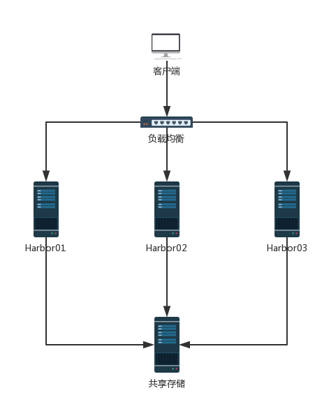
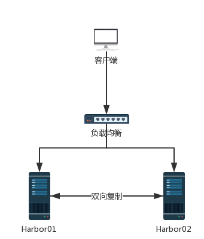

## 企业级容器镜像仓库Harbor运维管理

-Author: bavdu

-Mail: bavduer@163.com

-Github: https://github.com/bavdu

---


**/* Harbor简史 */**

在实际生产环境中, 往往需要把镜像发布到几十、上百台或更多的节点上, 这时单台Docker主机上镜像已经无法满足, 项目越来越多, 镜像就越来越多, 都放到一台docker主机上是不行的, 我们需要一个像git仓库一样的系统来统一管理镜像.

Harbor是由VMware公司开源的容器镜像仓库, 事实上, Harbor是在Docker Registry上进行了相应的企业级拓展, 从而获得了更加广泛的应用, 这些企业级拓展包括: 管理用户界面、基于角色访问控制、AD/LDAP集成以及审计日志, 足以满足基本企业需求.


####Harbor主要功能

**/* 1. 基于角色访问控制 */**

在企业中, 通常有不同的开发团队负责不同的项目, 镜像像代码一样, 每个人角色不同需求也不同, 因此就需要访问权限控制, 根据角色分配相应的权限.

比如: 开发人员需要对项目构建这就用到读写权限(pull/push), 测试人员只需要读权限(pull), 运维一般管理镜像仓库, 具备权限分配能力, 项目经理具备所有权限


- Guest: 对指定项目只读权限
- Developer: 开发人员, 读写项目权限
- Admin: 项目管理, 所有权限
- Anonymous: 当用户未登陆时,该用户视为匿名, 不能访问私有项目, 只能访问公开项目


**/* 2.镜像复制 */**

可以将仓库中的镜像同步到远程Harbor, 类似于MySQL的主从复制功能

**/* 3.镜像删除和空间回收 */**

Harbor支持在web界面删除镜像, 回收无用的镜像, 释放磁盘空间

**/* 4.审计 */**

对仓库的所有操作都有记录

**/* 5. REST API */**

具备完整的API, 方便与外部集成


#### Harbor高可用方案

方案一: 共享存储

多个实例共享数据共享一个存储, 任何一个实例持久化存储的镜像, 其他实例都可以读取到, 通过前置负载均衡分发请求



方案二: 复制同步

利用镜像复制功能, 实现双向复制保持数据一致, 通过前置负载均衡分发请求



#### Harbor组件

| 组件               | 功能                                         |
| ------------------ | -------------------------------------------- |
| harbor-adminserver | 配置管理中心                                 |
| harbor-db          | MySQL数据库                                  |
| harbor-jobservice  | 负责镜像复制                                 |
| harbor-log         | 记录操作日志                                 |
| harbor-UI          | Web管理页面和API                             |
| nginx              | 前端代理, 负责前端页面和镜像的上传/下载/转发 |
| redis              | 会话                                         |
| registry           | 镜像                                         |

#### Harbor部署

-环境准备

```shell
-Hardware(硬件)
	CPU: min=2/pre=4
	MEM: min=4GB/pre=8GB
	DSK: min=40GB/pre=160GB
-Software(软件)
	Python Version: 2.7up
	Docker Engine: 1.10up
	Docker Compose: 1.6up
	Openssl: latest
-Network Ports(网络端口)
	HTTPS: 443、4443
	HTTP: 80
```

-Harbor部署https方式

```shell
-https://storage.googleapis.com/harbor-releases/harbor-offline-installer-v1.5.3.tgz
下载此软件包需要翻墙, 请自行安装Google浏览器插件
```


```shell
##部署docker
$ curl -o /etc/yum.repos.d/docker-ce.repo \
https://mirrors.aliyun.com/docker-ce/linux/centos/docker-ce.repo
$ yum -y install docker-ce
$ sudo curl -sSL https://get.daocloud.io/daotools/set_mirror.sh | sudo sh -s http://bc437cce.m.daocloud.io

##部署GitHub:docker-compose1.22(需要翻墙)或者aliyun:docker-compose1.21
$ curl -L https://github.com/docker/compose/releases/download/1.22.0/docker-compose-`uname -s`-`uname -m` -o /usr/local/bin/docker-compose
$ chmod a+x /usr/local/bin/docker-compose

$ curl -L https://mirrors.aliyun.com/docker-toolbox/linux/compose/1.21.2/docker-compose-Linux-x86_64 -o /usr/local/bin/docker-compose
$ chmod a+x /usr/local/bin/docker-compose


##自签发TLS证书
$ openssl req \
    -newkey rsa:4096 -nodes -sha256 -keyout ca.key \
    -x509 -days 365 -out ca.crt
Country Name (2 letter code) [XX]:CN
State or Province Name (full name) []:BJ
Locality Name (eg, city) [Default City]:BJ
Organization Name (eg, company) [Default Company Ltd]:bavdu
Organizational Unit Name (eg, section) []:jiaoxue
Common Name (eg, your name or your server's hostname) []:reg.bavdu.com
Email Address []:bavduer@163.com

$ openssl req \
    -newkey rsa:4096 -nodes -sha256 -keyout harbor.key \
    -out harbor.csr
Country Name (2 letter code) [XX]:CN
State or Province Name (full name) []:BJ
Locality Name (eg, city) [Default City]:BJ
Organization Name (eg, company) [Default Company Ltd]:bavdu
Organizational Unit Name (eg, section) []:jiaoxue
Common Name (eg, your name or your server's hostname) []:reg.bavdu.com
Email Address []:bavduer@163.com

Please enter the following 'extra' attributes
to be sent with your certificate request
A challenge password []:
An optional company name []:

$ openssl x509 -req -days 365 -in harbor.csr -CA ca.crt -CAkey ca.key -CAcreateserial -out harbor.crt

##部署配置
$ tar xf harbor-offline-installer-v1.5.3.tgz
$ cd harbor
$ vim harbor.cfg
hostname = reg.bavdu.com
ui_url_protocol = https
ssl_cert = /usr/etc/cert/bavdu.com.crt
ssl_cert_key = /usr/etc/cert/bavdu.com.key

$ ./prepare

$ ./install.sh

##docker主机认证仓库
docker: $ mkdir -p /etc/docker/certs.d/reg.qfcc.com
harbor: $ scp /usr/etc/cert/ca.crt <docker_hostIP>:/etc/docker/certs.d/reg.qfcc.com/

docker: $ docker login reg.qfcc.com
Username: 
Password:
```

```shell
##查看运行状态
$ docker-compose ps
看到 harbor-adminserver、harbor-db、harbor-jobservice、harbor-log、harbor-ui、nginx、redis、registry都启动起来了就代表成功了
```


#### Harbor使用

**/* 上传 */**

在web界面上在library仓库添加开发人员bavdu管理, 此时bavdu就具备了pull/push权限

在docker主机中

```shell
[root@docker ~]# docker logout
Removing login credentials for https://index.docker.io/v1/
[root@docker ~]# docker login reg.qfcc.com
Username: bavdu
Password:
WARNING! Your password will be stored unencrypted in /root/.docker/config.json.
Configure a credential helper to remove this warning. See
https://docs.docker.com/engine/reference/commandline/login/#credentials-store

Login Succeeded
[root@docker ~]# docker images
REPOSITORY          TAG                 IMAGE ID            CREATED             SIZE
nginx               latest              be1f31be9a87        13 days ago         109MB
tomcat              latest              41a54fe1f79d        4 weeks ago         463MB
[root@docker ~]# docker image tag nginx:latest reg.qfcc.com/library/nginx
[root@docker ~]# docker push reg.qfcc.com/library/nginx
The push refers to repository [reg.qfcc.com/library/nginx]
92b86b4e7957: Pushed
94ad191a291b: Pushed
8b15606a9e3e: Pushed
latest: digest: sha256:204a9a8e65061b10b92ad361dd6f406248404fe60efd5d6a8f2595f18bb37aad size: 948
[root@docker ~]#
```

在web界面中查看镜像是否被上传到仓库中


**/* 下载 */**

```shell
[root@docker ~]# docker login reg.qfcc.com
Username: bavdu
Password:
WARNING! Your password will be stored unencrypted in /root/.docker/config.json.
Configure a credential helper to remove this warning. See
https://docs.docker.com/engine/reference/commandline/login/#credentials-store

Login Succeeded
[root@docker ~]# docker pull reg.qfcc.com/library/nginx
Using default tag: latest
latest: Pulling from library/nginx
802b00ed6f79: Pull complete
5291925314b3: Pull complete
bd9f53b2c2de: Pull complete
Digest: sha256:204a9a8e65061b10b92ad361dd6f406248404fe60efd5d6a8f2595f18bb37aad
Status: Downloaded newer image for reg.qfcc.com/library/nginx:latest
[root@docker ~]# docker image ls
REPOSITORY                   TAG           IMAGE ID            CREATED             SIZE
reg.qfcc.com/library/nginx   latest        be1f31be9a87        13 days ago         109MB
tomcat                       latest        41a54fe1f79d        4 weeks ago         463MB
[root@docker ~]#
```


**/* 定期清理 */**

存储库删除分为两步:

- 第一步: 在web中删除, 这是标记删除, 存储库中还存在
- 第二步: 确保所有人都没有用仓库的情况下, 执行以下指令, 若有人上传/下载镜像可能会出现错误

```shell
$ docker-compose stop
$ docker run -it --name gc --rm --volumes-from registry vmware/registry:2.6.2-photon garbage-collect /etc/registryconfig.yml
$ docker-compose start
```

