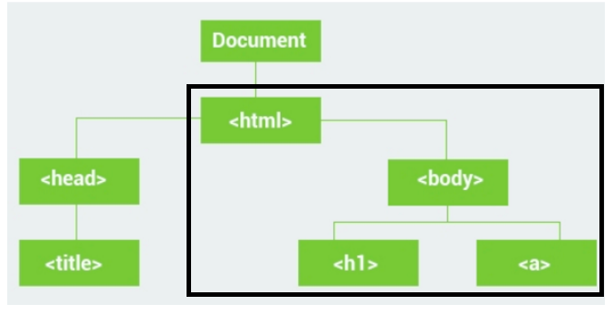
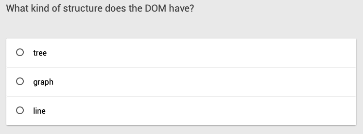
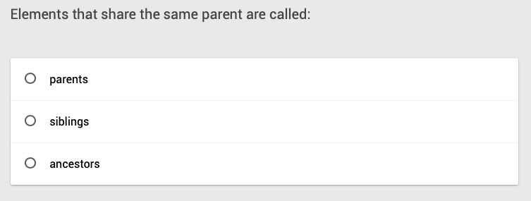
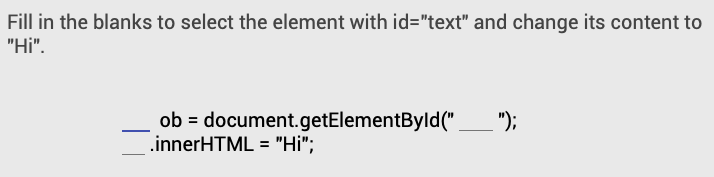
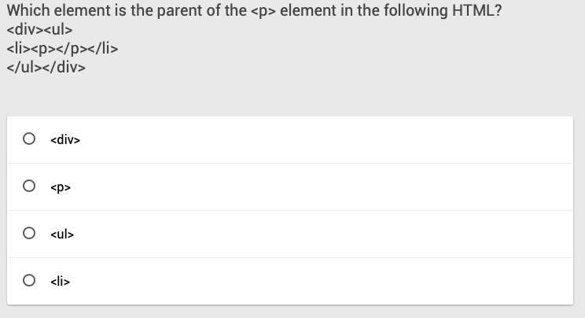
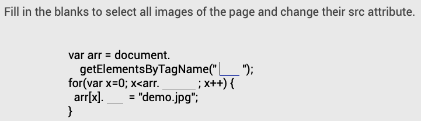
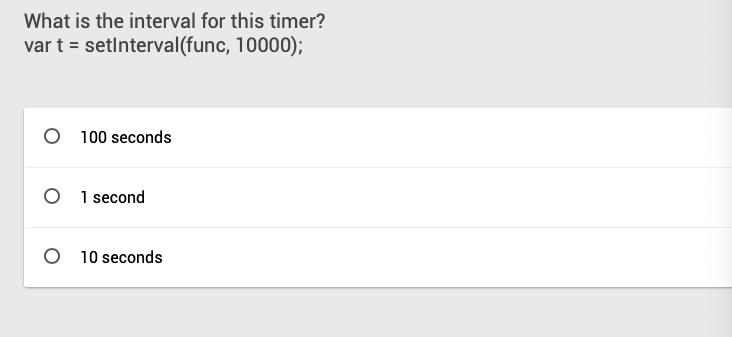
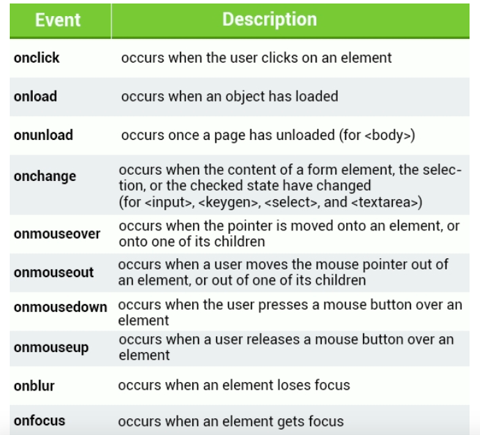

[TOC]

# 一、什么是 DOM

一个web页面是一个文档。这个文档可以在浏览器窗口或作为HTML源码显示出来。

全称文档对象模型（Document Object Model） 是HTML和XML文档的编程接口。它提供了对文档的结构化的表述，并定义了一种方式可以使从程序中对该结构进行访问，从而改变文档的结构，样式和内容。

DOM 将文档解析为一个由节点和对象（包含属性和方法的对象）组成的结构集合。

* html是body的parent， 是它下面所有元素的祖先。
* body是h1 和 a 的parent。
* h1 和 a 是body 的 child， 是html的 descendants。
* h1 和 a 是siblings。


简言之，DOM 是 HTML 的 API，是提供给 JavaScript 脚本语言使用的。




# 二、 选择器
所有的html元素都是objects，而每一个object都有属性和函数。通过document对象的下列函数可以访问你想要的html元素。

## 1. 直接查找

```javascript
document.getElementById(id)      // 根据 id 获取一个标签对象
document.getElementsByClassName(name)  // 根据 class 属性获取标签列表
document.getElementsByTagName(name)   // 根据标签名获取标签列表，例如<p>、<div>都是一种标签
```


[在线演示](https://code.sololearn.com/WLGwaWyGxHU1/#html)

## 2. 间接查找(自修，因为在这里只是了解位置，知道就行，后面我们主要是使用 jQuery 开发)


演示 1 个 
其他自己练习一下
[在线演示](https://code.sololearn.com/WpXlWzgG54Th/#html)

```javascript
parentNode          // 父节点
childNodes          // 所有子节点
firstChild          // 第一个子节点
lastChild           // 最后一个子节点
nextSibling         // 下一个兄弟节点
previousSibling     // 上一个兄弟节点
 
parentElement           // 父节点标签元素
children                // 所有子标签
firstElementChild       // 第一个子标签元素
lastElementChild        // 最后一个子标签元素
nextElementSibling      // 下一个兄弟标签元素
previousElementSibling  // 上一个兄弟标签元素
```



# 三、DOM 操作

## 1. 内容操作

```javascript
innerText   // 获取到标签的所用文本
value       // 主要是针对 input 标签的输入框进行获取输入的值
```

**Example**

```html
<input type="text" id="inputName">
<script>
    // 获取值
    var user=document.getElementById("inputName").value
   
    // 赋值
    document.getElementById("inputName").value = "QF"
</script>

```


## 2.  属性操作（演示一个即可）

```javascript
attributes                // 获取所有标签属性
setAttribute(key,value)   // 设置标签属性
getAttribute(key)         // 获取指定标签属性
```

**Example**

```javascript
// 获取到元素的所有属性中的第一个
document.getElementById("input-name").attributes[0]
```
```html

<script>
var el = document.getElementById("myimg");
el.src = "nvhanzi.png";
</script>
```


## 3. 类操作（演示一个即可）

```javascript
className                  // 获取所有类名
classList.remove("cls")    // 删除指定类
classList.add("cls")       // 添加类
```

**Example**

```javascript
var tag = document.getElementById('input-name')
tag.classList.remove("form-control")
```


## 4. 其他操作

### 4.1 交互

```javascript
console.log("打印出的内容" )           在解释器的终端输出内容
alert("弹出的内容" )                   弹出框，会在浏览器上弹出内容
confirm("弹出提示的内容信息" )          确认框， 会在浏览器上弹出要用户选择的确认框，点确认，会返回 true 点取消，会返回 false
```


### 4.2 url 刷新（会使用到）

```javascript
location.href               获取当前URL
location.href = "url"       重定向
location.reload()           重新加载，即刷新当前页面
```


### 4.3 定时器（会使用到）

```javascript

// 多次定时器；每隔 500 毫秒，就执行一次 函数，它还可以返回一个对象；
obj = setInterval(func_name(){},500)

// 清除多次定时器；obj 是一个定时器的对象，可以利用它对这个定时器进行中断操作
clearInterval(obj)

// 单次定时器，也叫超时器；在500毫秒后执行一次函数就退出
setTimeout(func_name(){},500)

// 清除单次定时器
clearTimeout(obj)
```

毫秒


### 4.4 示例：翻滚吧-字体

```html
<!DOCTYPE html>
<html lang="en">
<head>
    <meta charset="UTF-8">
    <title></title>
</head>
<body>
    <div id="i1">欢迎来到千锋教育云计算</div>
 
    <script>
        function func() {
            // 获取标签中间的文字
            var txt = document.getElementById('i1').innerText; // "欢迎来到千锋教育云计算"
            var a = txt.charAt(0);
            // 特定位置的字符串
            var b = txt.substring(1,txt.length);
            // 字符串子集 star, end
            var new_txt = b + a;
            // 迎来到千锋教育云计算欢
            // 对指定标签中间内容进行重新赋值
            document.getElementById('i1').innerText = new_txt;
        }
        // 定时器，每500毫秒执行一次
        setInterval(func,500);
 
    </script>
</body>
</html>
```


### 4.5 示例：显示当前时间

```html
<!DOCTYPE html>
<html lang="en">
<head>
    <meta charset="UTF-8">
    <title></title>
</head>
<body>
    <div id="i1"></div>
 
    <script>
        function currentDate() {
            var da = new Date();  // 获取当前时间，这是一个当前时间对象
 
            var year = da.getFullYear();     // 年  
            var month = da.getMonth()  + 1;  // 月  默认从 0 开始 ，0 是 1 月
            var day = da.getDate();          // 天
 
            var hours = da.getHours();       // 小时
            var minutes = da.getMinutes();   // 分钟
            var seconds = da.getSeconds();   // 秒
 
            var txt = year + "-" + month + "-" + day + " " + hours+":"+minutes+":"+seconds;
 
     document.getElementById('i1').innerHTML = txt;
        }
                    
                    // 计时器
        setInterval(currentDate,1000);       
    </script>
</body>
</html>
```


# 四、事件


当用户点击、移动鼠标、提交表单。



## 1. 事件绑定

在 JavaScript 代码中，利用对标签的内部属性进行赋值的方式进行绑定事件

这就相当于对一个变量进行赋值操作，这也就会产生一个特点：

**对于同一个标签，一个事件只能被绑定一次，绑定了多次，最后一次生效**


```html
<div id='i1'> 点我 </div>

<script>
document.getElementById('i1').onclick = function(event){
// event -> 当前事件相关的信息
// this -> 当前被点击的标签对象，在这里不用在实参中显示传递，即可在函数体内直接使用
    alert("欢迎您使用事件绑定技巧")
}
</script>
```

```html
<button onclick="show()">Click Me</button>
<script>
function show() {
  alert("Hi there");
}
</script>
```


## 2. 示例：CSS 之 注册、登录框实现

```html
<!DOCTYPE html>
<html lang="en">
<head>
    <meta charset="UTF-8">
    <title></title>
    <style>
        .modal{
            /*设置整个对话框的高度和宽度*/
            height: 300px;
            width: 400px;
            /*对话框的颜色*/
            background-color: white;

            /* fixed 是针对浏览器显示窗口属性的设置：相对窗口的绝对位置不变*/
            position: fixed;
            /*相对于整个窗口的50%
            但是，这个一半的位置的起始点不是这个对话框的中心位置，而是对话框的
            最左边位置在整个窗口的中心处，所以还要与外边距属性配合使用才能到达
            想要的效果；
            */
            left: 50%;
            /*把对话框自身整体从左边向左移动200px；因为自身整个宽度是400px*/
            margin-left: -200px;
            /*同样是先对与整个显示窗口的 50%*/
            top: 50%;
            margin-top: -150px;
            /*设置图层优先级，数字越大，优先级越高，图层的最上面*/
            z-index: 99;
        }
        /*默认让对话框隐藏起来*/
        .hide{
            display: none;
        }
        /*设置遮罩图层，大小设置时，只需要考虑把当前显示的窗口遮住就行*/
        .zz{
            /*fixed 是针对窗口的属性，所以用 fixed 最合适*/
            position: fixed;
            background-color: black;
            /*下面从位置属性是把整个窗口都遮住*/
            top:0;
            left: 0;
            right: 0;
            bottom: 0;

            z-index: 98;
            /*设置这个图层的透明度*/
            opacity: 0.5;
        }
    </style>
</head>
<body>


    <div style="height: 3000px;background-color: #dddddd">
        <input type="button" value="出现吧" onclick="showDiv();" />
        <div>
            我是在最下层
        </div>
    </div>

    <div id="i2" class="zz hide">我是遮罩层，有了我，最下层就没法被选中了，并且
    我要有被唤醒的函数功能</div>
    <div id="i1" class="modal hide">
        <input type="button" value="取消" onclick="hideDiv();" />
    </div>

    <script>
        function showDiv() {
            document.getElementById('i1').classList.remove('hide');
            document.getElementById('i2').classList.remove('hide');
        }
        function hideDiv() {
            document.getElementById('i1').classList.add('hide');
            document.getElementById('i2').classList.add('hide');
        }
    </script>
</body>
</html>>
 
```


## 3.HTML5 的本地存储

 `localStorage` 类似于`sessionStorage。`区别在于，数据存储在 `localStorage` 是无期限的，而当页面会话结束——也就是说当页面被关闭时,数据存储在`sessionStorage` 会被清除 。

### 3.1 基本操作

向本地存储中添加键值对

```js
localStorage.setItem("user", "Tom");
```


下面是用于读取 localStorage 键的值:

```js
let cat = localStorage.getItem("user");
```


下面是用于移除 localStorage 项:

```js
localStorage.removeItem("user");
```


下面是用于移除所有的 localStorage 项：

```js
// 移除所有
localStorage.clear();
```


### 3.2 实战案例：记住我

```html
<!DOCTYPE html>
<html lang="en">
<head>
    <meta charset="UTF-8">
    <title>Title</title>
    <!-- 最新版本的 Bootstrap 核心 CSS 文件 -->
<link rel="stylesheet" href="https://cdn.bootcss.com/bootstrap/3.3.7/css/bootstrap.min.css" integrity="sha384-BVYiiSIFeK1dGmJRAkycuHAHRg32OmUcww7on3RYdg4Va+PmSTsz/K68vbdEjh4u" crossorigin="anonymous">
<style>
    .log-box{
        margin-top: 10%;
    }
</style>

</head>
<body>
<div class="container">
<div class="row log-box">
    <div class=" col-md-4  col-md-offset-4">
       <div class="panel panel-success">
            <div class="panel-heading">
                <h3 class="panel-title">请输入用户名和密码</h3>
            </div>
            <div class="panel-body">
                <form>
                  <div class="form-group">
                    <label for="input-name">用户名</label>
                    <input type="text" class="form-control" id="input-name" placeholder="Email or UserName">
                  </div>
                  <div class="form-group">
                    <label for="inpu-password">密码</label>
                    <input type="password" class="form-control" id="inpu-password" placeholder="Password">
                  </div>

                  <div class="checkbox">
                    <label>
                      <input id="remember-me" type="checkbox"> 记住我
                    </label>
                      <label>
                      <input id="remove-me" type="checkbox"> 清除
                    </label>
                  </div>
                  <button type="submit" class="btn btn-default">登录</button>
                </form>
            </div>
        </div>
    </div>
</div>
</div>

</body>
<script>
    function remember_me(){
        // 绑定 element 改变事件
        document.getElementById("remember-me").onchange = function (event) {
            // 获取到 input 输入的值
            var user_name = document.getElementById("input-name").value;

            // 把数据存储到本地
            localStorage.setItem("user-name", user_name)
        };
        document.getElementById("remove-me").onchange = function (event) {
            //  清除 input 标签的内容，并清除本地存储的所有数据
            var ret = confirm("确认清除所有数据吗？" );
            if (ret){
                document.getElementById("input-name").value="";
                localStorage.clear();
                }
           
        };

        // 判断本地存储中是否已经有用户名，假如有，就把此值填充到页面的 input 内
        if (localStorage.getItem("user-name")){
            document.getElementById("input-name").value = localStorage.getItem("user-name");
        }
    }
    // 执行函数
    remember_me();
</script>

</html>
```


[练习题-图片导航栏](https://code.sololearn.com/WRYR3KpVMAiP/#html)