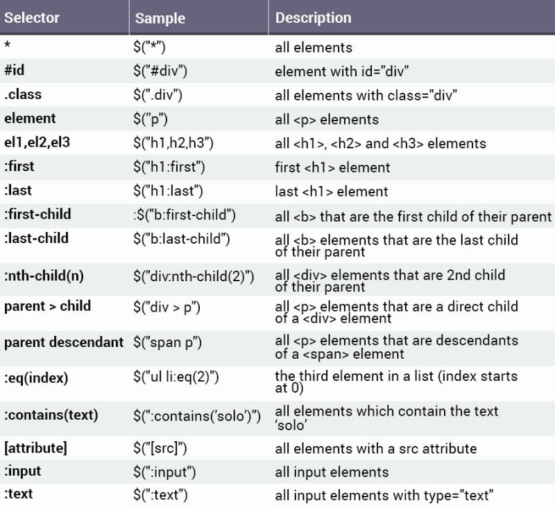
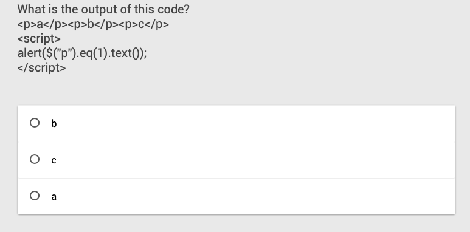

#### jQuery是什么？

     就像是 python 中的模块、 类库
    
     就是把 JavaScript 的语句封装起来的一个模块、类库。

JavaScript 中有：
1.直接查找：
2.间接查找

> Jquery 有：
>
> 选择器
>
> 筛选器

例子：想要获取指定id的元素并更改它的html。
用原生js操作：
```js
var el = document.getElementById("start");
el.innerHTML = "Go";
```
用Jquery操作：
```js
$("#start").html("Go");
```


#### 特点

1. 快速、小巧但是强大选择器 --- 类似于css的选择器

2. 使得DOM操作，事件处理，动画控制更方便。

3. Ajax封装 (后面项目的时候讲)
4. 不能和Vue同时使用，因为Vue操作的时虚拟DOM，Jquery操作的是实际DOM，容易导致冲突。


#### JQuery 下载与使用

          官网： [https://jquery.com](https://jquery.com/)
    
          中文文档：<http://jquery.cuishifeng.cn/>
    
          如何使用:

建议把要使用的源文件更名为不带版本号的文件名，引入的时候也不带版本号，在代码块引入的附近写上注释，注明版本即可。


也可以在线引用CDN(Content Delivery Network)，下面是jQuery的官方CDN。

```html
<!DOCTYPE html>
<html>
    <head>
        <title>Page Title</title>
        <script src="https://code.jquery.com/jquery-3.1.1.js"></script>
    </head>
    <body>
    </body>
</html>
```
⚠️ jQuery是JavaScript的类库，所以它的后缀名是.js


#### 基础语法
```js
$(document).ready(function() {
   // jQuery code goes here
});

//jQuery起手式
$(function() {
   // jQuery code goes here
});
```
下面是对上面的简写方式，$声明需要访问jQuery，ready阻止jQuery代码在未加载完毕前运行。其它语法后面详细说明。


html文件如下：
```html
<!DOCTYPE html>
<html>
  <head>
    <title>Page Title</title>
    <script src="https://code.jquery.com/jquery-3.1.1.js"></script>
  </head>
  <body>
    <div id="start">Start</div>
  </body>
</html>
```

JavaScript:
jQuery第二式
```js
$(function() {
  $("#start").html("Go!");
});
```

Basic syntax is: $("selector").action()
- The $ accesses jQuery.
- The (selector) finds HTML elements.
- The action() is then performed on the element(s).
上面则是选择id为start的元素，然后调用html()函数。


#### 选择器
```javascript
/*1.元素全选器 --> 选择所有的指定元素*/
$("div")

/*2.id 选择器 --> 选择id=“test”的元素*/
$('#test')
          
/*3.class选择器 -> 选择class=“menu”的元素*/
$('.menu')
```


```javascript
/*4.组合选择器一 --> 会找到所有的在小括号内的标签，写的时候每个标签之间用 逗号分开*/
$('div,p,span')

/*5.组合选择器二 --> 所有class=“menu”的div元素 */
$('div.menu')

/* 6. parent --- child 
   --> 找到这个标签的下的所有的 目标标签，不论在第几层，都会被找到;
       写的时候标签之间用 空格隔开。*/
$('div p')
          
/*7. parent > child 
   --> 只会找到这个标签的下一层里的所有的符合目标的标签，也就是只在其下面的第一层中找 */
$('form > input')
          
/* 8. 根据明确的层级找

:first --> 在同级别的标签中找到第一元素

:last --> 在同级别的标签中找到最后一个元素

:eq() --> 在同级别的标签中利用标签所在的索引位置找到匹配的标签，索引号从 0 开始*/
$("p:first")  // the first <p> element

```
更多：



```javascript
8. 过滤器
   jQuery filter() 方法
   filter() 方法允许您规定一个标准。不匹配这个标准的元素会被从集合中删除，匹配的元素会被返回。

下面的例子返回带有类名 "url" 的所有 <p> 元素：
$(function(){
  $("p").filter(".url");
});

9. 属性选择器 ☆☆☆☆☆
  --> 匹配到某个标签下且具有某一属性的所有标签
<input type="text" name='username'/>
$("input[type='text']")
或者
$("input[name='username']")
```


更多


#### 筛选器
```html
<div> div element
<p>paragraph </p>
</div>
```
jQuery
```js
var e = $("s").parent();
e.css("border","2px solid red");
```


```javascript
next() --> 获取同级紧邻的下一个元素
next("#test") --> 获取到同级标签下一个元素中 id 为 test 的元素
nextAll() --> 获取同级紧邻的下方的所有元素
nextUntil(".c1") --> 获取同级标签紧邻的其下的所有元素，直到类名为 c1 的标签为止，就不在向下匹配
prev() --> 获取同级紧邻上一个元素
prevAll() --> 获取同级紧邻上方所有的元素
prevUtil() --> 获取同级紧邻下方所有的元素

children() --> 获取所有的子元素
parent() --> 获取自己的父元素
parents() --> 获取所有的父元素
siblings() --> 获取兄弟元素
eq() --> 指定第几个元素 $("div").eq(2); 表示所有div元素的第3个，从0开始算。

```



移除元素
```html
<p style="color:red">Red</p>
<p style="color:green">Green</p>
<p style="color:blue">Blue</p>
```
```js
$("p").eq(1).remove();
```


移除内容用empty()， 不详细讲了。


#### jQuery 操作

```javascript
// css 样式操作
// 添加样式
$(".c1").css("display",none);

// 文本操作
$("div").text("dsadsa")
input系列框里面的值，
$("xxx").val("dsadsa")

$("xxx").html()

// 属性操作
给某一个标签的属性赋值
$("xxx").attr("class","c1");

获取属性 target 的值
$("xxx").attr("key"); 

移除标签的属性
$("xxx").removeAttr("key");

添加类 注意类名前面没有点
$("xxx").addClass("c1" );

移除类
$("xxx").removeClass("c1" );

没有这个类，就设置为这个类,有这个类，就移除这个类
$("xxx").toggleClass("hidden");

判断有没有这个类
$("xxx").hasClass("c1" );

在操作关于input系列【radio checkbox】 我们选中或者取消，
不能采用attr来进行设值, 不过，在1.3 版本修复了这个bug---
prop()专门是用来对input【radio checkbox】
$("xxx").prop();

// 文档操作
往选中的元素内部的后面添加元素
append();

往选中的元素的前面添加元素
prepend();

往选中元素的外部的后面进行添加
after();

往选中元素的外部的前面进行添加
before();

将元素内部的内容删除
empty();

将元素的标签删除； 如：$("xxx").remove()
remove();
```


#### 事件

事件由用户触发，例如点击元素、移动鼠标或者提交表格。
例如，我们想实现点击时显示当前时间。
```js
$("#demo").click(function(){
 $("body").html(Date())
 });
```
复习一下：
```js
// 页面加载事件的两种方式：
// 允许我们在文档完全加载完后执行函数
$(function(){
    $("div").click(function(){
        console.log("dsadsadsa");
    })
});

$(document).ready(function(){
    $("div").click(function(){
        console.log("dsadsadsa");
    })
});
```
通用事件
Mouse Events:
click occurs when an element is clicked.
dblclick occurs when an element is double-clicked.
mouseenter occurs when the mouse pointer is over (enters) the selected element.
mouseleave occurs when the mouse pointer leaves the selected element.
mouseover occurs when the mouse pointer is over the selected element.

Keyboard Events:
keydown occurs when a keyboard key is pressed down.
keyup occurs when a keyboard key is released.

Form Events:
submit occurs when a form is submitted.
change occurs when the value of an element has been changed.
focus occurs when an element gets focus.
blur occurs when an element loses focus.

Document Events: 
ready occurs when the DOM has been loaded.
resize occurs when the browser window changes size.
scroll occurs when the user scrolls in the specified element.

##### 另一种处理事件的方式

```javascript
// 绑定事件 目前推荐的方式
$( "p" ).on( "click", function() {
  alert("clicked");
});
```

下面代码实现了什么样的效果？
```js
// 移除事件 目前推荐的方式
$("div").on("click", function() { 
  alert('Hi there!'); 
  $("div").off("click");
}); 
```


#### 自动触发
```js
$("div").click(function() {
   alert("Clicked!");
});
$("div").trigger("click");
```


### 实战 To-Do List
html
```html
<h1>My To-Do List</h1>
<input type="text" placeholder="New item" />
<button id="add">Add</button>
<ol id="mylist"></ol>
```
明确需要处理的函数

```js
$(function() {
  $("#add").on("click", function() {
    //event handler
  });
});
```
具体业务逻辑
```js
var val = $("input").val();
if(val !== '') {
  var elem = $("<li></li>").text(val);
  $(elem).append("<button class='rem'>X</button>");
  $("#mylist").append(elem);
  $("input").val(""); //clear the input
}
```


现在还没有删除的功能
```js
$(".rem").on("click", function() {
  $(this).parent().remove();
});
```

习题时间


#### 一些好玩的
淡入淡出效果
```js
$(function() {
  $("p").click(function() {
    $("div").fadeToggle(1000);
  });
});
```
[在线演示效果](https://code.sololearn.com/1137/#js)

```js

$("div").toggle(); /*显示/隐藏切换*/
$("div").slideToggle(500);  /*上下隐藏效果*/

动画效果

```js
var div = $("div");
div.animate({opacity: 1});
div.animate({height: '+=100px', width: '+=100px', top: '+=100px'}, 500);
div.animate({height: '-=100px', width: '-=100px', left: '+=100px'}, 500);
div.animate({height: '+=100px', width: '+=100px', top: '-=100px'}, 500);
div.animate({height: '-=100px', width: '-=100px', left: '-=100px'}, 500);
div.animate({opacity: 0.5});

```
[在线演示](https://code.sololearn.com/1142/#js)

下拉菜单样式
```html
<div class="menu">
  <div id="item">Drop-Down</div>
  <div id="submenu">
    <a href="#">Link 1</a>
    <a href="#">Link 2</a>
    <a href="#">Link 3</a>
  </div>
</div>
```
```js

$("#item").click(function() {
  $("#submenu").slideToggle(500);
}); 
```
[在线演示](https://code.sololearn.com/1143/#js)

* * *
