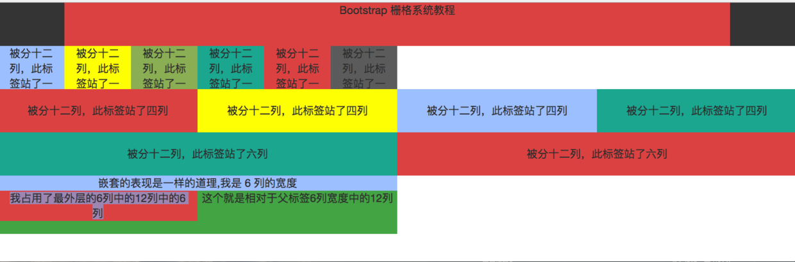

# 一、响应式

```
<!DOCTYPE html>
<html lang="zh-CN">
<head>
    <meta charset="UTF-8">
    <meta name="viewport" content="width=device-width, initial-scale=1.0">
    <meta http-equiv="X-UA-Compatible" content="ie=edge">
    <title>全局样式</title>
    <style>
       .mytest{
           width: 300px;
           height: 500px;
           background-color: blue;
       }
       /*当视窗最宽为 900px ,最小宽度为 300px 的时候改变样式*/
       /* @media only screen and (max-width: 900px) and (min-width: 300px){ */
    /* only 表示只针对屏幕，而不是视窗 */
       @media screen and (max-width: 900px) and (min-width: 300px){
           .mytest{
               width: 100%;
               height: 100px;
               background: red;
           }
       }
    </style>
    
</head>
<body>
<div class="mytest"></div>
</body>
</html>
```


 # 二、示例




```html
<!DOCTYPE html>
<html lang="en">
<head>
    <meta charset="UTF-8">
    <title>Title</title>
    <!--由于这里是使用浏览器直接打开的这个网页，所以这里引入 bootstrap 文件的方式是使用的相对路径-->
        <link rel="stylesheet" href="../static/bootstrap/css/bootstrap.min.css">
    <style>

        div{
            height: 80px;
            text-align: center;
            font-size: 20px;

        }

        .title{
            font-size: 50px;
            background-color: #3c3c3c;
        }

        .content{
            line-height: 80px;
        }
    </style>
</head>
<body>
<div class="container-fluid">

    <div class="row title">
        <div class="col-md-10 col-md-offset-1" style="background-color: #E04B4A"> Bootstrap 栅格系统教程</div>
    </div>

    <div class="row">
         <div class="col-md-1" style="background-color: #A6C6FF">被分十二列，此标签站了一列</div>
         <div class="col-md-1" style="background-color: #ffff00">被分十二列，此标签站了一列</div>
         <div class="col-md-1" style="background-color: #95b75d">被分十二列，此标签站了一列</div>
         <div class="col-md-1" style="background-color: #1caf9a">被分十二列，此标签站了一列</div>
         <div class="col-md-1" style="background-color: #E04B4A">被分十二列，此标签站了一列</div>
     <div class="col-md-1" style="background-color: #666">被分十二列，此标签站了一列</div>
    </div>
    <div class="row content">
         <div class="col-md-3" style="background-color: #E04B4A">被分十二列，此标签站了四列</div>
         <div class="col-md-3" style="background-color: #ffff00">被分十二列，此标签站了四列</div>
         <div class="col-md-3" style="background-color: #A6C6FF">被分十二列，此标签站了四列</div>
         <div class="col-md-3" style="background-color: #1caf9a">被分十二列，此标签站了四列</div>
    </div>
    <div class="row content">
         <div class="col-md-6" style="background-color: #1caf9a">被分十二列，此标签站了六列</div>
        <div class="col-md-6" style="background-color: #E04B4A">被分十二列，此标签站了六列</div>

    </div>
    <div class="row">
        <div class="col-md-6" style="background: #A6C6FF">嵌套的表现是一样的道理,我是 6 列的宽度
        <div class="row" style="background: #4cae4c">这个就是相对于父标签6列宽度中的12列
        <dib class="col-md-6" style="background: #E04B4A">我占用了最外层的6列中的12列中的6列</dib>
        </div>
        </div>
        <div class="col-md-6"></div>
    </div>
</div>
</body>
</html>
```

