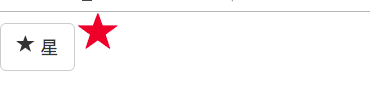
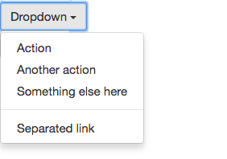
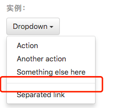
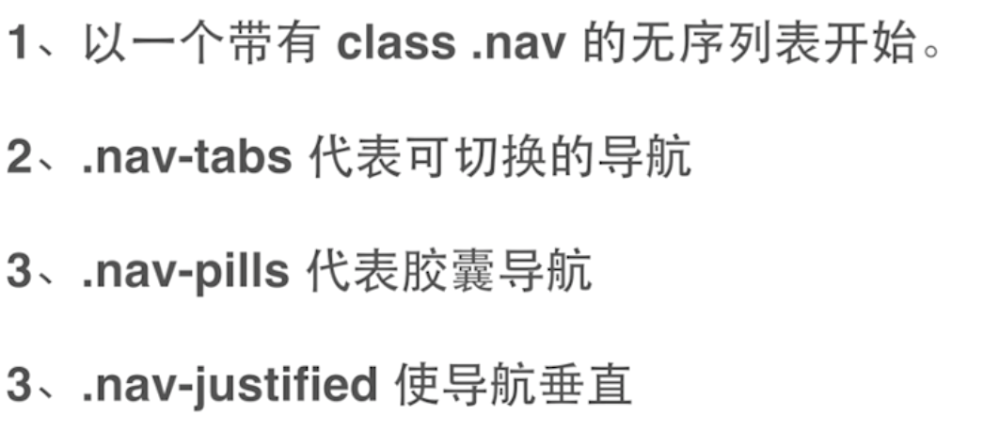
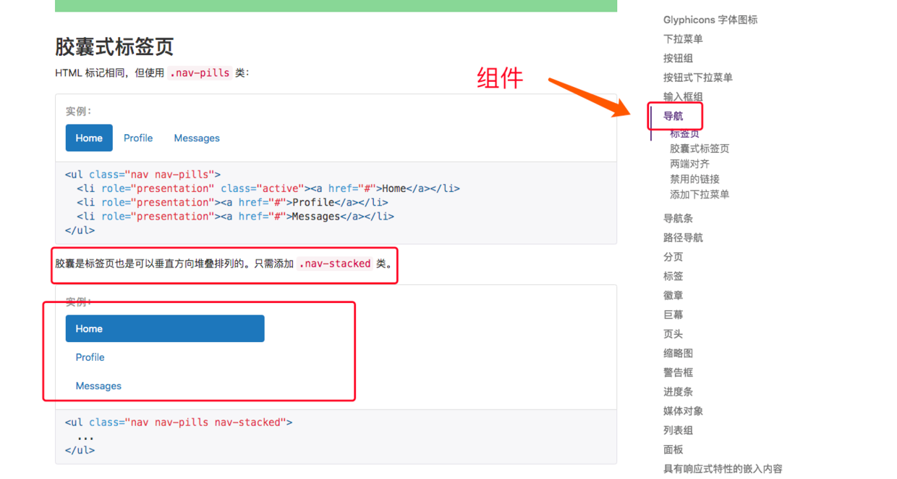
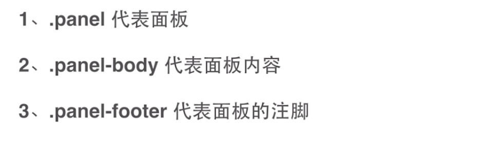

# 一、字体图标
Bootstrap 包括250多个来自 Glyphicon Halflings 的字体图标。
[Glyphicons](http://glyphicons.com/) Halflings 一般是收费的，但是他们的作者允许 Bootstrap 免费使用。

在 `bootstrap.cscc` 文件中已经引入了字体图标的文件。

所以我们可以直接使用。

由于是字体图标，所以，关于字体的属性都可以应用到这个图标上，比如大小、颜色等。

[点我查看全部图标](https://v3.bootcss.com/components/)

## 如何使用？

所有图标都需要一个基类`.glyphicon`和对应每个图标的类 `glyphicon-*`。

#### 为图标单独创建一个元素
图标类不能和其它组件直接联合使用。
它们不能在同一个元素上与其他类共同存在。
应该创建一个嵌套的 <span> 标签，并将图标类应用到这个 <span> 标签上。

#### 只对内容为空的元素起作用
图标类只能应用在不包含任何文本内容或子元素的元素

实例




```html
<button type="button" class="btn btn-default btn-lg">
    <span class="glyphicon glyphicon-star" aria-hidden="true"></span> Star
</button>
<span class="glyphicon glyphicon-star" style="font-size: 40px;color: crimson;" aria-hidden="true"></span>
```

# 二、下拉菜单
Bootstrap 的下拉菜单依赖于 `js`, 所以应该引入 `bootstrap.js` 文件，而 `bootstrap.js` 又依赖 `jQuery`。

所以应该先引入 `jQuery` ，之后再引入 `bootstrap.js`

```html
    <link rel="stylesheet" href="../static/bootstrap/css/bootstrap.css">
    <script src='../static/jquery.js'></script>
    <script src='../static/bootstrap/js/bootstrap.js'></script>
```

定义一个下拉菜单需要给其添加 `.dropdown` 组件。

- `.dropdown` 定义下拉，在最外层
- `. .dropup`   定义上拉，在最外层
- `.dropdown-menu` 定义一个下拉菜单，包含在 `.dropdown` 中
- `data-toggle`  是绑定了一个事件
- `.dropdown-menu-right` 实现右对齐

实例



```html
<div class="dropdown">
    <button type="button" class="btn btn-default dropdown-toggle"  
    id="dropdownMenu1"
    data-toggle="dropdown">
        Dropdown
        <span class="caret"></span>
    </button>
    <ul class="dropdown-menu" aria-labelledby="dropdownMenu1">
        <li><a href="#">Action</a></li>
        <li><a href="#">Another action</a></li>
        <li><a href="#">Something else here</a></li>
        <li role="separator" class="divider"></li>
        <li><a href="#">Separated link</a></li>
    </ul>
</div>
```


B默认情况下，下拉菜单自动沿着父元素的上沿和左侧被定位为 100% 宽度。 为 .dropdown-menu 添加 .dropdown-menu-right 类可以让菜单右对齐。

### 分割线
为下拉菜单添加一条分割线，用于将多个链接分组。




```html
<ul class="dropdown-menu" aria-labelledby="dropdownMenuDivider">
  ...
  <li role="separator" class="divider"></li>
  ...
</ul>
```

# 三、 导航






# 四、面板


