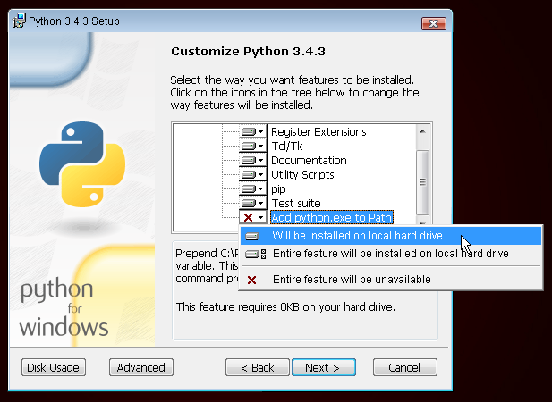

# 安装
在线下教程中，你会建立一个博客，有一些配置任务最好能够在之前完成，那样你就可以在那一天直接开始编程。
# 安装Python

Django 是用 Python 写的。 在 Django 中，我们需要使用 Python 语言去做所有的事情。 让我们从安装开始 ！ 我们希望您能安装 Python 3.6，所以如果你有任何以前的版本，你将需要将其升级。
## Windows系统
您可以从 https://www.python.org/downloads/release/ 网站上下载 Windows版的Python。 下载 *.msi 文件完成之后，你应该运行它 （双击它），并按照那里的指示。 重要的是记住 Python 的安装位置的路径 （目录）。 它以后将会被需要 ！
需要注意一件事情：在安装向导的第二步，选中“Customize”，向下滚动并确保选中“Add python.exe to the Path”选项，如下所示：

## Linux系统
很有可能你的系统已经默认安装了Python。要检查你是否安装了 （并且它是哪一个版本），打开控制台，并键入以下命令：
`$ python3 --version
Python 3.4.3`
如果你未曾安装过 Python 或者你想要一个不同的版本，你可以按如下所示安装它：
## Debian 或 Ubuntu
在控制台中键入此命令：
`$ sudo apt install python3`
## Fedora
在您的控制台中使用此命令：
`$ sudo dnf install python3`
## openSUSE
在您的控制台中使用此命令：
`$ sudo zypper install python3`
## OS X
你需要去到网站 https://www.python.org/downloads/release/ 然后下载 Python 安装程序：
* 下载 Mac OS X 64-bit/32-bit installer 文件，
* 双击 python-3.4.3-macosx10.6.pkg 以运行安装程序。
验证安装成功，请打开 终端 应用，运行 python3 命令：
`$ python3 --version
Python 3.4.3`


# 配置 virtualenv 与安装 Django

## 虚拟环境
在安装 Django 之前，我们会让你安装一个非常实用的工具，它可以让你计算机上的编码环境保持整洁。 这个步骤可以跳过，但我们强烈建议你跟着做。 从最佳实践设置开始将会在未来为你省去无数的烦恼！
所以，让我们创建一个 虚拟环境 （也称为 virtualenv）。 虚拟环境会以项目为单位将你的 Python/Django 安装隔离开。 这意味着对一个网站的修改不会影响到你同时在开发的其他任何一个网站。 优雅吧？
你需要做的就是找到您想创建 虚拟环境的一个目录 ；比如您的主目录。 在 Windows 上，它可能看起来像 C:\Users\Name （其中 Name 是您的登录名）。
在本教程中我们将使用您的 home 目录下的一个新目录 djangogirls ：
`mkdir djangogirls
cd djangogirls`
我们将虚拟环境称为 myvenv。一般的命令格式是：
`python3 -m venv myvenv`
## Windows系统
若要创建新的 虚拟环境，您需要打开的控制台 （我们在前几章里已经告诉过你了，还记得吗？），然后运行 C:\Python34\python -m venv myvenv。 它看起来会像这样：
`C:\Users\Name\djangogirls&gt; C:\Python34\python -m venv myvenv`
C:\Python34 是您之前安装Python的目录， myvenv 是您虚拟环境 的名字。 你可以使用其他任何名字，但请坚持使用小写，并不要使用空格、重音符号或特殊字符。 始终保持名称短小是个好主意 — — 你会大量引用它 ！

## Linux 和 OS X
在 Linux 和 OS X 上创建的 虚拟环境 就和运行 python3 -m venv myvenv 一样简单。看起来像这样：
`~/djangogirls$ python3 -m venv myvenv`
myvenv 是您 虚拟环境 的名字。 您可以使用其他任何名称，但请始终使用小写以及不要有空格。 始终保持名称短小是个好主意，因为你会大量引用它！

> 注意： 在Ubuntu 14.04上启动虚拟环境会报以下错误：
> Error: Command '['/home/eddie/Slask/tmp/venv/bin/python3', '-Im', 'ensurepip', '--upgrade', '--default-pip']' returned non-zero exit status 1
> 为了解决这个问题，请使用 virtualenv 命令。
>
> ```shell
> ~/djangogirls$ sudo apt install python-virtualenv    
> ~/djangogirls$ virtualenv --python=python3.4 myvenv   #myvenv 自定义
> ```
>
> 
## 使用虚拟环境
上面的命令将创建一个名为 myvenv 目录 （或任何你选择的名字），其中包含我们的虚拟环境 （基本上是一堆的目录和文件）。
## Windows系统
运行如下命令进入你的虚拟环境：
C:\Users\Name\djangogirls&gt; myvenv\Scripts\activate
## Linux 和 OS X
运行如下命令进入你的虚拟环境：

```shell
~/djangogirls$ source myvenv/bin/activate`
```

记住要将 myvenv 替换成你选择的 虚拟环境的 名字 ！

> 注： 有时 source 可能不可用。在这些情况下试着做这面这些事情：
>
> ```shell
> ~/djangogirls$ . myvenv/bin/activate
> ```
>
> 当你看到在您的控制台中有如下提示就知道你已经进入 虚拟环境 ：
> `(myvenv) C:\Users\Name\djangogirls`
> 或：
> `(myvenv) ~/djangogirls$`
> 注意 （myvenv）前缀的出现 ！
> 当在一个虚拟的环境中工作时，python 将自动指向正确的版本，因此您可以使用 python 代替 python3.
> 好的现在所有重要的依赖关系已经就位。最后，我们可以安装 Django ！
# 安装 Django
既然你有了虚拟环境 ，您可以使用 pip安装 Django 。在控制台中，运行 pip install django==1.8 （注意我们使用双等于号： ==).    下载2.1
```(myvenv) ~$ pip install django==1.8
(myvenv) ~$ pip install django==1.8
Downloading/unpacking django==1.8
Installing collected packages: django
Successfully installed django
Cleaning up...
```
在 Windows 上
> 如果你在 Windows 平台上调用 pip 时得到一个错误，请检查是否您项目的路径名是否包含空格、 重音符号或特殊字符 (如：C:\Users\User Name\djangogirls)。 若的确如此，请尝试移动它到另外一个没有空格、重音符号或特殊字符的目录，（例如：C:\djangogirls）。 在移动之后，请重试上面的命令。
在 Linux 上
> 如果你在Ubuntu 12.04上得到一个错误，请运行 pip python -m pip install -U --force-reinstall pip来修复虚拟环境中的pip安装。
就是这样！你现在（终于）准备好创建一个 Django 应用程序！

# 安装 Git
## Windows系统
你可以从 git-scm.com 下载Git。 你可以在所有的安装步骤中点击"next next next"，除了第5步"Adjusting your PATH environment"，需要选择"Run Git and associated Unix tools from the Windows command-line"(底部的选项)。 除此之外，默认值都没有问题。 签出时使用 Windows 风格的换行符，提交时使用 Unix 风格的换行符，这样比较好。
## MacOS系统
从git-scm.com下载Git,根据说明操作。
## Linux系统
如果git还没有被安装的话，你可以从你的软件包管理器中下载git, 请试试下面命令:
```sudo apt install git
# or
sudo yum install git
# or
sudo zypper install git
```
## 创建一个 GitHub 账户
前往 GitHub.com 并注册一个新的账号。
## 创建一个 PythonAnywhere 帐户
下一步，在PythonAnywhere注册一个“Beginner”账户。
www.pythonanywhere.com注意 在这里选择的用户名会出现在博客链接的地址当中yourusername.pythonanywhere.com ，因此最好选择你自己的绰号或者是与博客内容相关的名字。
