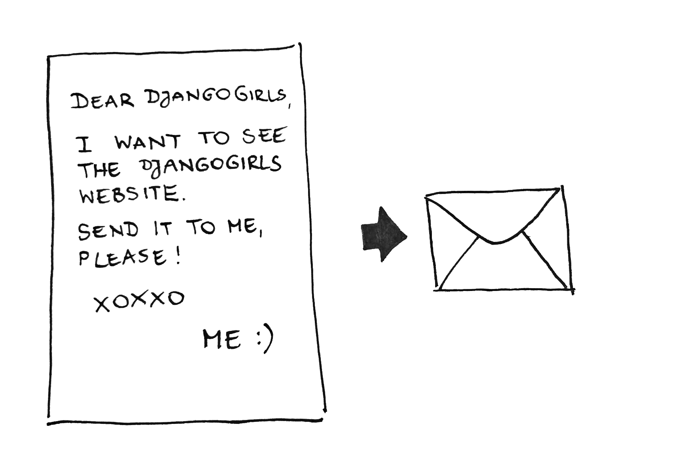

# 互联网是如何工作的？

我们猜你每天在使用互联网。但是当你在浏览器里输入一个像 https://baidu.com 的地址并按 回车键的时候，你真的知道背后发生了什么吗？

你需要了解的第一件事是一个网站只是一堆保存在硬盘上的文件。 就像你的电影、 音乐或图片一样。 然而，网站的唯一的不同之处是： 网站包含一种称为 HTML 的代码。

如果你不熟悉编程，一开始你会很难理解HTML。你的浏览器 (如Chrome、 Safari、 Firefox 等) 却很喜欢它。 Web浏览器懂得这些代码，遵循它的指令并如你所想的那样展示这些文件。

就像我们对待每个电脑文件一样，我们需要把HTML文件存储在硬盘的某个位置。 对于互联网，我们使用特定而功能强大的电脑，我们称之为服务器。 它们没有屏幕、鼠标或者键盘，因为它们的主要目的是存储数据，并用它来提供服务。 这就是为什么它们被称作服务器--因为他们用数据服务你。

好了，但是你想知道互联网看起来是什么样子的，对吗？
我们给你画了一幅画！它看起来像这样：

看起来很糟糕，对吗？ 事实上，它是一个由互相连通的机器 (上面提到的服务器) 组成的网络。 数以十万计的机器！ 很多，很多数以公里长的电缆分布在全世界！ 你能访问一个海底电缆地图网站（ http://submarinecablemap.com/ ）来看这个网络有多么复杂。 这是一个网站上的截屏：

它很迷人，对吧？ 但是很明显，我们不太可能用电缆去连接任何两台上网的电脑。 我们需要将请求通过很多很多不同的机器传递，以便连接一台机器 (比如存储https://baidu.com的机器)。

它看起来像这样：

想象一下当你键入 https://baidu.com ，你会发送一封信说：“亲爱的baidu，我想看看baidu.com网站，请将它发送给我！”
你的信件去了离你最近的邮局。 然后它去离你的收件人稍近一点的邮局，然后再去另一个，以此类推地到达它的目的地。 唯一的事情是，如果你将许多信件 (数据包) 发送到同一个地方，他们可以通过完全不同邮政局 (路由器)。 这取决于每个办公室的分布情况。

是的，就这么简单。你发送信息，然后期望一些回复。当然，你使用的不是纸笔，而是比特数据，但是思想是一样的！

我们使用的地址叫做IP地址，这种地址却不包含街道、城市、邮编和城市。 你的电脑首先要求DNS（域名服务器）baidu.com成为IP地址。 他工作起来有点像老式的电话簿，在那里你可以找到你想联系的人的名字，并且找到他们的电话号码和地址。
当你发送一封信时，它需要确切的功能以便正确的传递：地址，邮票等等。 你使用一种接收者同样能够理解的语言，对吗？ 你送到网站的数据包也类似如此。 我们使用一个名为 HTTP (Hypertext Transfer Protocol：超文本传输协议) 的协议。

所以，基本上，当你有一个网站你需要有一台服务器用于网站的托管。 当服务器接收到一个访问请求（一封信），它把网站内容发送回去（回信）。
既然这是Django教程，你会问Django做什么。 当你发送一个响应时，你通常不会发送同样的东西给每一个人。 如果你信件的内容是个性化的必然更好，尤其是对于那个刚刚给你写信的人，对吗？ Django帮助你创建这些个性化，有趣的信件：）。
废话少说，抓紧时间创造！
