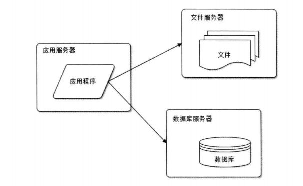

## 构建分离式LNMP架构

-Author: bavdu

-Mail: bavduer@163.com

-GitHub: https://github.com/bavdu

-Date: 2018/09/16

---


**<u>网站架构是怎么设计的？</u>**

根据业务的逻辑和需求来设定的. 在业务的初期访问量并不大,公司为了节约成本,所以把应用服务、数据库、文件服务等所有资源放在一台服务器中,如下图所示:


随着业务的发展,就会发现一台服务器禁不住那么多用户的访问,所以讲应用服务器与数据服务器分离. 三台服务器对硬件资源的要求各不相同. 

- 应用服务器需要更快的CPU
- 文件服务器需要更大的磁盘和带宽
- 数据库服务器需要更快的磁盘和更大的内存



环境准备:

- VMware Workstation 14 Pro
- CentOS Linux release 7.5.1804 (Core)  x3


软件版本:

- Nginx 1.14
- MariaDB 5.5
- PHP 5.5


应用服务器:

```shell
#建立nginx的安装源
[root@qianfeng_nginx ~]# vim /etc/yum.repos.d/nginx.repo
[nginx]
name=nginx repo
baseurl=http://nginx.org/packages/centos/7/$basearch
gpgcheck=0
enabled=1

[root@qianfeng_nginx ~]# yum -y install nginx nfs-utils

#设置nginx服务配置
[root@qianfeng_nginx ~]# cd /etc/nginx/conf.d
[root@qianfeng_nginx conf.d]# cp default.conf qianfeng_cloud.conf
[root@qianfeng_nginx conf.d]# rm -rf default.conf
[root@qianfeng_nginx conf.d]# vim qianfeng_cloud.conf
server {
    listen       80;
    server_name  www.qianfeng.com;

    location / {
        root   /usr/share/nginx/html;
        index  index.php index.html index.htm;
    }

    error_page   500 502 503 504  /50x.html;
    location = /50x.html {
        root   /usr/share/nginx/html;
    }

    location ~ \.php$ {
        root           /usr/share/nginx/html;
        fastcgi_pass   <nfsphp主机IP地址>:9000;
        fastcgi_index  index.php;
        fastcgi_param  SCRIPT_FILENAME  $document_root$fastcgi_script_name;
        include        fastcgi_params;
    }
}

[root@qianfeng_nginx ~]# rm -rf /usr/share/nginx/html/*
[root@qianfeng_nginx ~]# vim /etc/fstab
<nfsphp主机IP地址>:/usr/share/nginx/html	/usr/share/nginx/html	nfs	defaults	0 0
```


数据库服务器:

```shell
[root@qianfeng_db ~]# yum -y install mariadb-server mariadb
[root@qianfeng_db ~]# systemctl start maraidb && systemctl enable mariadb

[root@qianfeng_db ~]# mysql -uroot
mysql> create database iterm01;
mysql> grant all privileges on iterm01.* to 'nginx'@'<nginx应用服务器IP网段>' identified by '123456';
mysql> exit
```


nfsphp服务器:

```shell
[root@qianfeng_nfsphp ~]# yum -y install nfs-utils php php-mysql php-devel php-gd php-fpm php-mcrypt php-mbstring php-xml
[root@qianfeng_nfsphp ~]# groupadd -g 996 nginx
[root@qianfeng_nfsphp ~]# useradd -u 998 -g nginx -M -s /sbin/nologin nginx
[root@qianfeng_nfsphp ~]# vim /etc/php-fpm.d/www.conf
listen=<本机IP地址>:9000
listen_allower_client=<nginx主机IP地址>,<。。。>
user=nginx
group=nginx
[root@qianfeng_nfsphp ~]# sytemctl start php-fpm && systemctl enable php-fpm

[root@qianfeng_nfsphp ~]# vim /etc/exports
/usr/share/nginx/html		<nginx应用服务器IP网段>(rw,sync)
[root@qianfeng_nfsphp ~]# mkdir -p /usr/share/nginx/html
[root@qianfeng_nfsphp ~]# systemctl start nfs && systemctl enable nfs

[root@qianfeng_nfsphp ~]# vim /usr/share/nginx/html/index.php
<?php phpinfo(); ?>
```


整合:

```shell
[root@qianfeng_nginx ~]# mount -a
打开浏览器访问nginx主机IP地址验证
```

