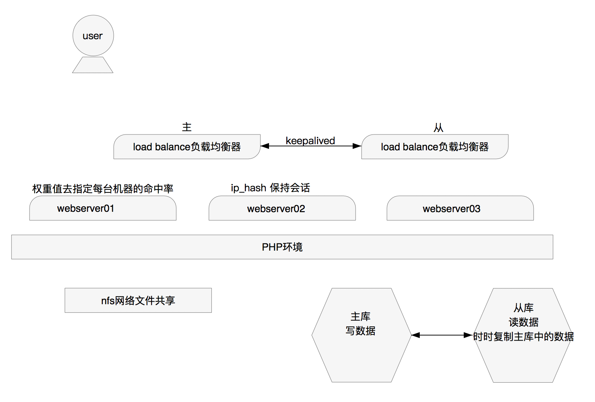

## 大型网站 之 负载均衡

-Author：bavdu

-Mail：bavduer@163.com

-GitHub：https://github.com/bavdu

---

/* 环境准备 */

- CentOS 7  x3
- nginx 1.14



/* 构建过程 */

```shell
Loadbalance_Server:192.168.13.20
$ yum -y install nginx
$ vim /etc/nginx/nginx.conf
http {
    upstream myapp {
        ip_hash;
        server 192.168.13.21 weight=5;
        server 192.168.13.22 weight=1;
    }
    
    server {
        listen 80;
        server_name www.qianfeng.com;
        
        location / {
            proxy_pass http://myapp;
        }
    }
}
$ systemctl restart nginx && systemctl enable nginx
```

```shell
Web_Server01:192.168.13.21
$ yum -y install nginx
$ vi /usr/share/nginx/html/index.html
<h1>Welcome to QianFeng Cloud Compute 001test001!</h1>
$ systemctl restart nginx && systemctl enable nginx
```

```shell
Web_Server02:192.168.13.22
$ yum -y install nginx
$ vi /usr/share/nginx/html/index.html
<h1>Welcome to QianFeng Cloud Compute 222TEST222!</h1>
$ systemctl restart nginx && systemctl enable nginx
```


/* 测试 */

1. 选择两个浏览器去分别浏览192.168.13.20
2. 可以选择一台浏览器去刷新访问192.168.13.20