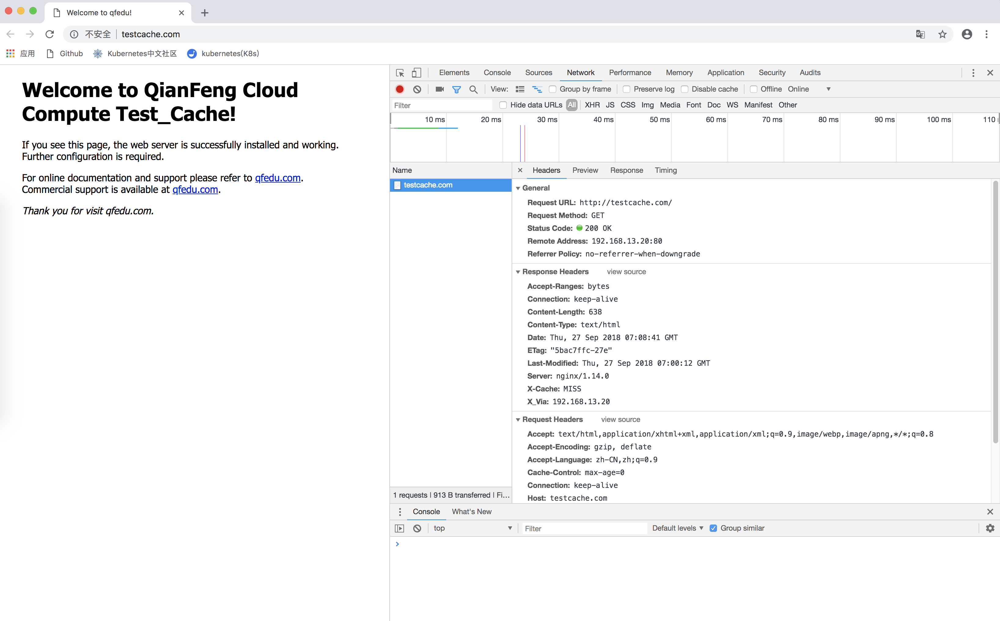

## 大型网站 之 web缓存

-Author：bavdu

-Mail：bavduer@163.com

-GitHub：https://github.com/bavdu

---

**/* 理论基础 */**

Nginx指出类似squid的web缓存功能, 就是把web页面根据URL编码哈希后保存在硬盘上, nginx的稳定性和速度比squid要高出很多, 而且在性能上nginx对多核CPU的利用也超过Squid. 而且nginx也同时支持负载均衡, 这对于短期突然顶不住访问量的网站来说非常有利.


**/* 环境准备 */**

```shell
WebServer01:
[root@web01 ~]# yum -y install nginx
[root@web01 ~]# vi /usr/share/nginx/html/index.html
<!DOCTYPE html>
<html>
<head>
<title>Welcome to qfedu!</title>
<style>
    body {
        width: 35em;
        margin: 0 auto;
        font-family: Tahoma, Verdana, Arial, sans-serif;
    }
</style>
</head>
<body>
<h1>Welcome to QianFeng Cloud Compute Test_Cache001!</h1>
<p>If you see this page, the web server is successfully installed and
working. Further configuration is required.</p>

<p>For online documentation and support please refer to
<a href="http://qfedu.com/">qfedu.com</a>.<br/>
Commercial support is available at
<a href="http://qfedu.com/">qfedu.com</a>.</p>

<p><em>Thank you for visit qfedu.com.</em></p>
</body>
</html>

[root@web01 ~]# systemctl start nginx && systemctl enable nginx
```

```shell
WebServer02:
[root@web02 ~]# yum -y install nginx
[root@web02 ~]# vi /usr/share/nginx/html/index.html
<!DOCTYPE html>
<html>
<head>
<title>Welcome to qfedu!</title>
<style>
    body {
        width: 35em;
        margin: 0 auto;
        font-family: Tahoma, Verdana, Arial, sans-serif;
    }
</style>
</head>
<body>
<h1>Welcome to QianFeng Cloud Compute Test_Cache002!</h1>
<p>If you see this page, the web server is successfully installed and
working. Further configuration is required.</p>

<p>For online documentation and support please refer to
<a href="http://qfedu.com/">qfedu.com</a>.<br/>
Commercial support is available at
<a href="http://qfedu.com/">qfedu.com</a>.</p>

<p><em>Thank you for visit qfedu.com.</em></p>
</body>
</html>

[root@web02 ~]# systemctl start nginx && systemctl enable nginx
```


**/* 缓存构建 */**

缓存是缓存nginx服务器接收请求过的数据,数据超时时间不能太长,因为数据可能会发生变化,但是nginx服务器内部的缓存的数据还没有更新,会导致客户端请求的数据不是最新数据的问题,数据缓存目录不能定义在server块内,要定义在http块中

```shell
/* 安装nginx服务 */
[root@nginx_cache ~]# yum -y install nginx

/* 配置nginx缓存 */
[root@nginx_cache ~]# vim /etc/nginx/nginx.conf
http {
..........
    upstream webserver {
      server 192.168.13.21 weight=2;		#此IP地址为本实验采用的内网IP地址
      server 150.109.121.110 weight=2;		#同上
    }

    proxy_temp_path /usr/share/nginx/proxy_temp_dir;
    proxy_cache_path /usr/share/nginx/proxy_cache_dir levels=1:2 keys_zone=cache_one:100m inactive=1d max_size=30g;
    server {
      listen 80;
      server_name testcache.com;

      location / {
        add_header X_Via $server_addr;
        add_header X-Cache $upstream_cache_status;
        proxy_pass  http://webserver;
        proxy_cache cache_one;
        proxy_cache_valid 200 304 12h;
        proxy_cache_key $host$uri$is_args$args;
      }

      location ~* ^/form {
        proxy_cache  cache_one;
        proxy_pass  http://webserver;
        proxy_set_header X-Real-IP $remote_addr;
      }
    }
}
[root@nginx_cache ~]# nginx -t
nginx: the configuration file /etc/nginx/nginx.conf syntax is ok
nginx: configuration file /etc/nginx/nginx.conf test is successful
[root@nginx_cache ~]# systemctl restart nginx && systemctl enable nginx
```

**/* 详解注释 */**

add_header X_Via： 在http头部添加服务器IP地址

add_header X-Cache：在http头部添加缓存命中信息

proxy_cache：使用代理xxx

proxy_cache_valid：设置规定页面缓存时间

proxy_cache_key：设置缓存使用的key,默认为完整的访问URL,根据实际情况设置缓存key


**/* 首次访问 */**




MISS：缓存未命中,回源到后端获取最新的内容


**/* 二次访问 */**


HIT：缓存命中,直接返回缓存中内容,不回源到后端

