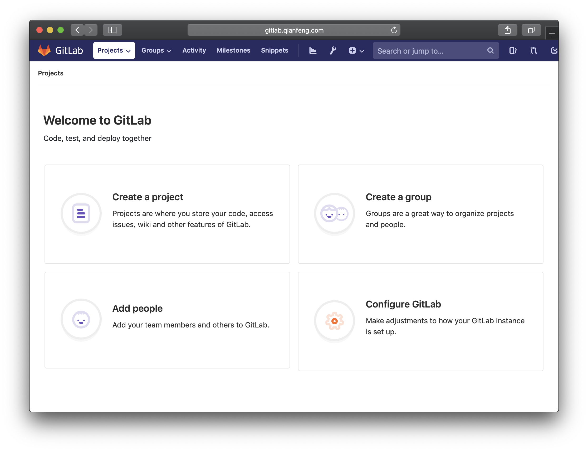

---

-Author: liuchao

-Email: bavduer@163.com

-Github: https://github.com/bavdu

---


**/* git的两种部署方式 */**

```shell
##Yum安装方式
[root@git ~]# yum -y install git
已加载插件：fastestmirror
Loading mirror speeds from cached hostfile
软件包 git-1.8.3.1-14.el7_5.x86_64 已安装并且是最新版本
无须任何处理
[root@git ~]# git config --global user.name bavdu
[root@git ~]# git config --global user.email bavduer@163.com

##源码安装最新版
[root@git ~]# wget https://mirrors.edge.kernel.org/pub/software/scm/git/git-2.9.5.tar.gz
[root@git ~]# yum install curl-devel expat-devel gettext-devel openssl-devel zlib-devel
[root@git ~]# yum install perl-ExtUtils-MakeMaker gettext-devel

[root@git ~]# tar xf git-2.9.5.tar.gz
[root@git ~]# cd git-2.9.5
[root@git ~]# make prefix=/usr/local all
[root@git ~]# make prefix=/usr/local install
[root@git ~]# git --version
git version 2.9.5
[root@git ~]# git config --global user.name bavdu
[root@git ~]# git config --global user.email bavduer@163.com
```


**/* git的工作流程 */**

1. 初始化、提交、查看修改、版本回退

   ```shell
   ##初始化
   [root@git ~]# mkdir /InitWebServer
   [root@git ~]# cd /InitWebServer/
   [root@git InitWebServer]# git init
   初始化空的 Git 仓库于 /InitWebServer/.git/
   
   ##提交
   [root@git InitWebServer]# cat README
   ##Git Version Control 2.9.5
   - Author: bavdu
   - Email: bavduer@163.com
   - Github: https://github.com/bavdu
   ---
   This page is study git version control.
   git is a free software.
   
   [root@git InitWebServer]# git add README
   [root@git InitWebServer]# git commit -m "write a distribution"
   [master（根提交） 6fd28a8] write a distribution
    1 file changed, 9 insertions(+)
    create mode 100644 README
   [root@git InitWebServer]# 
   ```

   ```shell
   ##查看修改
   [root@git InitWebServer]# vim README
   [root@git InitWebServer]# git status
   位于分支 master
   尚未暂存以备提交的变更：
     （使用 "git add <文件>..." 更新要提交的内容）
     （使用 "git checkout -- <文件>..." 丢弃工作区的改动）
   
   	修改：     README
   
   修改尚未加入提交（使用 "git add" 和/或 "git commit -a"）
   [root@git InitWebServer]# git diff README
   diff --git a/README b/README
   index 071b021..f190a0b 100644
   --- a/README
   +++ b/README
   @@ -7,4 +7,4 @@
   
    This page is study git version control.
    git is a free software.
   -distribution distribution
   +distribution
   [root@git InitWebServer]# git add README
   [root@git InitWebServer]# git status
   位于分支 master
   要提交的变更：
     （使用 "git reset HEAD <文件>..." 以取消暂存）
   
   	修改：     README
   
   [root@git InitWebServer]# git commit -m "add distribution"
   [master 2c4f4cb] add distribution
    1 file changed, 1 insertion(+), 1 deletion(-)
   [root@git InitWebServer]# git status
   位于分支 master
   nothing to commit, working tree clean
   [root@git InitWebServer]#
   
   总结:
   - 要随时掌握工作区的状态，使用git status命令
   - 如果git status告诉你有文件被修改过，用git diff可以查看修改内容
   ```

   ```shell
   ##版本回退
   [root@git InitWebServer]# vim init_webserver.sh
   [root@git InitWebServer]# sed -ri s/Prepare/prePare/g init_webserver.sh
   [root@git InitWebServer]# git add init_webserver.sh
   [root@git InitWebServer]# git commit -m "modfiy Prepare to prePare"
   [master 2cc83f7] modfiy Prepare to prePare
    1 file changed, 29 insertions(+)
    create mode 100644 init_webserver.sh
   [root@git InitWebServer]# sed -ri s/upgrade/update/g init_webserver.sh
   [root@git InitWebServer]# git add init_webserver.sh
   [root@git InitWebServer]# git commit -m "modfiy upgrade to update"
   [master 1885322] modfiy upgrade to update
    1 file changed, 1 insertion(+), 1 deletion(-)
   [root@git InitWebServer]# sed -ri s/selinux/SELinux/g init_webserver.sh
   [root@git InitWebServer]# git add init_webserver.sh
   [root@git InitWebServer]# git commit -m "modfiy selinux to SELinux"
   [master f55a9c6] modfiy selinux to SELinux
    1 file changed, 2 insertions(+), 2 deletions(-)
   [root@git InitWebServer]#
   
   [root@git InitWebServer]# git log
   commit f55a9c661ef05d00b2964d98a62ce6cba789a285
   Author: bavdu <bavduer@163.com>
   Date:   Sat Nov 10 22:21:50 2018 +0800
   
       modfiy selinux to SELinux
   
   commit 18853229eff76b911724105831143a8ecfbc5fd0
   Author: bavdu <bavduer@163.com>
   Date:   Sat Nov 10 22:20:59 2018 +0800
   
       modfiy upgrade to update
   
   commit 2cc83f785e4f2302158514fe49c10296d8c3fab2
   Author: bavdu <bavduer@163.com>
   Date:   Sat Nov 10 22:19:51 2018 +0800
   
       modfiy Prepare to prePare
   
   [root@git InitWebServer]# git log --pretty=oneline
   f55a9c661ef05d00b2964d98a62ce6cba789a285 modfiy selinux to SELinux
   18853229eff76b911724105831143a8ecfbc5fd0 modfiy upgrade to update
   2cc83f785e4f2302158514fe49c10296d8c3fab2 modfiy Prepare to prePare
   2c4f4cbe47394117a2fa18825166d804d4215eb9 add distribution
   e43d1289b47bc1558e482758d456756ae40a1bc4 add word distribution.
   5a96a0cb2acb49a10d9dbf109706689f909ad756 add word distribution.
   6fd28a839c545e8450079d403cb62e293332a9ae write a distribution
   
   [root@git InitWebServer]# git reset --hard 18853229eff76b911724105831143a8ecfbc5fd0
   HEAD 现在位于 1885322 modfiy upgrade to update
   
   [root@git InitWebServer]# git reflog
   1885322 HEAD@{0}: reset: moving to 18853229eff76b911724105831143a8ecfbc5fd0
   f55a9c6 HEAD@{1}: reset: moving to f55a9c6
   1885322 HEAD@{2}: reset: moving to HEAD^
   f55a9c6 HEAD@{3}: commit: modfiy selinux to SELinux
   1885322 HEAD@{4}: commit: modfiy upgrade to update
   2cc83f7 HEAD@{5}: commit: modfiy Prepare to prePare
   2c4f4cb HEAD@{6}: commit: add distribution
   e43d128 HEAD@{7}: commit: add word distribution.
   5a96a0c HEAD@{8}: commit: add word distribution.
   6fd28a8 HEAD@{9}: commit (initial): write a distribution
   [root@git InitWebServer]# git reset --hard f55a9c6
   HEAD 现在位于 f55a9c6 modfiy selinux to SELinux
   [root@git InitWebServer]# git log --pretty=oneline
   f55a9c661ef05d00b2964d98a62ce6cba789a285 modfiy selinux to SELinux
   18853229eff76b911724105831143a8ecfbc5fd0 modfiy upgrade to update
   2cc83f785e4f2302158514fe49c10296d8c3fab2 modfiy Prepare to prePare
   2c4f4cbe47394117a2fa18825166d804d4215eb9 add distribution
   e43d1289b47bc1558e482758d456756ae40a1bc4 add word distribution.
   5a96a0cb2acb49a10d9dbf109706689f909ad756 add word distribution.
   6fd28a839c545e8450079d403cb62e293332a9ae write a distribution
   [root@git InitWebServer]#
   
   总结:
   - HEAD指向的版本就是当前版本,因此Git允许我们在版本的历史之间穿梭,使用命令:
   	`git reset --hard commit_id`
   - 穿梭前，用git log可以查看提交历史，以便确定要回退到哪个版本
   - 要重返未来，用git reflog查看命令历史，以便确定要回到未来的哪个版本
   ```

2. 添加远程库、克隆远程库

   

   ```shell
   [root@git ~]# git clone https://github.com/bavdu/InitWebServer.git
   [root@git ~]# vim README
   [root@git ~]# vim init_webserver.sh
   [root@git InitWebServer]# git add .
   [root@git InitWebServer]# git commit -m "add README && script"
   [master dafd314] add README && script
    2 files changed, 39 insertions(+)
    create mode 100644 README
    create mode 100644 init_webserver.sh
   [root@git InitWebServer]# git push -u origin master
   Username for 'https://github.com': <你的账号>
   Password for 'https://bavdu@github.com':<你的密码>
   对象计数中: 4, 完成.
   Delta compression using up to 2 threads.
   压缩对象中: 100% (4/4), 完成.
   写入对象中: 100% (4/4), 889 bytes | 0 bytes/s, 完成.
   Total 4 (delta 0), reused 0 (delta 0)
   To https://github.com/bavdu/InitWebServer.git
      40e19d6..dafd314  master -> master
   分支 master 设置为跟踪来自 origin 的远程分支 master。
   [root@git InitWebServer]#
   ```


**/* Gitlab部署 */**

```shell
##部署Gitlab
[root@git ~]# yum -y install policycoreutils-python
[root@git ~]# rpm -ivh https://mirrors.tuna.tsinghua.edu.cn/gitlab-ce/yum/el7/gitlab-ce-11.4.5-ce.0.el7.x86_64.rpm
[root@git ~]# gitlab-ctl reconfigure
```


user: root

password: <你设定的密码>



构建ssh_key免密上传


创建git仓库<仓库使用和github一致>


gitlab的备份操作及备份恢复

```shell
##备份<设置备份目录及保存天数>
[root@gitlab ~]# vim /etc/gitlab/gitlab.rb
gitlab_rails['backup_path'] = "/var/opt/gitlab/backups"
gitlab_rails['backup_keep_time'] = 604800
[root@gitlab ~]# gitlab-rake gitlab:backup:create

##恢复
[root@gitlab ~]# cd /var/opt/gitlab/backups
[root@gitlab backups]# chmod 777 1541872172_2018_11_11_11.4.5_gitlab_backup.tar
[root@gitlab backups]# gitlab-ctl stop unicorn
ok: down: unicorn: 0s, normally up
[root@gitlab backups]# gitlab-ctl stop sidekiq
ok: down: sidekiq: 0s, normally up
[root@gitlab backups]# gitlab-rake gitlab:backup:restore BACKUP=<备份编号>
[root@gitlab backups]# gitlab-ctl reconfigure
```

