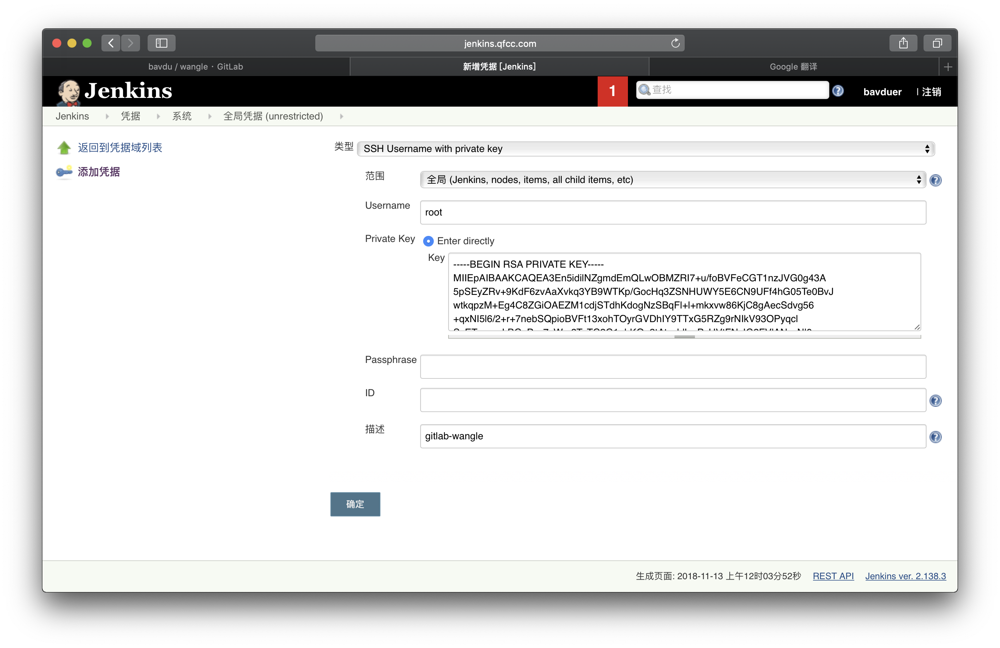

## **Jenkins**流水线

-Author: liuchao

-Email: bavduer@163.com

-Github: https://github.com/bavdu

---


**持续集成CI(Continus Integration)**

> 持续集成是指开发者在代码的开发过程中, 可以频繁的将代码部署集成到主干, 并进行自动化测试

**持续交付(Continous Delivery)**

> 持续交付指的是在持续集成的环境基础之上, 将代码部署到预生产环境—“拉取代码并部署至测试环境中”

**持续部署(Continous Deployment)**

> 在持续交付的基础上,把部署到生产环境的过程自动化,持续部署和持续交付的区别就是最终部署到生产环境是自动化的


**/* Jenkins部署 */**

```shell
##构建JAVA环境
[root@jenkins ~]# tar xf jdk-8u181-linux-x64.tar -C /usr/local/
[root@jenkins ~]# mv /usr/local/jdk1.8.0_181 /usr/local/java
[root@jenkins ~]# vim /etc/profile
export JAVA_HOME=/usr/local/java 
export PATH=$JAVA_HOME/bin:$PATH 
export CLASSPATH=.:$JAVA_HOME/lib/dt.jar:$JAVA_HOME/lib/tools.jar 
[root@jenkins ~]# source /etc/profile

[root@jenkins ~]# java -version
java version "1.8.0_181"
Java(TM) SE Runtime Environment (build 1.8.0_181-b13)
Java HotSpot(TM) 64-Bit Server VM (build 25.181-b13, mixed mode)
```

```shell
##部署tomcat服务<tomcat.apache.org>
[root@jenkins ~]# wget http://mirror.bit.edu.cn/apache/tomcat/tomcat-9/v9.0.13/bin/apache-tomcat-9.0.13.tar.gz
[root@jenkins ~]# tar xf apache-tomcat-9.0.13.tar.gz -C /usr/local/
[root@jenkins local]# mv apache-tomcat-9.0.13 tomcat
[root@jenkins ~]# rm -rf /usr/local/tomcat/webapps/*
```

```shell
##部署maven服务<maven.apache.org>
[root@jenkins ~]# wget http://mirrors.hust.edu.cn/apache/maven/maven-3/3.6.0/binaries/apache-maven-3.6.0-bin.tar.gz
[root@jenkins ~]# tar xf apache-maven-3.6.0-bin.tar.gz -C /usr/local/
[root@jenkins local]# mv apache-maven-3.6.0 maven
[root@jenkins ~]# vim /etc/profile
export MAVEN_HOME=/usr/local/maven
export PATH=$MAVEN_HOME/bin:$PATH
[root@jenkins ~]# source /etc/profile
```

```shell
##部署Jenkins服务<jenkins.io>
[root@jenkins ~]# wget http://mirrors.jenkins.io/war-stable/latest/jenkins.war
[root@jenkins ~]# unzip jenkins.war -d /usr/local/tomcat/webapps/ROOT
[root@jenkins ~]# ln -s /usr/local/tomcat/bin/startup.sh /usr/bin/tomcat
[root@jenkins ~]# chmod a+x /usr/bin/tomcat
[root@jenkins ~]# tomcat
Using CATALINA_BASE:   /usr/local/tomcat
Using CATALINA_HOME:   /usr/local/tomcat
Using CATALINA_TMPDIR: /usr/local/tomcat/temp
Using JRE_HOME:        /usr/local/java
Using CLASSPATH:       /usr/local/tomcat/bin/bootstrap.jar:/usr/local/tomcat/bin/tomcat-juli.jar
Tomcat started.

[root@jenkins ~]# cat .jenkins/secrets/initialAdminPassword
467df83210e845a9b86f00d0a5709933
```

登陆页面


选择插件来安装


安装插件


设置用户名及密码


开始使用Jenkins


####**/* Jenkins 自动化打包、部署、发布过程 */**

*第一部分: Jenkins自动化拉取gitlab上的代码*

1.安装gitlab插件


2.创建gitlab用户添加至项目中并具备管理权限


3.系统管理之全局插件管理




4.构建项目


5.点击立即构建并生成报文


*第二部分: 将代码自动部署至测试环境*

1.新建新项目wangle_deploy


2.webserver生成密钥对添加至gitlab/wangle项目中的Deploy key & SSH Key.

```shell
[root@webserver ~]# useradd wangle
[root@webserver ~]# echo "wangle1115" | passwd --stdin wangle
[root@webserver ~]# ssh-keygen
[root@webserver ~]# cat .ssh/id_rsa.pub
ssh-rsa AAAAB3NzaC1yc2EAAAADAQABAAABAQDDDmD9j7NTXiabhBXpf3PHSv8FZ82gPv4iaBLcWGc09YRpWfi6lAyMXaoVqoduUbVcF7m4klJ+/55xAekma1/Yi2hjZrbFvNSj5f96f+CVTtB18IXI9l6u9Pgh7mC7vZU796e8x7QzRS4rH0o/uOiVe5ecyT3Noy5/RwbhGYIL+KhGlxrn+pESXE4NyYGuSijaNkuc76VRgHTMHM3fuv9dCpU3nn4RYd6VY3HcsubAM8Z2ELM1/G1FT/mji0DgUq4CRKK7avol6xPa+f+hk203FFOVv9BuhS6/xEixHTV/eND1/RezvPnY8Vg+DlgpYpAVcwpWGTe27VmM2tffhVgl root@webserver

[root@webserver ~]# su - wangle
[wangle@webserver ~]$ ssh-keygen -t rsa
[wangle@webserver ~]$ cat .ssh/id_rsa.pub
ssh-rsa AAAAB3NzaC1yc2EAAAADAQABAAABAQCq7s09/WRXN4sJHvgQYCgMwGBBUCro65UZHu6Y5uFzzL0TUn1uhzfEU23nfaCznVlWdIVIYh+oO4lr1ewRkWYk6aAmIfYgSF3GZ6Lbeb6bixLLP/b3lt0Sf4VYWHZJhCKqMwrGjjNXZTz66b65X8HQJinTWDEv8KEVlvQS3sCWtBTS5mKh28Q2RTdzqJA8gbtaOHDsahClkV26KJr+4oXTPl4ofaJKhs5I7/2XvMYz1w5OuZzQcxGRxFivjQkIJN/bN+oTEhP5VRC93QJyw9ttlyy9G9Ep3ZzxpZyqRVPeKh9wTWKlT886igGlp/DAd5Dx6oxh+3zTgjaYGnGRE+6P wangle@webserver


[root@webserver ~]# usermod -aG wheel wangle
[root@webserver ~]# id wangle
uid=1000(wangle) gid=1000(wangle) 组=1000(wangle),10(wheel)

[wangle@webserver ~]$ vim Deploy
#!/usr/bin/env bash
#
##Author: liuchao
##Email: bavduer@163.com
##Github: https://github.com/bavdu

##clone wangle.git to locahost.
git clone git@gitlab.qfcc.com:bavdu/wangle.git
cd wangle
git pull

##transfer project file to remote computer.
sudo setfacl -m u:wangle:rwx /usr/share/nginx/html/
cp -rf ./wangle/* /usr/share/nginx/html/

[wangle@webserver ~]$ chmod a+x Deploy
```


3.将Jenkins服务器中的root用户的密钥认证到webserver中的wangle用户

```shell
[root@jenkins ~]# ssh-copy-id wangle@192.168.13.12
-认证完成之后测试链接
```

4.立即构建项目进行测试


*第三部分: GitLab触发jenkins构建项目*

1.安装Jenkins插件


2.生成随机token令牌

```shell
[root@jenkins ~]# openssl rand -hex 12
2f24fd87f25f7efa1e7e8688
```

3.构建项目触发器


4.配置gitlab webhook<点击Test显示201则表示成功>


`http://jenkins.qfcc.com:8080/buildByToken/build?job=项目名称&token=身份令牌token值`


5.打开gitlab的push权限, 上传代码进行测试


```shell
[root@developer ~]# git clone git@gitlab.qfcc.com:bavdu/wangle.git
正克隆到 'wangle'...
remote: Enumerating objects: 18, done.
remote: Counting objects: 100% (18/18), done.
remote: Compressing objects: 100% (14/14), done.
remote: Total 18 (delta 1), reused 0 (delta 0)
接收对象中: 100% (18/18), done.
处理 delta 中: 100% (1/1), done.

[root@developer ~]# cd wangle/
[root@developer wangle]# vim test
[root@developer wangle]# git add test
[root@developer wangle]# git commit -m "add test file"
[master 995ce0e] add test file
 1 file changed, 1 insertion(+)
 create mode 100644 test
 
[root@developer wangle]# git push origin master
Counting objects: 4, done.
Compressing objects: 100% (2/2), done.
Writing objects: 100% (3/3), 325 bytes | 0 bytes/s, done.
Total 3 (delta 0), reused 0 (delta 0)
To git@gitlab.qfcc.com:bavdu/wangle.git
   f7998ed..995ce0e  master -> master
```

6.查看Jenkins构建情况


